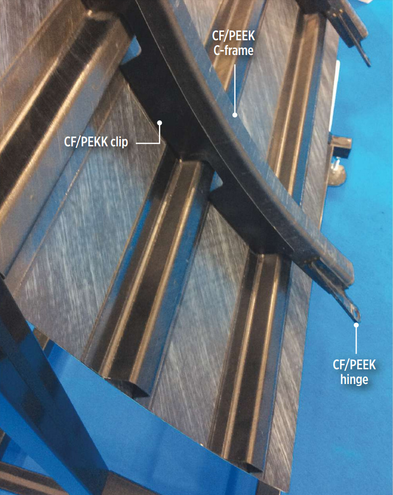

# AE731
## Theory of Elasticity
Dr. Nicholas Smith 
Wichita State University, Department of Aerospace Engineering
August 17, 2021

----
## upcoming schedule

-   Aug 17 - Intro to Elasticity
-   Aug 19 - Coordinate Transformation
-   Aug 24 - Principal Values
-   Aug 26 - Tensor Calculus

----
## outline

<!-- vim-markdown-toc GFM -->

* introduction
* syllabus and schedule
* calculus of tensors
* examples

<!-- vim-markdown-toc -->

---
# introduction

----
## about me

 <!-- .element width="75%" -->

----
## education
  - B.S. in Mechanical Engineering from Brigham Young University
    - Worked with ATK to develop tab-less gripping system for tensile testing composite tow specimens
    - Needed to align the specimen, as well as grip it without causing a stress concentration

----
## education
  - M.S. and Ph.D. from School of Aeronautics and Astronautics at Purdue University
    - Worked with Boeing to simulate mold flows
    - First ever mold simulation with anisotropic viscosity

----
## research

----
## research

----
## research

- Composites are being used in 3D printing now
- Printing patterns are optimized for isotropic materials 
- Sometimes composites hurt more than they help when not utilized properly 

----
## research

- Thermoplastic composites offer many advantages over thermoset
- Production speed, recyclability
- Also have challenges, such as bonding/welding

----
## classes

-   AE 731 Elasticity Theory (odd years in fall)
-   AE 737 Mechanics of Damage Tolerance (every year in spring)
-   AE 837 Advanced Mechanics of Damage Tolerance (odd years in fall)
-   AE 760AA Micromechanics and Multiscale Modeling (odd years in spring)
-   AE 831 Continuum Mechanics (even years in fall)

----
## introductions

-   Name
-   Student status (Undergrad, Masters, Ph.D)
-   Full time or part time student?
-   One interesting thing to remember you by

---
# syllabus and schedule

----
## course website

-   All class materials will be posted on the [class website](https://ndaman.github.io/elasticity/#/)
-   I will also make an effort to post to Blackboard, but it takes a little more effort, so you may need to remind me
-   The website uses the same format as my presentations, so treat it like slides (navigate with arrow keys)

----
## course textbook

-   Martin H. Saad, *Elasticity: Theory, Application, and Numerics*
-   Any version is sufficient
-   Homework will be given in handouts
-   Textbook will be closely followed in class and is a very highly regarded elasticity text
-   Includes useful MATLAB tutorials, as well as some more specialized topics we will not have time to cover in this course, but may be useful to your research

----
## office hours

-   I will e-mail everyone in the course a Doodle link we can use to find the optimal office hours
-   Let me know if you do not receive the e-mail, you may need to update your information in Blackboard
-   Take advantage of office hours, this is time that I have already set aside for you
-   If the regular office hours do not work for your schedule, send me an e-mail and we can work out a time to meet

----
## tentative outline

-   Chapter 1 - Calculus of tensors
    -   17 Aug - 26 Aug (4 lectures)
-   Chapter 2 - Kinematics
    -   2 Sep - 9 Sep (3 lectures)
-   Exam 1 (covers Chapter 1-2)
    -   16 Sep

----
## tentative outline

-   Chapter 3 - Stress
    -   21 Sep - 28 (3 lectures)
-   Chapter 4 - Constitutive equations
    -   30 Sep - 7 Oct (3 lectures)
-   Chapter 5 - Solution strategies
    -   14 Oct - 21 Oct (3 lectures)
-   Exam 2 (Chapters 3-5)
    -   28 Oct

----
## tentative outline

- Ch 6 - Energy principles
  - 2 Nov - 9 Nov (3 lectures)
- Ch 7-8 - 2D problems
  - 11 Nov - 18 Nov (3 lectures)
- Ch 10 - Complex variables
    - 30 Nov - 2 Dec
    

- Special topics
    - No homework
    - Not on final exam
    - Anisotropic elasticity
    - Heterogeneous materials
    - Numerical applications (finite elements)
    

----
## final exam

-   Tuesday 7 December
-   5:40 - 7:30 pm
-   Cannot take final exam at any other time, make travel plans accordingly
-   Comprehensive

----
## grades

-   Grade breakdown
    -   Homework 5%
    -   Exam 1 30%
    -   Exam 2 30%
    -   Final Exam 35%
-   Follow a traditional grading scale

----
## class expectations

-   Consider the cost (to you or others) of your being in class
-   I ask that you refrain from distracting behaviors during class
-   When you have something more important than class to take care of it, please take care of it outside of class

---
# calculus of tensors

----
## scalars

-   Scalar
    -   single value (at a point)
    -   e.g. temperature, density

----
## vectors

-   Vector
    -   expressed in terms of coordinate system
    -   one-dimensional array
    -   e.g. displacement

----
## matrices

-   Matrix
    -   two-dimensional array
    -   e.g. stress, strain

----
## scalars, vectors, matrices

`$$\rho = 25$$`

`$$u = (x,y)$$`

`$$[\sigma] = \begin{bmatrix}
\sigma_{xx} & \sigma_{xy} \\
\sigma_{yx} & \sigma_{yy}
\end{bmatrix}$$`

----
## scalars, vectors, matrices

- In two dimensions
    - Scalars have 1 term
    - Vectors have 2 terms
    - Matrices have 4 terms
 

- In three dimensions
    - Scalars have 1 term
    - Vectors have 3 terms
    - Matrices have 9 terms
    

----
## tensors

-   Formal definition for tensors later in the course
-   Scalar = 0-order tensor
-   Vector = 1st-order tensor
-   Matrix = 2nd-order tensor

----
## tensors

-   We will also use higher-order tensors in this course
-   High-order tensors are difficult to write
-   It can even be difficult to distinguish vectors, scalars, and matrices in some notations
-   Index notation is used to address these problems

----
## index notation

-   Use subscripts to indicate when a variable has multiple values
-   `$\rho$` has no subscript, and thus it must be a scalar
-   `$u_i$` has one subscript, *i*, indicating it has multiple values
-   “Multiple” means the number of coordinate system axes, unless otherwise specified.
-   `$u_i = (u_1, u_2, u_3)$`

----
## index notation

-   `$\sigma_{ij}$` has two subscripts, *i* and *j*, meaning it spans the coordinate system in two directions.
`$$\sigma_{ij} = \begin{bmatrix}
    \sigma_{11} & \sigma_{12}\\
    \sigma_{21} & \sigma_{22}
 \end{bmatrix}$$`

-   We can use this notation for any order of tensor
-   In 3D, we need a fourth-order tensor to define material stiffness, we write this in index notation as
-   `$C_{ijkl}$`

----
## addition

-   We can do arithmetic in index notation
-   `$a_i + b_i = (a_1+b_1, a_2+b_2, a_3+b_3)$`
-   We can also use a different index in the two variables to create a matrix
`$$c_{ij} = a_i + b_j = \begin{bmatrix}
    a_1 + b_1 & a_1 + b_2 \\
    a_2 + b_1 & a_2 + b_2
\end{bmatrix}$$`

----
## multiplication

-   We can multiply a scalar by a vector
-   `$\lambda a_i = (\lambda a_1, \lambda a_2)$`
-   Or multiply two vectors
`$$c_{ij} = a_i b_j = \begin{bmatrix}
    a_1 b_1 & a_1 b_2 \\
    a_2 b_1 & a_2 b_2
    \end{bmatrix}$$`

----
## math laws

-   The usual laws (commutative, associative, distributive) still apply
-   `$a_i + b_i = b_i + a_i$`
-   `$a_{ij} b_k = b_k a_{ij}$`
-   `$a_i + (b_i + c_i) = (a_i + b_i) + c_i$`
-   `$a_i(b_{jk}c_l) = (a_i b_{kj})c_l$`
-   `$a_{ij}(b_k + c_k) = a_{ij}b_k + a_{ij}c_k$`

----
## equality

-   What does this mean? <!-- .element class="fragment" -->
    -  <!-- .element class="fragment" -->  
`$a_i = b_i$`
    -  <!-- .element class="fragment" --> 
`$a_1 = b_1$`, `$a_2 = b_2$`, etc.
-   What about this? <!-- .element class="fragment" --> 
    -  <!-- .element class="fragment" --> 
`$a_i = b_j$`
    -  <!-- .element class="fragment" -->  Doesn’t make sense, incorrect use of index notation 

----
## dummy index

-   When an index is repeated in the same term, it is referred to as a “dummy index”
-   The dummy index indicates summation over all axes
-   e.g. `$a_{ii} = a_{11} + a_{22} + a_{33}$`
-   Note: summation on a matrix will reduce to a scalar, summation on higher order tensors will reduce the order by 2

----
## dummy index

-   The dummy index can be triggered by any repeated index in a .
-   Summation or not?
    -   `$a_i + b_{ij}c_j$`
    -   `$a_{ij} + b_{ij}$`
    -   `$a_{ij} + b_{ij}c_j$`

----
## matrix multiplication

-   How can we write matrix multiplication in index notation?

`$$begin{bmatrix}
    a_{11} & a_{12} \\
    a_{21} & a_{22}
\end{bmatrix}
\begin{bmatrix}
    b_{11} & b_{12} \\
    b_{21} & b_{22}
\end{bmatrix} =
\begin{bmatrix}
    c_{11} & c_{12} \\
    c_{21} & c_{22}
\end{bmatrix}$$`

-   <!-- .element class="fragment"-->
`$c_{11} = a_{11}b_{11} + a_{12}b_{21}$`
-   <!-- .element class="fragment"-->
`$c_{12} = a_{11}b_{21} + a_{12}b_{22}$`
-   <!-- .element class="fragment" -->
`$c_{ij} = a_{ik}b_{kj}$`

----
## symmetry

-   Symmetry can be a very powerful tool in Elasticity
-   Here we define some useful forms of symmetry in index notation
-   Symmetric
    -   `$a_{ij ... z} = a_{z ... ji}$`
    -   `$a_{ij .. m ... n ... z} = a_{ij ... n ... m ... z}$`

----
## anti-symmetry
-   Anti-symmetric (skew symmetric)
    -   `$a_{ij ... z} = -a_{z ... ji}$`
    -   `$a_{ij ... m ... n ... z} = -a_{ij ... n ... m ... z}$`

----
## symmetry

-   Useful identity
    -   If `$a_{ij ... m ... n ... k}$` is symmetric in *mn* and `$b_{pq ... m ... n ...r}$` is antisymmetric in *mn*, then the product is zero
    -   `$a_{ij ... m ... n ... k} b_{pq ... m ... n ...r} = 0$`
-   We can also write any tensor as the sum of its symmetric and anti-symmetric parts
    -   `$a_{ij} = \frac{1}{2} (a_{ij} + a_{ji}) + \frac{1}{2} (a_{ij} - a_{ji})$`

----
## symmetry

-   This textbook uses a special shortcut notation for the symmetric and anti-symmetric portions of a tensor
    -   Symmetric: `$a_{(ij)} = \frac{1}{2}(a_{ij}+a_{ji})$`
    -   Anti-symmetric: `$a_{[ij]} = \frac{1}{2}(a_{ij}-a_{ji})$`

----
## special symbols

-   For convenience we define two symbols in index notation
-   *Kronecker delta* is a general tensor form of the Identity Matrix

`$$\delta_{ij} = \left\{
\begin{array}{ll}
1& \text{if $i=j$}\\
0& \text{otherwise}
\end{array}
\right. = \begin{bmatrix}
1 & 0 & 0\\
0 & 1 & 0 \\
0 & 0 & 1
\end{bmatrix}$$`

-   Is also used for higher order tensors

----
## Kronecker delta

-   `$\delta_{ij} = \delta_{ji}$`
-   `$\delta_{ij} = 3$`
-   `$\delta_{ij} a_j = a_i$`
-   `$\delta_{ij}a_{ij} = a_{ii}$`

----
## special symbols

-   *alternating symbol* or *permutation symbol*

`$$\epsilon_{ijk} = \left \{
\begin{array}{rl}
1 & \text{if $ijk$ is an even permutation of 1,2,3}\\
-1 & \text{if $ijk$ is an odd permutation of 1,2,3}\\
0 & \text{otherwise}
\end{array}
\right.$$`

----
## permutation symbol

-   This symbol is not used as frequently as the *Kronecker delta*
-   For our uses in this course, it is enough to know that 123, 231, and 312 are even permutations
-   321, 132, 213 are odd permutations
-   all other indexes are zero
-   `$\epsilon_{ijk}\epsilon_{imn} = \delta_{jm} \delta_{kn} - \delta_{jn}\delta_{mk}$`

----
## determinant

-   We use the alternating symbol for writing determinants and cross-products

`$$\det[a_{ij}] = |a_{ij}| = \begin{vmatrix}
a_{11} & a_{12} & a_{13}\\
a_{21} & a_{22} & a_{23}\\
a_{31} & a_{32} & a_{33}
\end{vmatrix}
= \epsilon_{ijk}a_{i1} a_{j2} a_{k3}$$`

`$$\det[a_{ij}] = \frac{1}{6}\epsilon_{ijk} \epsilon_{pqr}a_{ip}a_{jq}a_{kr}$$`

----
## cross product

-   The cross-product can be written as a determinant:

`$$\hat{a} \times \hat{b} = \begin{vmatrix}
\hat{e}_1 & \hat{e}_2 & \hat{e}_3\\
a_1 & a_2 & a_3 \\
b_1 & b_2 & b_3
\end{vmatrix}$$`

-   Or in index notation

`$$\hat{a} \times \hat{b} = \epsilon_{ijk} \hat{e}_i a_j b_k $$`

----
## partial derivative

-   We indicate (partial) derivatives using a comma
-   In three dimensions, we take the partial derivative with respect to each variable (*x*, *y*, *z* or *x*1, *x*2, *x*3)
-   For example a scalar property, such as density, can have a different value at any point in space
-   `$\rho = \rho(x_1, x_2, x_3)$`

`$$\rho_{,i} = \frac{\partial}{\partial x_i} \rho = \left\langle \frac{\partial \rho }{\partial x_1}, \frac{\partial \rho }{\partial x_2}, \frac{\partial \rho }{\partial x_3} \right\rangle$$`

----
## partial derivative

-   Similarly, if we take the partial derivative of a vector, it produces a matrix

`$$u_{i,j} = \frac{\partial}{\partial x_j} u_i = \begin{bmatrix}
\frac{\partial u_1}{\partial x_1} & \frac{\partial u_1}{\partial x_2} & \frac{\partial u_1}{\partial x_3}\\
\frac{\partial u_2}{\partial x_1} & \frac{\partial u_2}{\partial x_2} & \frac{\partial u_2}{\partial x_3}\\
\frac{\partial u_3}{\partial x_1} & \frac{\partial u_3}{\partial x_2} & \frac{\partial u_3}{\partial x_3}
\end{bmatrix}$$`

---
# examples

----
## example 1

-   Write the following in conventional notation
`$$T_{ij,j} + F_i = 0$$`
-   <!-- .element class="fragment" --> The comma indicates a partial derivative
-   <!-- .element class="fragment" --> The first index, 
_i_, is not repeated in any terms, so it is a “free index”
    -   This means in a 3D coordinate system, we will have at least three equations
-   <!-- .element class="fragment" --> The second index, 
_j_, is repeated in the first term, indicating summation.
    -   We will have exactly three equations

----
## example 1 (solution)

`$$T_{ij,j} + F_i = 0$$`

`$$\begin{aligned}
\frac{\partial T_{11}}{\partial x_1} + \frac{\partial T_{12}}{\partial x_2} + \frac{\partial T_{13}}{\partial x_3} + F_1= 0\\
\frac{\partial T_{21}}{\partial x_1} + \frac{\partial T_{22}}{\partial x_2} + \frac{\partial T_{23}}{\partial x_3} + F_2= 0\\
\frac{\partial T_{31}}{\partial x_1} + \frac{\partial T_{32}}{\partial x_2} + \frac{\partial T_{33}}{\partial x_3} + F_3= 0\\\end{aligned}$$`

----
## example 2

-   Identify whether the following expressions represent a scalar, vector, or matrix
-   If index notation is used incorrectly, give a reason why
-   `$A_i = B_i$`
-   `$A_i = B_i + C_i D_i$`
-   `$\delta_{ij}A_iB_j$`
-   `$\phi = \frac{\partial F_i}{\partial x_i}$`

----
## example 2 (solution)

-   Vector equation
-   Incorrect use of index notation, *i* used as both free and dummy index
-   Scalar value (both indexes are dummy indexes)
-   Scalar value (could also be written `$F_{i,i}$`)

