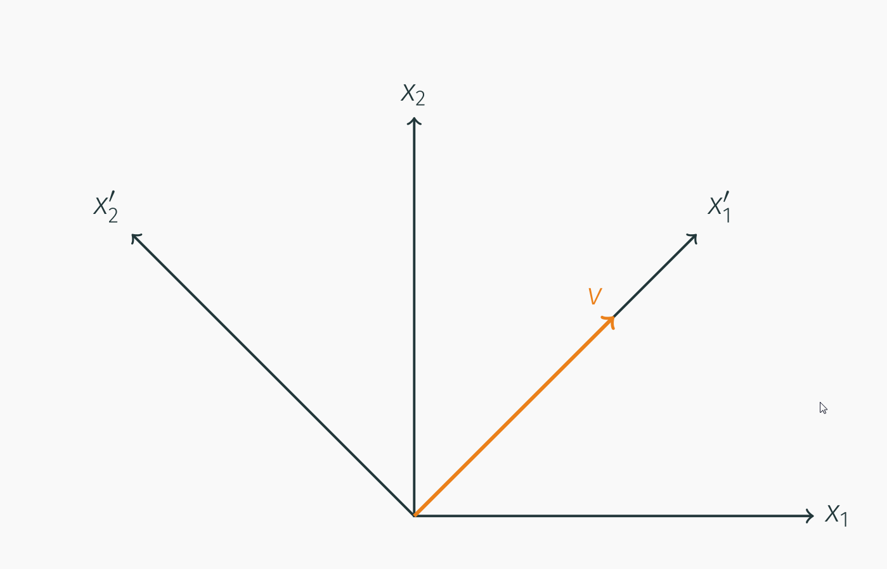
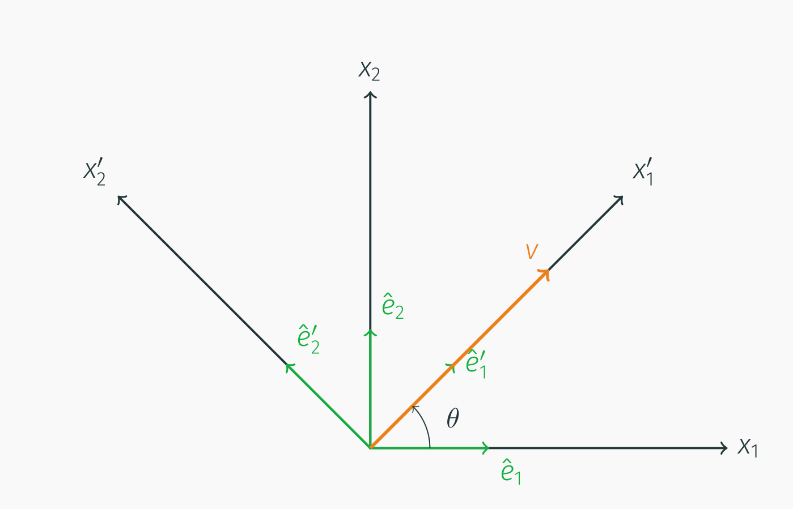
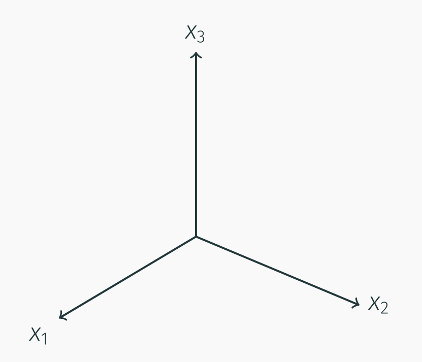
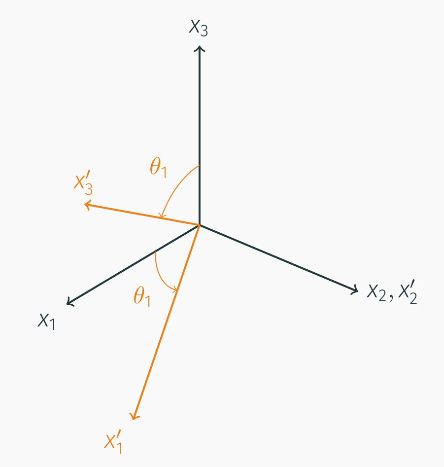
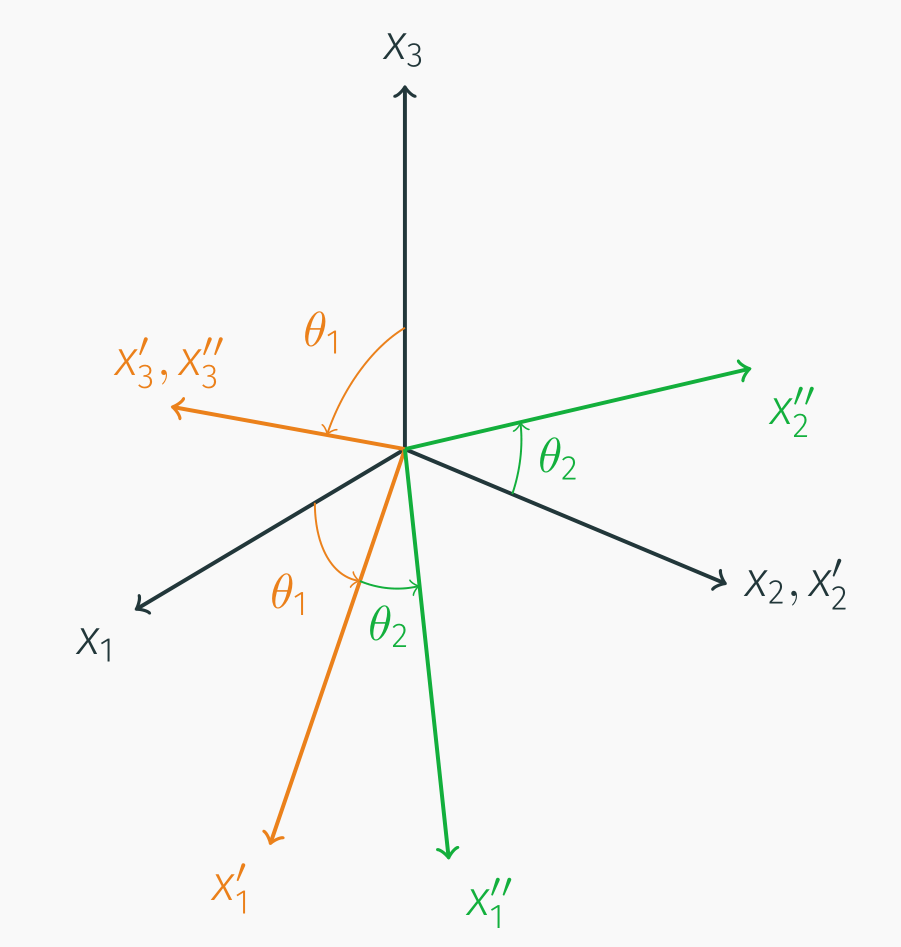

# AE731
## Theory of Elasticity
Dr. Nicholas Smith 
Wichita State University, Department of Aerospace Engineering
August 21, 2019

----
## upcoming schedule

-   Aug 21 - Coordinate Transformation
-   Aug 26 - Principal Values
-   Aug 28 - Tensor Calculus
-   Sep 2 - Labor Day
-   Sep 4 - Displacement and Strain, Homework 1 Due

----
## outline

<!-- vim-markdown-toc GFM -->

* review
* examples
* index notation algebra
* group problems
* coordinate transformation
* examples

<!-- vim-markdown-toc -->

---
# review

----
## office hours

-   TBD, Only 4 have responded, right now looks like M or W 3 - 4
-   Homework will generally be due on Wednesdays
-   Feel free to e-mail me for an appointment outside office hours if the time does not work for you

----
## homework

-   Homework 1 is available on Blackboard and [course website](https://ndaman.github.io/elasticity/#/) if you want to start working on it
-   Due on September 4 (I do not accept late homework)
-   Covers all of Chapter 1, relatively difficult, don’t wait until last minute
-   Study groups help a lot (but submit your own work)

----
## index notation

Free index vs. dummy index

-  	is not repeated on any term
-		takes all values (1,2,3)
-		e.g. *u**i* = ⟨*u*1, *u*2, *u*3⟩ 
-		must match across terms in an express or equation

-		is repeated on at least one term
-		indicates summation over all values
-		e.g. *σ**ii* = *σ*11 + *σ*22 + *σ*33 
-		can not be used more than twice in the same term (*A**ij**B**jk**C**kl* is good, *A**ij**B**ij**C**ij* is not) 
	

----
## symmetry

-   Two types of symmetry: symmetry and antisymmetry
-   Symmetry: *a**ij* = *a**ji*
-   Anti-symmetry: *a**ij* = −*a**ji*

----
## symmetry

-   We can break any tensor up into symmetric and anti-symmetric portions
-   <!-- .element style="list-style-type: none" --> $a\_{ij} = \\frac{1}{2} (a\_{ij} + a\_{ji}) + \\frac{1}{2} (a\_{ij} - a\_{ji})$

----
## example

-   Find symmetric and anti-symmetric portions of

$$\\begin{bmatrix}
1 & 4 & 3\\\\
2 & 1 & 5\\\\
4 & 3 & 6
\\end{bmatrix}$$

----
## example symmetric portion

$$a\_{(ij)} = \\frac{1}{2}(a\_{ij} + a\_{ji})$$

$$a\_{(ij)} = \\frac{1}{2} \\left (
\\begin{bmatrix}
1 & 4 & 3\\\\
2 & 1 & 5\\\\
4 & 3 & 6
\\end{bmatrix}+
\\begin{bmatrix}
1 & 2 & 4\\\\
4 & 1 & 3\\\\
3 & 5 & 6
\\end{bmatrix}\\right)
= \\begin{bmatrix}
1 & 3 & 3.5\\\\
3 & 1 & 4\\\\
3.5 & 4 & 6
\\end{bmatrix}$$

----
## example anti-symmetric portion

$$a\_{(ij)} = \\frac{1}{2}(a\_{ij} - a\_{ji})$$

$$a\_{(ij)} = \\frac{1}{2} \\left (
\\begin{bmatrix}
1 & 4 & 3\\\\
2 & 1 & 5\\\\
4 & 3 & 6
\\end{bmatrix}-
\\begin{bmatrix}
1 & 2 & 4\\\\
4 & 1 & 3\\\\
3 & 5 & 6
\\end{bmatrix}\\right)
= \\begin{bmatrix}
0 & 1 & -0.5\\\\
-1 & 0 & 1\\\\
0.5 & -1 & 0
\\end{bmatrix}$$

----
## special symbols

-   For convenience we define two symbols in index notation
-   *Kronecker delta* is a general tensor form of the Identity Matrix

$$\\delta\_{ij} = \\left\\{
\\begin{array}{ll}
1& \\text{if $i=j$}\\\\
0& \\text{otherwise}
\\end{array}
\\right. = \\begin{bmatrix}
1 & 0 & 0\\\\
0 & 1 & 0 \\\\
0 & 0 & 1
\\end{bmatrix}$$

-   Is also used for higher order tensors

----
## Kronecker delta

-   *δ**ij* = *δ**ji*
-   *δ**ii*= 3
-   *δ**ij**a**j*= *a**i*
-   *δ**ij**a**ij*= *a**ii*

----
## special symbols

-   *alternating symbol* or *permutation symbol*

$$\\epsilon\_{ijk} = \\left\\{
\\begin{array}{rl}
1 & \\text{if $ijk$ is an even permutation of 1,2,3}\\\\
-1 & \\text{if $ijk$ is an odd permutation of 1,2,3}\\\\
0 & \\text{otherwise}
\\end{array}
\\right.$$

----
## permutation symbol

-   This symbol is not used as frequently as the *Kronecker delta*
-   For our uses in this course, it is enough to know that 123, 231, and 312 are even permutations
-   321, 132, 213 are odd permutations
-   all other indexes are zero
-   *ϵ**ijk**ϵ**imn* = *δ**jm**δ**kn* − *δ**jn**δ**mk*

----
## determinant

-   We use the alternating symbol for writing determinants and cross-products

$$\\det\[a\_{ij}\] = |a\_{ij}| = \\begin{vmatrix}
a\_{11} & a\_{12} & a\_{13}\\\\
a\_{21} & a\_{22} & a\_{23}\\\\
a\_{31} & a\_{32} & a\_{33}
\\end{vmatrix}
= \\epsilon\_{ijk}a\_{i1} a\_{j2} a\_{k3}$$

$$\\det\[a\_{ij}\] = \\frac{1}{6}\\epsilon\_{ijk} \\epsilon\_{pqr}a\_{ip}a\_{jq}a\_{kr}$$

----
## cross product

-   The cross-product can be written as a determinant:

$$\\hat{a} \\times \\hat{b} = \\begin{vmatrix}
\\hat{e}\_1 & \\hat{e}\_2 & \\hat{e}\_3\\\\
a\_1 & a\_2 & a\_3 \\\\
b\_1 & b\_2 & b\_3
\\end{vmatrix}$$

-   Or in index notation

$$\\hat{a} \\times \\hat{b} = \\epsilon\_{ijk} \\hat{e}\_i a\_j b\_k $$

----
## partial derivative

-   We indicate (partial) derivatives using a comma
-   In three dimensions, we take the partial derivative with respect to each variable (*x*, *y*, *z* or *x*1, *x*2, *x*3)
-   For example a scalar property, such as density, can have a different value at any point in space
-   *ρ* = *ρ*(*x*1, *x*2, *x*3)

$$\\rho\_{,i} = \\frac{\\partial}{\\partial x\_i} \\rho = \\left\\langle \\frac{\\partial \\rho }{\\partial x\_1}, \\frac{\\partial \\rho }{\\partial x\_2}, \\frac{\\partial \\rho }{\\partial x\_3} \\right\\rangle$$

----
## partial derivative

-   Similarly, if we take the partial derivative of a vector, it produces a matrix

$$u\_{i,j} = \\frac{\\partial}{\\partial x\_j} u\_i = \\begin{bmatrix}
\\frac{\\partial u\_1}{\\partial x\_1} & \\frac{\\partial u\_1}{\\partial x\_2} & \\frac{\\partial u\_1}{\\partial x\_3}\\\\
\\frac{\\partial u\_2}{\\partial x\_1} & \\frac{\\partial u\_2}{\\partial x\_2} & \\frac{\\partial u\_2}{\\partial x\_3}\\\\
\\frac{\\partial u\_3}{\\partial x\_1} & \\frac{\\partial u\_3}{\\partial x\_2} & \\frac{\\partial u\_3}{\\partial x\_3}
\\end{bmatrix}$$

---
# examples

----
## example 1

-   Write the following in conventional notation
    *T**ij*, *j* + *F**i* = 0
-   <!-- .element class="fragment" --> The comma indicates a partial derivative
-   <!-- .element class="fragment" --> The first index, *i*, is not repeated in any terms, so it is a “free index”
    -   This means in a 3D coordinate system, we will have at least three equations
-   <!-- .element class="fragment" --> The second index, *j*, is repeated in the first term, indicating summation.
    -   We will have exactly three equations

----
## example 1 (solution)

*T**ij*, *j* + *F**i* = 0

$$\\begin{aligned}
\\frac{\\partial T\_{11}}{\\partial x\_1} + \\frac{\\partial T\_{12}}{\\partial x\_2} + \\frac{\\partial T\_{13}}{\\partial x\_3} + F\_1= 0\\\\
\\frac{\\partial T\_{21}}{\\partial x\_1} + \\frac{\\partial T\_{22}}{\\partial x\_2} + \\frac{\\partial T\_{23}}{\\partial x\_3} + F\_2= 0\\\\
\\frac{\\partial T\_{31}}{\\partial x\_1} + \\frac{\\partial T\_{32}}{\\partial x\_2} + \\frac{\\partial T\_{33}}{\\partial x\_3} + F\_3= 0\\\\\\end{aligned}$$

----
## example 2

-   Identify whether the following expressions represent a scalar, vector, or matrix
-   If index notation is used incorrectly, give a reason why
-   *A**i* = *B**i*
-   *A**i* = *B**i* + *C**i**D**i*
-   *δ**ij**A**i**B**j*
-   $\\phi = \\frac{\\partial F\_i}{\\partial x\_i}$

----
## example 2 (solution)

-   Vector equation
-   Incorrect use of index notation, *i* used as both free and dummy index
-   Scalar value (both indexes are dummy indexes)
-   Scalar value (could also be written *F**i*, *i*)

---
# index notation algebra

----
## substitution

-   When solving tensor equations, we often need to manipulate expressions
-   We need to make sure the correct indexes are used when substituting, for example
-   *a**i* = *U**im**b**m*
-   *b**i* = *V**im**c**m*
-   To substitute the second into the first, we need to change indexes

----
## substitution

-   We need to change the free index, *i*, to *m* in the second equation
-   Since *m* is already used as the dummy index, we need to change that too
-   *b**m* = *V**mj**c**j*
-   We can now make the substitution
-   *a**i* = *U**im**V**mj**c**j*

----
## multiplication

-   We need to be careful with indexes when multiplying expressions
-   *p* = *a**m**b**m*  and  *q* = *c**m**d**m*
-   We can express, *pq*, but remember the dummy index cannot be repeated more than once
-   *pq* ≠ *a**m**b**m**c**m**d**m*
-   Instead we must change the dummy index in one of the expressions first
-   *pq* = *a**m**b**m**c**n**d**n*

----
## factoring

-   In the following expression, we would like to factor out *n*, but it has different indexes
-   *T**ij**n**j* − *λn**i* = 0
-   Recall *δ**ij**a**j* = *a**i*, we can rewrite *n**i* = *δ**ij**n**j*
-   *T**ij**n**j* − *λδ**ij**n**j* = 0
-   (*T**ij* − *λδ**ij*)*n**j* = 0

----
## contraction

-   *T**ii* is the contraction of *T**ij*
-   This can often be a useful tool in solving tensor equations
-   *T**ij* = *λΔδ**ij* + 2*μE**ij*
-		*T**ii* = *λΔδ**ii* + 2*μE**ii*

----
## example

-   Solve the equation below for *U**k* in terms of *P**i* and *a**i*.
-   <!-- .element style="list-style-type: none" --> $$\\mu \\left\[ \\delta\_{kj} a\_i a\_i + \\frac{1}{1-2\\nu} a\_k a\_j \\right\] U\_k = P\_j$$
-   <!-- .element class="fragment" --> Multiply both sides by *a**j*
-		<!-- .element style="list-style-type: none", class="fragment" --> $$\\mu \\left\[ a\_j \\delta\_{kj} a\_i a\_i + \\frac{1}{1-2\\nu} a\_k a\_j a\_j \\right\] U\_k = P\_j a\_j$$
-   <!-- .element class="fragment" -->The dummy indexes can be changed
-		<!-- .element style="list-style-type: none", class="fragment" --> $$\\mu \\left\[ a\_j \\delta\_{kj} a\_i a\_i + \\frac{1}{1-2\\nu} a\_k a\_i a\_i \\right\] U\_k = P\_j a\_j$$

----
## example

-   *a**j**δ**kj* = *a**k*
-		<!-- .element style="list-style-type: none" --> $$\\mu U\_k \\left\[ a\_k a\_i a\_i + \\frac{1}{1-2\\nu} a\_k a\_i a\_i \\right\] = P\_j a\_j$$
-   <!-- .element class="fragment" -->Factoring
-		<!-- .element style="list-style-type: none", class="fragment" --> $$\\mu U\_k a\_k a\_i a\_i \\left\[ 1 + \\frac{1}{1-2\\nu} \\right\] = P\_j a\_j$$
-   <!-- .element class="fragment" -->Simplifying
-		<!-- .element style="list-style-type: none", class="fragment" --> $$\\mu U\_k a\_k a\_i a\_i \\left\[ \\frac{2(1-\\nu)}{1-2\\nu} \\right\] = P\_j a\_j$$

----
## example

-   Solve for *U**k**a**k*
-		<!-- .element style="list-style-type: none" --> $$U\_k a\_k = \\frac{P\_j a\_j(1-2\\nu)}{2\\mu a\_i a\_i (1-\\nu) }$$
-   <!-- .element class="fragment" -->This is a scalar equation, we need to find *U**j*, but we substitute this back into the original equation.
-   <!-- .element class="fragment" -->First, expand the original equation
-		<!-- .element style="list-style-type: none", class="fragment" --> $$\\mu U\_k \\delta\_{kj} a\_i a\_i + \\mu U\_k \\frac{1}{1-2\\nu} a\_k a\_j = P\_j$$

----
## example

-   After substitution, we find
-		<!-- .element style="list-style-type: none" -->$$\\mu U\_j a\_i a\_i + \\mu \\frac{1}{1-2\\nu} \\frac{P\_j a\_j(1-2\\nu)}{2\\mu a\_i a\_i (1-\\nu) } a\_j = P\_j$$
-   <!-- .element class="fragment" -->The index *j* is repeated too many times, so we need to change *P**j**a**j* to a different index
-		<!-- .element style="list-style-type: none", class="fragment" --> $$\\mu U\_j a\_i a\_i + \\frac{P\_k a\_k}{2 a\_i a\_i (1-\\nu) } a\_j = P\_j$$
-   <!-- .element class="fragment" -->We can now solve for *U**j*
-		<!-- .element style="list-style-type: none", class="fragment" --> $$U\_j  = \\frac{1}{\\mu a\_i a\_i} \\left\[P\_j - \\frac{P\_k a\_k}{2 a\_i a\_i (1-\\nu) } a\_j\\right\]$$

---
# group problems

----
## group 1 

Identify the dummy and free indexes in each of the following expressions. Indicate the tensor order of the expression. If index notation is used incorrectly, identify why it is used incorrectly and propose a correction.

1.  *a**i**b**j**c**k* + *d**ijk*
2.  *a**ii**b**k* + *c**kk**d**j*
3.  *C**ijkl**ϵ**kl*

----
## group 2 

Is it possible to factor *n**i* from the following equation? If so, factor it.

*T**ij**n**j* − *λn**i* = 0

----
## group 3 

Find the symmetric, *S**ij*, and anti-symmetric, *A**ij*, portions of *T**ij*. 
Verify that *S**ij* + *A**ij* = *T**ij*

$$T\_{ij} = \\begin{bmatrix}
      1 & 0 & 3\\\\
      0 & 1 & 2\\\\
      3 & 0 & 3
  \\end{bmatrix}$$

---
# coordinate transformation

----
## two dimensions

 <!-- .element width="80%" -->

----
## dimensions

-   The vector, *v*, remains fixed, but we transform our coordinate system
-   In the new coordinate system, the *x*2′ portion of *v* is zero.
-   To transform the coordinate system, we first define some unit vectors.
-   $\\hat{e}\_1$ is a unit vector in the direction of *x*1, while $\\hat{e}\_1^\\prime$ is a unit vector in the direction of *x*1′

----
## two dimensions

 <!-- .element width="80%" --> 

----
## two dimensions

-   For this example, let us assume *v* = ⟨2, 2⟩ and *θ* = 45∘
-   We can write the transformed unit vectors, $\\hat{e}\_1^\\prime$ and $\\hat{e}\_2^\\prime$ in terms of $\\hat{e}\_1$, $\\hat{e}\_2$ and the angle of rotation, *θ*.

$$\\begin{aligned}
\\hat{e}\_1^\\prime &= \\langle \\hat{e}\_1 \\cos \\theta , \\hat{e}\_2 \\sin \\theta\\rangle\\\\
\\hat{e}\_2^\\prime &= \\langle -\\hat{e}\_1 \\sin \\theta , \\hat{e}\_2 \\cos \\theta \\rangle\\end{aligned}$$

----
## two dimensions

-   We can write the vector, *v*, in terms of the unit vectors describing our axis system
-   $v = v\_1 \\hat{e}\_1 + v\_2 \\hat{e}\_2$
-   (note: $\\hat{e}\_1=\\langle 1, 0 \\rangle$ and $\\hat{e}\_2 = \\langle 0,1 \\rangle$)
-   *v* = ⟨2, 2⟩=2⟨1, 0⟩+2⟨0, 1⟩

----
## two dimensions

-   When expressed in the transformed coordinate system, we refer to *v*′
-   *v*′ = ⟨*v*1cos*θ* + *v*2sin*θ*, −*v*1sin*θ* + *v*2cos*θ*⟩
-   $v^\\prime = \\langle 2\\sqrt{2}, 0 \\rangle$
-   We can recover the original vector from the transformed coordinates:
-   $v = v\_1^\\prime \\hat{e}\_1^\\prime + v\_2^\\prime \\hat{e}\_2^\\prime$
-   (note: $\\hat{e}\_1^\\prime=\\langle \\frac{\\sqrt{2}}{2},\\frac{\\sqrt{2}}{2} \\rangle$ and $\\hat{e}\_2^\\prime = \\langle -\\frac{\\sqrt{2}}{2},\\frac{\\sqrt{2}}{2} \\rangle$)
-   $v = 2\\sqrt{2}\\langle \\frac{\\sqrt{2}}{2},\\frac{\\sqrt{2}}{2} \\rangle, 0 \\langle -\\frac{\\sqrt{2}}{2},\\frac{\\sqrt{2}}{2} \\rangle = \\langle 2, 2 \\rangle$

----
## general 

-   Coordinate transformation can become much more complicated in three dimensions, and with higher-order tensors
-   It is convenient to define a general form of the coordinate transformation in index notation
-   We define *Q**ij* as the cosine of the angle between the *x**i*′ axis and the *x**j* axis.
-   This is also referred to as the “direction cosine”
    *Q**ij* = cos(*x**i*′, *x**j*)

----
## general 

-   We can use this form on our 2D transformation example

$$\\begin{aligned}
Q\_{ij} &= \\cos (x\_i^\\prime, x\_j)\\\\ &= \\begin{bmatrix}
\\cos (x\_1^\\prime, x\_1) & \\cos (x\_1^\\prime, x\_2)\\\\
\\cos (x\_2^\\prime, x\_1) & \\cos (x\_2^\\prime, x\_2)
\\end{bmatrix}\\\\ &= \\begin{bmatrix}
\\cos \\theta & \\cos (90-\\theta)\\\\
\\cos (90+\\theta) & \\cos \\theta
\\end{bmatrix} \\\\ &= \\begin{bmatrix}
\\cos \\theta & \\sin \\theta \\\\
-\\sin \\theta & \\cos \\theta
\\end{bmatrix}\\end{aligned}$$

----
## general 

-   We can transform any-order tensor using *Q**ij*
-   Vectors (first-order tensors): *v**i*′ = *Q**ij**v**j*
-   Matrices (second-order tensors): *σ**mn*′ = *Q**mi**Q**nj**σ**ij*
-   Fourth-order tensors: *C**ijkl*′ = *Q**im**Q**jn**Q**ko**Q**lp**C**mnop*

----
## general 

-   We can similarly use *Q**ij* to find tensors in the original coordinate system
-   Vectors (first-order tensors): *v**i* = *Q**ji**v**j*′
-   Matrices (second-order tensors): *σ**mn* = *Q**im**Q**jn**σ**ij*′
-   Fourth-order tensors: *C**ijkl* = *Q**mi**Q**nj**Q**ok**Q**pl**C**mnop*′

----
## mental/emotional health warning

-		Some texts flip the definition of *Q**ij*, and then flip their transformation law accordingly
-		Any time you use tensor transformation, make sure you are following a consistent set of transformation laws

----
## general 

-   We can derive some interesting properties of the transformation tensor, *Q**ij*
-   We know that *v**i* = *Q**ji**v**j*′ and that *v**i*′ = *Q**ij**v**j*
-   If we substitute (changing the appropriate indexes) we find:
-   *v**i* = *Q**ji**Q**jk**v**k*
-   We can now use the Kronecker Delta to substitute *v**i* = *δ**ik**v**k* which gives
-   *δ**ik**v**k* = *Q**ji**Q**jk**v**k*

---
# examples

----
## example

	

  <ul>
    	<li>Find *Q**ij*1 for rotation of 60∘ about *x*2 </li>
			<li>Find *Q**ij*2 for rotation of 30∘ about *x*3′ </li>
			<li>Find *e**i*′′ after both rotations </li>
    </ul>

----
## example

 <!-- .element width="50%" --> 

----
## example

<!-- .element width="50%" --> 

----
## example

-   *Q**ij*1 = cos(*x**i*′, *x**j*)
-   *Q**ij*2 = cos(*x**i*′′, *x**j*′)

$$Q\_{ij}^1 = \\begin{bmatrix}
\\cos 60 & \\cos 90 & \\cos 150\\\\
\\cos 90 & \\cos 0 & \\cos 90\\\\
\\cos 30 & \\cos 90 & \\cos 60
\\end{bmatrix}$$
$$Q\_{ij}^2 = \\begin{bmatrix}
\\cos 30 & \\cos 60 & \\cos 90\\\\
\\cos 120 & \\cos 30 & \\cos 90\\\\
\\cos 90 & \\cos 90 & \\cos 0
\\end{bmatrix}$$

----
## example

-   We now use *Q**ij* to find $\\hat{e}\_i^\\prime$ and $\\hat{e}\_i^{\\prime \\prime}$
-   First, we need to write $\\hat{e}\_i$ in a manner more consistent with index notation
-   We will indicate axis direction with a superscript, e.g. $\\hat{e}\_1 = e\_i^1$
-   *e**i*′ = *Q**ij*1*e**j*
-   *e**i*′′ = *Q**ij*2*e**j*′
-   How do we find *e**i*′′ in terms of *e**i*?
-   *e**i*′′ = *Q**ij*2*Q**jk*1*e**k*

