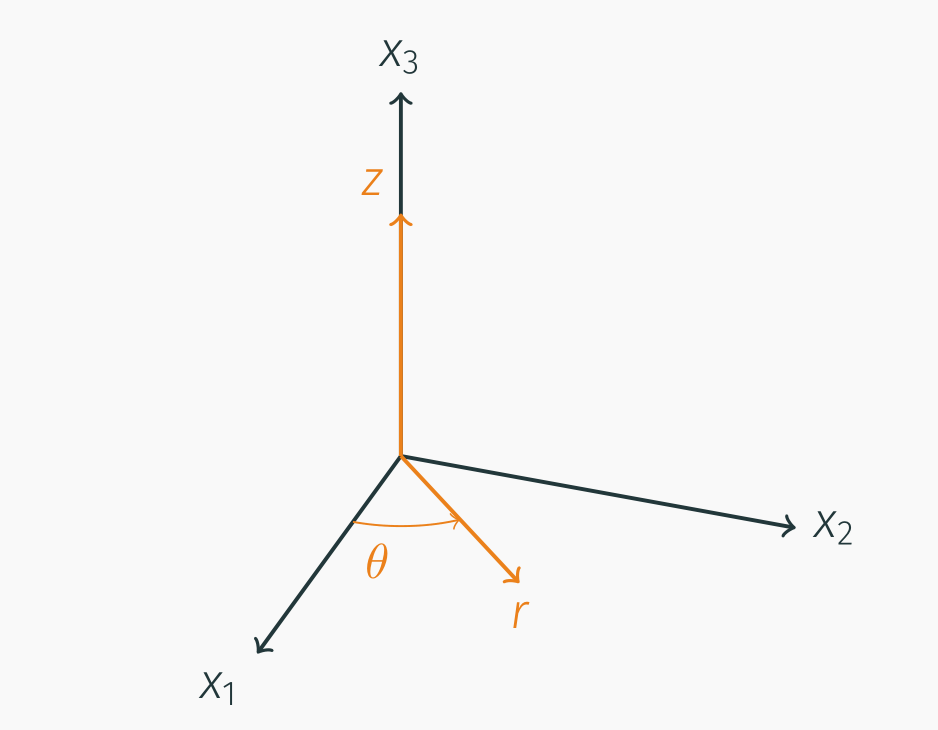
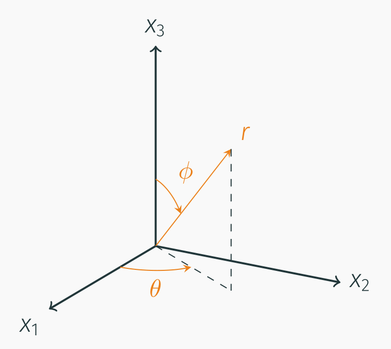

# AE731
## Theory of Elasticity
Dr. Nicholas Smith<br/>
Wichita State University, Department of Aerospace Engineering
August 28, 2019

----
## upcoming schedule

-   Aug 28 - Tensor Calculus
-   Sep 2 - Labor Day
-   Sep 4 - Displacement and Strain, Homework 1 Due
-   Sep 9 - Strain Transformation
-   Sep 11 - Exam 1 Review

----
## outline

<!-- vim-markdown-toc GFM -->

* group problems
* review
* tensor algebra
* tensor calculus
* other coordinate systems
* chapter summary

<!-- vim-markdown-toc -->

---
# group problems

----
## group 1

-   Rotate the following matrix into the principal coordinate system

$$\\begin{bmatrix} -1 & 1 & 0 \\\\ 1 & -1 & 0 \\\\ 0 & 0 & 1 \\end{bmatrix}$$

----
## group 2

-   The *x*<sup>′</sup> coordinate system is described by a rotation of 53.13<sup>∘</sup> about the *x*<sub>2</sub> axis
-   If *u*<sub>*i*</sub> = ⟨10, 15, 5⟩, find *u*<sub>*i*</sub><sup>′</sup>

----
## group 3

-   Compare the invariants of the *A*<sub>*i*</sub>*j* and *B*<sub>*ij*</sub>

$$\\begin{aligned}
  A\_{ij} &= \\begin{bmatrix} -1 & 1 & 0 \\\\ 1 & -1 & 0 \\\\ 0 & 0 & 1 \\end{bmatrix}\\\\
  B\_{ij} &= \\begin{bmatrix} 0.28 & 0.60 & -0.96 \\\\ 0.60 & -1 & 0.80 \\\\ -0.96 & 0.80 & -0.28 \\end{bmatrix}
\\end{aligned}$$

---
# review

----
## tensor transformations

-   We can use the direction cosines (cos(*x*<sub>*i*</sub><sup>′</sup>, *x*<sub>*j*</sub>)) to express any-order tensor in a transformed coordinate system

$$\\begin{aligned}
  a^\\prime &= a & \\text{zero order, scalar}\\\\
  a\_i^\\prime & = Q\_{ip} a\_p & \\text{first order, vector}\\\\
  a\_{ij}^\\prime & = Q\_{ip} Q\_{jq} a\_{pq} & \\text{second order, matrix}\\\\
  a\_{ijk}^\\prime & = Q\_{ip} Q\_{jq} Q\_{kr} a\_{pqr} & \\text{third order}\\\\
  a\_{ijkl}^\\prime & = Q\_{ip} Q\_{jq} Q\_{kr} Q\_{lo} a\_{pqro} & \\text{fourth order}
\\end{aligned}$$

-   Any tensor will follow these transformation rules

----
## programming with index notation

-   Some expressions in index notation can be simply translated to matrix expressions
-   Others are either confusing, or use higher-order tensors
-   For example, if we rotate the fourth-order stiffness tensor
    *C*<sub>*ijkl*</sub><sup>′</sup> = *Q*<sub>*ip*</sub>*Q*<sub>*jq*</sub>*Q*<sub>*kr*</sub>*Q*<sub>*lo*</sub>*C*<sub>*pqro*</sub>

----
## programming with index notation

``` matlab
for i = 1:3
for j = 1:3
for k = 1:3
for l = 1:3
 C(i,j,k,l) = 0;
 for p = 1:3
 for q = 1:3
 for r = 1:3
 for o = 1:3
  C(i,j,k,l) = C(i,j,k,l) +
Q(i,p)*Q(j,q)*Q(k,r)*Q(l,o)*C(p,q,r,o);
 end; end; end; end;
end; end; end; end;
        
```

----
## programming

-   In general, when programming an expression in index notation there are a few things to be careful about
    1.  Your programming language’s start index (C and Python start at 0, MATLAB and Fortran start at 1)
    2.  Make sure your free indexes are on the outside of the loop, and the dummy indexes are on the inside
    3.  Don’t forget to sum over the dummy indexes

---
# tensor algebra

----
## dot products

-   The dot product (inner product) can be used with any-ordered tensor
-   Will reduce the order of the tensor by one
-   *a*<sub>*i*</sub>*b*<sub>*i*</sub> = *c*
-   *A*<sub>*ij*</sub>*B*<sub>*jk*</sub> = *C*<sub>*ik*</sub>
-   *A*<sub>*ij*</sub>*b*<sub>*j*</sub> = *c*<sub>*i*</sub>
-   *A*<sub>*ijk*</sub>*b*<sub>*k*</sub> = *C*<sub>*ij*</sub>

----
## dot products

-   We can have higher-order “dot” products when multiple indexes are repeated
-   Double dot product will reduce the order of the tensor by two
-   *A*<sub>*ij*</sub>*B*<sub>*ij*</sub> = *c*
-   *A*<sub>*ijk*</sub>*B*<sub>*jkl*</sub> = *C*<sub>*il*</sub>
-   *A*<sub>*ijkl*</sub>*B*<sub>*kl*</sub> = *C*<sub>*ij*</sub>

----
## dyadic notation

-   There is an antiquated notation that you may encounter reading older papers and texts
-   Now known as “dyadic notation” (or sometimes “tensor product notation”)
-   Dyadic product: *C*<sub>*ij*</sub> = *a*<sub>*i*</sub>*b*<sub>*j*</sub> is written as *C* = *a* ⊗ *b*
-   Double dot product: *A*<sub>*ij*</sub>*B*<sub>*ji*</sub> = *c* is written as *A* : *B* = *c*

----
## kronecker delta

-   For convenience we define two symbols in index notation
-   *Kronecker delta* is a general tensor form of the Identity Matrix

$$\\delta\_{ij} = \\left\\{
	\\begin{array}{ll}
	1& \\text{if $i=j$}\\\\
	0& \\text{otherwise}
	\\end{array}
	\\right. = \\begin{bmatrix}
	1 & 0 & 0\\\\
	0 & 1 & 0 \\\\
	0 & 0 & 1
\\end{bmatrix}$$

----
## kronecker delta

-   Is also used for higher order tensors
-   *δ*<sub>*ij*</sub> = *δ*<sub>*ji*</sub>
-   *δ*<sub>*ii*</sub> = 3
-   *δ*<sub>*ij*</sub>*a*<sub>*j*</sub> = *a*<sub>*i*</sub>
-   *δ*<sub>*ij*</sub>*a*<sub>*ij*</sub> = *a*<sub>*ii*</sub>

----
## permutation symbol

-   *alternating symbol* or *permutation symbol*

$$\\epsilon\_{ijk} = \\left\\{
	\\begin{array}{rl}
	1 & \\text{if $ijk$ is an even permutation of 1,2,3}\\\\
	-1 & \\text{if $ijk$ is an odd permutation of 1,2,3}\\\\
	0 & \\text{otherwise}
	\\end{array}
\\right.$$

----
## permutation symbol

-   This symbol is not used as frequently as the *Kronecker delta*
-   For our uses in this course, it is enough to know that 123, 231, and 312 are even permutations
-   321, 132, 213 are odd permutations
-   all other indexes are zero
-   *ϵ*<sub>*ijk*</sub>*ϵ*<sub>*imn*</sub> = *δ*<sub>*jm*</sub>*δ*<sub>*kn*</sub> − *δ*<sub>*jn*</sub>*δ*<sub>*mk*</sub>

----
## cross product

-   The cross-product can be written in index notation

$$\\hat{a} \\times \\hat{b} = \\epsilon\_{ijk} a\_j b\_k \\hat{e}\_i$$

-   The coordinate system unit vectors ($\\hat{e}\_i$) are often neglected

$$\\hat{a} \\times \\hat{b} = \\epsilon\_{ijk} a\_j b\_k$$

----
## converting to matrix math

-   It is often convenient to write expressions in matrix notation to use MATLAB or graphing calculators
-   We need to be careful how this is done, in index notation left and right multiplication are identical, but this is not the case for matrices
- <!-- .element style="list-style-type:none" -->    \[*A*\]\[*B*\]=*A*<sub>*ij*</sub>*B*<sub>*jk*</sub>
- <!-- .element style="list-style-type:none" -->    \[*B*\]\[*A*\]=*B*<sub>*ij*</sub>*A*<sub>*jk*</sub> = *A*<sub>*jk*</sub>*B*<sub>*ij*</sub>

----
## converting to matrix math

-   Some useful relations

$$\\begin{aligned}
	\[A\]\[B\] & = A\_{ij} B\_{jk}\\\\
	\[A\]\[B\]^T & = A\_{ij} B\_{kj}\\\\
	\[A\]^T\[B\] & = A\_{ji} B\_{jk}\\\\
	tr(\[A\]\[B\]) & = A\_{ij} B\_{ji}\\\\
	tr(\[A\]\[B\]^T) & = A\_{ij} B\_{ij}
\\end{aligned}$$

----
## converting to matrix

-   Sometimes our expression is more complex (involves more terms)
-   e.g. transformation of a matrix
    *a*<sub>*ij*</sub><sup>′</sup> = *Q*<sub>*ip*</sub>*Q*<sub>*jq*</sub>*a*<sub>*pq*</sub>
    1.  Re-arrange so dummy indexes are adjacent
        *Q*<sub>*ip*</sub>*a*<sub>*pq*</sub>*Q*<sub>*jq*</sub>
    2.  Identify which (if any) tensors are transposed (dummy indexes should be on the inside of adjacent terms without a transpose)
- <!-- .element style="list-style-type:none" -->        *Q*<sub>*ip*</sub> *a* <sub>*pq*</sub> <span style="color:red">Q <sub>*jq*</sub></span>
- <!-- .element style="list-style-type:none" -->        \[*Q*\]\[*a*\]\[*Q*\]<sup>*T*</sup>

----
## example

-   Convert the expression in index notation to Matrix notation
    *A*<sub>*ik*</sub>*B*<sub>*jl*</sub>*C*<sub>*ml*</sub>*D*<sub>*mk*</sub>

  1.  <!-- .element class="fragment" -->Re-arrange to so that dummy indexes are in adjacent terms
		-   <!-- .element style="list-style-type:none" class="fragment" -->        *A*<sub>*ik*</sub>*D*<sub>*mk*</sub>*C*<sub>*ml*</sub>*B*<sub>*jl*</sub>

  2.  <!-- .element class="fragment" -->Identify which terms are transposed
		- <!-- .element style="list-style-type:none" class="fragment" --> *A*<sub>*ik*</sub> <span style="color:red">*D*<sub>*mk*</sub></span>*C* <sub>*ml*</sub> <span style="color:red">*B*<sub>*jl*</sub></span>
		- <!-- .element style="list-style-type:none" class="fragment" --> \[*A*\]\[*D*\]<sup>*T*</sup>\[*C*\]\[*B*\]<sup>*T*</sup>

---
# tensor calculus

----
## partial derivatives

-   We usually omit the (*x*<sub>*i*</sub>), but most variables we deal with are functions of *x*<sub>*i*</sub>
-   These are referred to as field variables. e.g.

$$\\begin{aligned}
	a &= a(x\_1, x\_2, x\_3) & &= a(x\_i) \\\\
	a\_i &= a\_i(x\_1, x\_2, x\_3) & &= a\_i(x\_i) \\\\
	a\_{ij} &= a\_{ij}(x\_1, x\_2, x\_3) & &= a\_{ij}(x\_i)
\\end{aligned}$$

----
## partial derivatives

-   We can use comma notation to simplify taking partial derivatives of field variables

$$\\begin{aligned}
	a\_{,i} &= \\frac{\\partial}{\\partial x\_i} a \\\\
	a\_{i,j} &= \\frac{\\partial}{\\partial x\_j} a\_i \\\\
	a\_{ij,k} &= \\frac{\\partial}{\\partial x\_k} a\_{ij} \\\\
\\end{aligned}$$

----
## partial derivatives

-   Free index and dummy index conventions still apply to the comma notation
-   *a*<sub>,*i*</sub> expands to
- <!-- .element style="list-style-type:none" -->   $$\\left \\langle \\frac{\\partial}{\\partial x\_1} a, \\frac{\\partial}{\\partial x\_2} a, \\frac{\\partial}{\\partial x\_3} a \\right \\rangle$$
-   But *b*<sub>*i*, *i*</sub> becomes
- <!-- .element style="list-style-type:none" -->   $$\\frac{\\partial}{\\partial x\_1} b\_1 + \\frac{\\partial}{\\partial x\_2} b\_2+ \\frac{\\partial}{\\partial x\_3} b\_3$$

----
## partial derivatives

-   And *b*<sub>*i*, *j*</sub> is

$$\\begin{bmatrix}
	b\_{1,1} & b\_{1,2} & b\_{1,3}\\\\
	b\_{2,1} & b\_{2,2} & b\_{2,3}\\\\
	b\_{3,1} & b\_{3,2} & b\_{3,3}
\\end{bmatrix}$$

----
## gradient

-   The gradient operator, ∇, is often used to indicate partial differentiation in matrix and vector notation
-   We can represent ∇ as a vector
- <!-- .element style="list-style-type:none" -->   $$\\nabla = \\left\\langle \\frac{\\partial}{\\partial x\_1}, \\frac{\\partial}{\\partial x\_2}, \\frac{\\partial}{\\partial x\_3} \\right \\rangle$$
-   ∇ is also referred to as the *del operator*

----
## gradient

-   We can convert between vector notation and index notation for many common operations using the ∇.

$$\\begin{aligned}
	\\nabla \\phi &= \\phi\_{,i}\\\\
	\\nabla^2 \\phi &= \\phi\_{,ii}\\\\
	\\nabla \\hat{u} &= u\_{i,j}\\\\
	\\nabla \\cdot \\hat{u} &= u\_{i,i} \\\\
	\\nabla \\times \\hat{u} &= \\epsilon\_{ijk} u\_{k,j} \\\\
	\\nabla^2 \\hat{u} &= u\_{i,kk}
\\end{aligned}$$

----
## divergence theorem

-   The Divergence Theorem (or Gauss Theorem) for a vector field, $\\hat{u}$,
- <!-- .element style="list-style-type:none" -->   $$\\iint\_S \\hat{u} \\cdot \\hat{n} dS = \\iiint \\nabla \\cdot \\hat{u} dV$$
-   is also valid for tensors of any order
- <!-- .element style="list-style-type:none" -->   ∬<sub>*S*</sub>*a*<sub>*ij*...*k*</sub>*n*<sub>*k*</sub>*dS* = ∭<sub>*V*</sub>*a*<sub>*ij*...*k*, *k*</sub>*dV*

----
## stokes theorem

-   Stokes theorem for a vector field, $\\hat{u}$,
- <!-- .element style="list-style-type:none" -->   $$\\oint \\hat{u}\\cdot d\\hat{r} = \\iint\_S \\left(\\nabla \\times \\hat{u}\\right)\\cdot \\hat{n} dS$$
-   also applies for tensors of any order
- <!-- .element style="list-style-type:none" -->   ∮*a*<sub>*ij*...*k*</sub>*dx*<sub>*t*</sub> = ∬<sub>*S*</sub>*ϵ*<sub>*rst*</sub>*a*<sub>*ij*...*k*, *s*</sub>*n*<sub>*r*</sub>*dS*

----
## green’s theorem

-   Green’s theorem is merely a simplification of Stokes theorem in a planar domain.
-   If we write the vector field, $\\hat{u} = f \\hat{e\_1} + g\\hat{e\_2}$, we find
- <!-- .element style="list-style-type:none" -->   $$\\iint\_S \\left( \\frac{\\partial g}{\\partial x\_1} - \\frac{\\partial f}{\\partial x\_2}\\right) dx dy = \\int\_C (f dx + g dy)$$

----
## zero-value theorem

-   The zero-value theorem is particularly useful in variational calculus, which we will use later in the course
-   If we know that
- <!-- .element style="list-style-type:none" -->   ∭<sub>*V*</sub>*f*<sub>*ij*...*k*</sub>*dV* = 0
-   then
- <!-- .element style="list-style-type:none" -->   *f*<sub>*ij*...*k*</sub> = 0

---
# other coordinate systems

----
## curvilinear coordinates

-   We discussed coordinate transformations earlier
-   However, we often desire to use other coordinate systems entirely
-   Polar coordinates (in 2D) are an example of this
-   In 3D, we can use cylindrical or spherical coordinates

----
## cylindrical coordinates

 <!-- .element width="60%" -->

----
## cylindrical coordinates

-   We can convert between Cartesian and cylindrical coordinate systems

$$\\begin{aligned}
  x\_1 &= r\\cos \\theta \\\\
  x\_2 &= r\\sin \\theta \\\\
  x\_3 &= z
\\end{aligned}$$

----
## cylindrical coordinates

-   Or to convert from Cartesian to cylindrical

$$\\begin{aligned}
  r &= \\sqrt{x\_1^2 + x\_2^2}\\\\
  \\theta &= \\tan^{-1} \\left(\\frac{x\_2}{x\_1}\\right)\\\\
  z &= x\_3
\\end{aligned}$$

----
## spherical coordinates
                                                                       
 <!-- .element width="60%" -->

----
## spherical coordinates

-   We can convert between Cartesian and spherical coordinate systems
-  <!-- .element style="list-style-type:none" --> 
$$\\begin{aligned}
  x\_1 &= r\\cos \\theta \\sin \\phi \\\\
  x\_2 &= r\\sin \\theta \\sin \\phi \\\\
  x\_3 &= r\\cos \\phi
\\end{aligned}$$

----
## spherical coordinates

-   Or to convert from Cartesian to cylindrical
-  <!-- .element style="list-style-type:none" --> 
$$\\begin{aligned}
  r &= \\sqrt{x\_1^2 + x\_2^2 + x\_3^2}\\\\
  \\phi &= \\cos ^{-1} \\left(\\frac{x\_3}{\\sqrt{x\_1^2 + x\_2^2 + x\_3^2}}\\right)\\\\
  \\theta &= \\tan^{-1} \\left(\\frac{x\_2}{x\_1}\\right)
\\end{aligned}$$

----
## calculus in cylindrical coordinates

$$\\begin{aligned}
    \\nabla f &= \\frac{\\partial f}{\\partial r} \\hat{r} + \\frac{1}{r}\\frac{\\partial f}{\\partial \\theta} \\hat{\\theta} + \\frac{\\partial f}{\\partial z}\\hat{z}\\\\
    \\nabla \\cdot \\mathbf{u} &= \\frac{1}{r} \\frac{\\partial (r u\_r)}{\\partial r} + \\frac{1}{r} \\frac{\\partial u\_\\theta}{\\partial \\theta} + \\frac{\\partial u\_z}{\\partial z}\\\\
    \\nabla \\times \\mathbf{u} &= \\left(\\frac{1}{r}\\frac{\\partial u\_z}{\\partial \\theta} - \\frac{\\partial u\_\\theta}{\\partial z}\\right)\\hat{r} +
    \\left(\\frac{\\partial u\_r}{\\partial z} - \\frac{\\partial u\_z}{\\partial r}\\right)\\hat{\\theta} +
    \\frac{1}{r}\\left(\\frac{\\partial (r u\_\\theta)}{\\partial r} - \\frac{\\partial u\_r}{\\partial \\theta}\\right) \\hat{z}
\\end{aligned}$$

----
## calculus in spherical coordinates

$$\\begin{aligned}
    \\nabla f =& \\frac{\\partial f}{\\partial r} \\hat{r} + \\frac{1}{r}\\frac{\\partial f}{\\partial \\phi} \\hat{\\phi} + \\frac{1}{r \\sin \\phi}\\frac{\\partial f}{\\partial \\theta}\\hat{\\theta}\\\\
    \\nabla \\cdot \\mathbf{u} =& \\frac{1}{r^2} \\frac{\\partial (r^2 u\_r)}{\\partial r} + \\frac{1}{r \\sin \\phi} \\frac{\\partial (u\_\\phi \\sin \\phi)}{\\partial \\phi} + \\frac{1}{r \\sin \\phi}\\frac{\\partial u\_\\theta}{\\partial \\theta}\\\\
    \\nabla \\times \\mathbf{u} =& \\frac{1}{r\\sin \\phi}\\left(\\frac{\\partial (u\_\\theta \\sin \\phi)}{\\partial \\phi} - \\frac{\\partial u\_\\phi}{\\partial \\theta}\\right)\\hat{r} +
    \\frac{1}{r}\\left(\\frac{1}{\\sin \\phi}\\frac{\\partial u\_r}{\\partial \\theta} - \\frac{\\partial (r u\_\\theta)}{\\partial r}\\right)\\hat{\\phi} + \\\\
    & \\frac{1}{r}\\left(\\frac{\\partial (r u\_\\phi)}{\\partial r} - \\frac{\\partial u\_r}{\\partial \\phi}\\right) \\hat{\\theta}
\\end{aligned}$$

---
# chapter summary

----
## topics

-   Index notation
    -   Free index vs. dummy index
    -   Solving matrix and vector equations
    -   Translation to matrix expressions
    -   Programming with index notation

----
## topics

-   Coordinate transformation
    -   Direction cosines
    -   Compound transformations (multiple rotations)
    -   Vector, matrix, and general tensor transformation

----
## topics

-   Principal values, directions, and invariants
-   Partial derivative notation
-   Cylindrical and spherical coordinates


