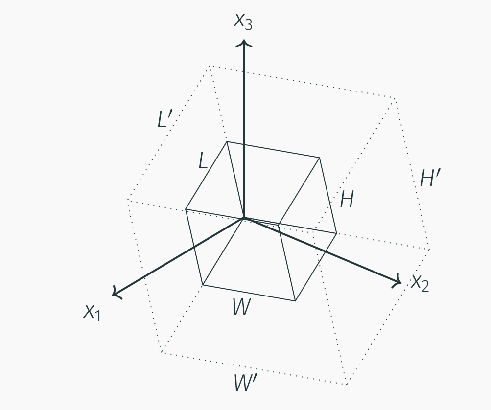
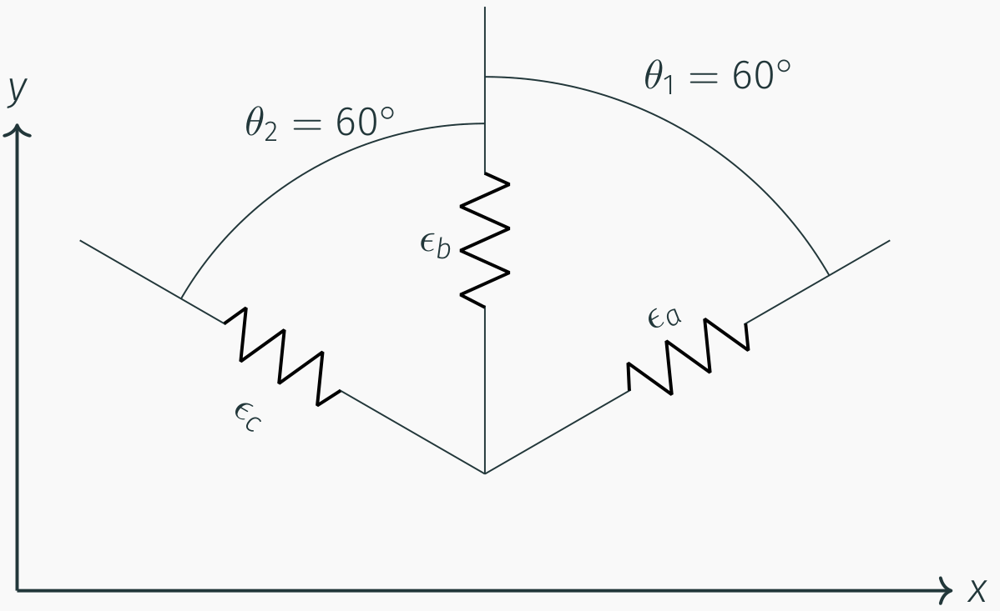
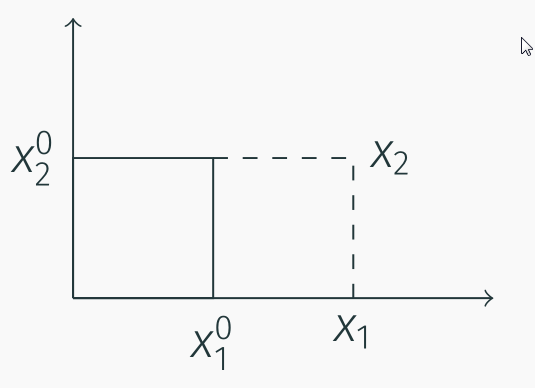

# AE731
## Theory of Elasticity
Dr. Nicholas Smith 
Wichita State University, Department of Aerospace Engineering
September 11, 2019

----
## upcoming schedule

-   Sep 11 - Displacement and Strain
-   Sep 16 - Exam Review, Homework 2 Due
-   Sep 18 - Exam 1

----
## outline

<!-- vim-markdown-toc GFM -->

* principal strains
* special strain definitions
* strain transformation
* exam
* review

<!-- vim-markdown-toc -->

---
# principal strains

----
## principal strains

-   Principal strains are found in exactly the same way as principal values discussed in Chapter 1
- <!-- .element style="list-style-type:none" -->
$$\det[e_{ij} e\delta_{ij}]=0$$
-   Invariants can also be found in the same fashion as in any other tensor

$$\\begin{aligned}
	\\vartheta\_1 &= e\_1 + e\_2 + e\_3\\\\
	\\vartheta\_2 &= e\_1 e\_2 + e\_2 e\_3 + e\_3 e\_1\\\\
	\\vartheta\_3 &= e\_1 e\_2 e\_3
\\end{aligned}$$

----
## principal strains

-   Principal strains and invariants have some important physical meanings
-   *ϑ*1 is called the *cubical dilation*, and is related to the change in volume of the material
-   Note that in the principal direction, there are no shear strains

$$\\begin{bmatrix}
	e\_1 & 0 & 0\\\\
	0 & e\_2 & 0 \\\\
	0 & 0 & e\_3
\\end{bmatrix}$$

-   This means that there is only extensional strain in the principal direction (i.e. a cube will remain a rectangular prism, the corners will maintain 90∘ angles)

----
## volume change

-   Consider a rectangular prism with edges oriented in the principal directions

 <!-- .element width="50%" -->

----
## volume change

-   The volume before deformation is *V* = *LWH*
-   The volume after deformation is given by *V*′ = *L*′*W*′*H*′
-   We can relate the side lengths after deformation to strains
- <!-- .element style="list-style-type:none" -->   
$$e\_1 = \\frac{L^\\prime - L}{L}$$
- <!-- .element style="list-style-type:none" -->   
$$Le_1 + L = L^\prime$$
-   We can now write the volume as *V*′ = *L*(1 + *e*1)*W*(1 + *e*2)*H*(1 + *e*3)

----
## volume change

-   After multiplication, the deformed volume is given as
-   *V*′ = *LWH*(1 + *e*1 + *e*2 + *e*3 + *e*1*e*2 + *e*2*e*3 + *e*1*e*3 + *e*1*e*2*e*3)
-   For small strains, *e**i* ≪ 1, therefore *e*1, *e*2, and *e*3 will be much larger than *e*1*e*2, *e*2*e*3, *e*1*e*3 and *e*1*e*2*e*3.
-   *V*′ = *LWH*(1 + *e*1 + *e*2 + *e*3)

----
## volume change

-   A “dilatation” is defined as the change in volume divided by the original volume
- <!-- .element style="list-style-type:none" -->   
$$\\frac{\\Delta V}{V} = \\frac{V^\\prime - V}{V}$$
-   Substituting the relationships found earlier
- <!-- .element style="list-style-type:none" -->   
$$\\frac{V^\\prime - V}{V} = \\frac{LWH(1+e\_1+e\_2+e\_3) - LWH}{LWH}$$
-   Which simplifies to
- <!-- .element style="list-style-type:none" -->	 
$$e_1 + e_2 + e_3 = \vartheta_1 $$

---
# special strain definitions

----
## spherical strain

-   This dilatation can be used to find the so-called *spherical strain*

$$\\begin{aligned}
	\\tilde{e}\_{ij} = \\frac{1}{3} e\_{kk} \\delta\_{ij} = \\frac{1}{3} \\vartheta\_1 \\delta\_{ij}
\\end{aligned}$$

-   The *deviatoric strain* is found by subtracting the spherical strain from the strain tensor
- <!-- .element style="list-style-type:none" -->   
$$\\hat{e}\_{ij} = e\_{ij} - \\frac{1}{3} e\_{kk} \\delta\_{ij}$$

---
# strain transformation

----
## strain transformation

-   The usual tensor transformation applies to the strain tensor as well
-   *e**ij*′ = *Q**im**Q**jn**e**mn*
-   In many instances, however, we are only concerned with the strain within a plane (for example, when using strain gages).

----
## strain transformation

-   For an in-plane rotation (rotation about *z*-axis), we find

$$Q\_{ij} = \\begin{bmatrix}
	\\cos \\theta & \\cos (90-\\theta) & \\cos 90\\\\
	\\cos (90+\\theta) & \\cos \\theta & \\cos 90\\\\
	\\cos 90 & \\cos 90 & \\cos 0\\\\
	\\end{bmatrix} = \\begin{bmatrix}
	\\cos \\theta & \\sin \\theta & 0\\\\
	-\\sin \\theta & \\cos \\theta & 0\\\\
	0 & 0 & 1\\\\
\\end{bmatrix}$$

----
## strain transformation

-   If we multiply this out, for the in-plane strain terms (*e**x*′, *e**x*′, and *e**xy*′) we find

$$\\begin{aligned}
	e^\\prime\_x &= e\_x \\cos ^2 \\theta + e\_y \\sin^2 \\theta + 2 e\_{xy} \\sin \\theta \\cos \\theta \\\\
	e^\\prime\_y &= e\_x \\sin ^2 \\theta + e\_y \\cos^2 \\theta - 2 e\_{xy} \\sin \\theta \\cos \\theta \\\\
	e^\\prime\_{xy} &= -e\_x \\sin \\theta \\cos \\theta + e\_y \\sin \\theta \\cos \\theta + e\_{xy} (\\cos^2 \\theta - \\sin^2 \\theta)
\\end{aligned}$$

----
## strain transformation

-   This is often re-written using the double-angle formulas

$$\\begin{aligned}
	e^\\prime\_x &= \\frac{e\_x + e\_y}{2} + \\frac{e\_x - e\_y}{2}\\cos 2\\theta + e\_{xy} \\sin 2\\theta \\\\
	e^\\prime\_y &= \\frac{e\_x + e\_y}{2} - \\frac{e\_x - e\_y}{2}\\cos 2\\theta - e\_{xy} \\sin 2\\theta \\\\
	e^\\prime\_{xy} &= \\frac{e\_y - e\_x}{2}\\sin 2\\theta + e\_{xy} \\cos 2\\theta
\\end{aligned}$$

----
## strain transformation

-   Many times it is easy to measure the axial strain directly with strain gages, but the shear strain cannot be easily measured
-   We can use an extra, off-axis strain gage, together with the strain transformation equations, to calculate the shear strain
-   Many companies already do this with “rosettes” which have strain gages at specified angles built-in

----
## example

 <!-- .element width="70%" -->

----
## example

-   Given that *ϵ**a* = 0.005, *ϵ**b* = −0.002 and *ϵ**c* = 0.003, find *e**x*, *e**y*, and *e**xy*.
-   Note that *e**y* = *ϵ**b* = −0.002
-   Set coordinate system so that *ϵ**b* = *e**x*′.
-   Use equation for *e**x*′ with *θ* = 30.
- <!-- .element style="list-style-type:none" -->   
$$e^\\prime\_x = \\frac{e\_x + e\_y}{2} + \\frac{e\_x - e\_y}{2}\\cos 60 + e\_{xy} \\sin 60$$

----
## example

-   We have two unknowns in this equation, so we need another
-   We can use the equation for *e**y*′ with *θ* = 60 so that *ϵ**b* = *e**x*′
- <!-- .element style="list-style-type:none" -->   
$$e^\\prime\_y = \\frac{e\_x + e\_y}{2} - \\frac{e\_x - e\_y}{2}\\cos 120 - e\_{xy} \\sin 120$$

----
## example

-   Substituting known values and simplifying:

$$\\begin{aligned}
	0.01 + 0.002 - 0.002 \\cos 60 &= e\_x (1+\\cos 60) + e\_{xy} \\sin 60 \\\\
	0.006 + 0.002 + 0.002 \\cos 120 &= e\_x (1-\\cos 120) - e\_{xy} \\sin 120
\\end{aligned}$$

-   And solving we find *e**x* = 0.006, *e**y* = −0.002, and *e**xy* = 0.00231.

---
# exam

----
## exam preparations

-   Exams from 2015 and 2017 are posted on Blackboard and the class website
-   This year’s exam will only be 5 problems
-   No equation sheet for the first exam, should remember things like coordinate transformation, Kronecker Delta
-   I do not expect you to remember things like invariants, the alternating symbol, or the strain transformation equations

----
## exam curve example

-   I grade exams problem by problem to try to avoid any bias and keep grading consistent
-   Partial credit I give is meant to translate to what percentage of the problem did you do correctly
-   Curve is primarily intended to correct for me writing/grading too hard (a perfect exam would have no curve)

----
## exam tips

-   Don’t cheat
-   Don’t get hung up on one problem, be mindful of the time
-   If you do not know exactly how to calculate a problem, try to show that you understand the big picture
-   Even when you do understand how to calculate a problem, clearly illustrate the “big picture” in a way that is clear and easy to find

---
# review

----
## topics

-   Chapter 1
    -   Index notation
    -   Solving tensor equations
    -   Coordinate transformation
    -   Principal values
    -   Principal directions
    -   Tensor calculus

----
## topics

-   Chapter 2
    -   Deformations
    -   Deformation gradient
    -   Strain and rotation
    -   Strain transformation
    -   Principal strains

----
## index notation

1.  Free indexes (subscript letters not repeated in a term)
2.  Dummy index (subscript letters repeated in a term)
3.  Rules
    1.  Indexes cannot repeat more than twice
    2.  Free indexes must match on either side of equation
    3.  Dummy index cannot be used as a free index

----
## converting to matrix

-   Sometimes our expression is more complex (involves more terms)
-   e.g. transformation of a matrix
    *a**ij*′ = *Q**ip**Q**jq**a**pq*
    1.  Re-arrange so dummy indexes are adjacent
        *Q**ip**a**pq**Q**jq*
    2.  Identify which (if any) tensors are transposed (dummy indexes should be on the inside of adjacent terms without a transpose)
- <!-- .element style="list-style-type:none" -->        
_Q_*ip* *a* *pq* Q *jq*
- <!-- .element style="list-style-type:none" -->        
\[*Q*\]\[*a*\]\[*Q*\]*T*

----
## example

-   Convert the expression in index notation to Matrix notation
    *A**ik**B**jl**C**ml**D**mk*

  1.  <!-- .element class="fragment" -->Re-arrange to so that dummy indexes are in adjacent terms
		-   <!-- .element style="list-style-type:none" class="fragment" -->        
_A_*ik**D**mk**C**ml**B**jl*

  2.  <!-- .element class="fragment" -->Identify which terms are transposed
		- <!-- .element style="list-style-type:none" class="fragment" --> 
_A_*ik* *D**mk**C* *ml* *B**jl*
		- <!-- .element style="list-style-type:none" class="fragment" --> 
\[*A*\]\[*D*\]*T*\[*C*\]\[*B*\]*T*

----
## solving 

-   Solve the following equation for *E**k* in terms of *C**ij*, *V**ij*, and *a**i*.
- <!-- .element style="list-style-type:none" -->   
_E_*k**δ**ik* = *C**kj*(*V**ij**a**k* − *E**k**δ**ij*)
-   Solve the following equation for *U**k* in terms of *a**i* and *P**j*
-   <!-- .element style="list-style-type:none" -->
$$\\mu \\left\\{\\delta\_{kj}a\_ia\_i + \\frac{1}{1-2\\nu}a\_ka\_j\\right\\}U\_k = P\_j$$
- <!-- .element style="list-style-type:none" -->    
Hint: First solve for *U**k**a**k*, then substitute that relationship to solve for *U**k*
-   Solve the following equation for *A**ij* in terms of *B**ij*
- <!-- .element style="list-style-type:none" -->   
_B_*ij* = *A**ij* + *A**kk**δ**ij*
- <!-- .element style="list-style-type:none" -->    
Hint: First solve for *A**kk* in terms of *B**ij*, then substitute that to solve for *A**ij*

----
## transformation

-   We can express any tensor quantity in terms of a rotated coordinate system
-   The direction cosines help to find the coordinates in the transformed system
- <!-- .element style="list-style-type:none" -->   
_Q_*ij* = cos(*x**i*′,*x**j*)
-   Any-order tensor can be expressed in this form

$$\\begin{aligned}
	a^\\prime &= a & \\text{zero order, scalar}\\\\
	a\_i^\\prime & = Q\_{ip} a\_p & \\text{first order, vector}\\\\
	a\_{ij}^\\prime & = Q\_{ip} Q\_{jq} a\_{pq} & \\text{second order, matrix}\\\\
	a\_{ijk}^\\prime & = Q\_{ip} Q\_{jq} Q\_{kr} a\_{pqr} & \\text{third order}\\\\
	a\_{ijkl}^\\prime & = Q\_{ip} Q\_{jq} Q\_{kr} Q\_{lo} a\_{pqro} & \\text{fourth order}
\\end{aligned}$$

----
## principal values

-   In the 2D coordinate transformation example, we were able to eliminate one value from a vector using coordinate transformation
-   For second-order tensors, we desire to find the “principal values” where all non-diagonal terms are zero
-   The direction determined by the unit vector, *n**j*, is said to be the *principal direction* or *eigenvector* of the symmetric second-order tensor, *a**ij* if there exists a parameter, *λ*, such that
- <!-- .element style="list-style-type:none" -->   
_a_*ij**n**j* = *λn**i*
-   Where *λ* is called the *principal value* or *eigenvalue* of the tensor

----
## principal values

-   We can re-write the equation
- <!-- .element style="list-style-type:none" -->   
(*a**ij* − *λδ**ij*)*n**j* = 0
-   This system of equations has a non-trivial solution if and only if det[*a**ij* − *λδ**ij*]=0
-   This equation is known as the characteristic equation, and we solve it to find the principal values of a tensor

----
## example

-   Find principal values, principal directions, and invariants for the tensor

$$c\_{ij} = \\begin{bmatrix}
	1 & 0 & 2\\\\
	0 & 2 & 0\\\\
	2 & 0 & 4
\\end{bmatrix}$$

----
## example

$$\\begin{vmatrix}
	1-\\lambda & 0 & 2\\\\
	0 & 2-\\lambda & 0\\\\
	2 & 0 & 4-\\lambda
\\end{vmatrix} = 0$$

----
## example

$$\\begin{aligned}
	(1-\\lambda)\[(2-\\lambda)(4-\\lambda)-0\]-0+2\[0-2(2-\\lambda)\] &= 0 \\\\
	(1-\\lambda)(2-\\lambda)(4-\\lambda)-4(2-\\lambda) &= 0
\\end{aligned}$$

$$\\begin{aligned}
	(2-\\lambda)\[(1-\\lambda)(4-\\lambda)-4\] &= 0 \\\\
	(1-\\lambda)(4-\\lambda)-4 &= 0\\\\
	\\lambda^2 -5\\lambda = 0
\\end{aligned}$$

*λ* = 5, 2, 0

----
## example

-   To find the principal direction for *λ*1 = 5

$$\\begin{bmatrix}
	1-5 & 0 & 2\\\\
	0 & 2-5 & 0\\\\
	2 & 0 & 4-5
	\\end{bmatrix}\\begin{Bmatrix}
	n\_1 \\\\ n\_2 \\\\ n\_3
\\end{Bmatrix} = 0$$

$$\\begin{bmatrix}
	-4 & 0 & 2\\\\
	0 & -3 & 0\\\\
	2 & 0 & -1
	\\end{bmatrix}\\begin{Bmatrix}
	n\_1 \\\\ n\_2 \\\\ n\_3
\\end{Bmatrix} = 0$$

----
## example

-   To row-reduce, we can multiply row 3 by 2

$$\\begin{bmatrix}
	-4 & 0 & 2\\\\
	0 & -3 & 0\\\\
	2 & 0 & -1
	\\end{bmatrix}\\begin{Bmatrix}
	n\_1 \\\\ n\_2 \\\\ n\_3
\\end{Bmatrix} = 0$$

-   Now we add this to row 1, which cancels all terms in row 1

$$\\begin{bmatrix}
	0 & 0 & 0\\\\
	0 & -3 & 0\\\\
	2 & 0 & -1
	\\end{bmatrix}\\begin{Bmatrix}
	n\_1 \\\\ n\_2 \\\\ n\_3
\\end{Bmatrix} = 0$$

----
## example

-   We are now left with only two equations

$$\\begin{aligned}
	-3 n\_2 &= 0\\\\
	2 n\_1 -n\_3 &= 0\\\\
\\end{aligned}$$

-   We know that *n*2 = 0. If we let *n*3 = 1, we find $n\_1 = \\frac{1}{2}$
- <!-- .element style="list-style-type:none" -->   
$$n^1 = \\langle \\frac{1}{2}, 0, 1 \\rangle$$

----
## example

-   To find the principal direction for *λ*2 = 2

$$\\begin{bmatrix}
	1-2 & 0 & 2\\\\
	0 & 2-2 & 0\\\\
	2 & 0 & 4-2
	\\end{bmatrix}\\begin{Bmatrix}
	n\_1 \\\\ n\_2 \\\\ n\_3
\\end{Bmatrix} = 0$$

$$\\begin{bmatrix}
	-1 & 0 & 2\\\\
	0 & 0 & 0\\\\
	2 & 0 & 2
	\\end{bmatrix}\\begin{Bmatrix}
	n\_1 \\\\ n\_2 \\\\ n\_3
\\end{Bmatrix} = 0$$

----
## example

-   To row-reduce, we can multiply row 1 by 2

$$\\begin{bmatrix}
	-1 & 0 & 2\\\\
	0 & 0 & 0\\\\
	2 & 0 & 2
	\\end{bmatrix}\\begin{Bmatrix}
	n\_1 \\\\ n\_2 \\\\ n\_3
\\end{Bmatrix} = 0$$

-   Now we add this to row 3, which cancels the first term

$$\\begin{bmatrix}
	-1 & 0 & 2\\\\
	0 & 0 & 0\\\\
	0 & 0 & 4
	\\end{bmatrix}\\begin{Bmatrix}
	n\_1 \\\\ n\_2 \\\\ n\_3
\\end{Bmatrix} = 0$$

----
## example

-   We are left with two equations

$$\\begin{aligned}
	-n\_1 + 2n\_3 &= 0\\\\
	4 n\_3 &= 0
\\end{aligned}$$

-   We know that *n*3 = 0, this also gives *n*1 = 0.
-   *n*2 can be any value, we choose *n*2 = 1
-   *n*2 = ⟨0, 1, 0⟩

----
## example

-   The third principal direction can be found two ways
-   We can either use the same method or use the cross-product *n*3 = *n*1 × *n*2

$$\\begin{bmatrix}
	1 & 0 & 2\\\\
	0 & 2 & 0\\\\
	2 & 0 & 4
	\\end{bmatrix}\\begin{Bmatrix}
	n\_1 \\\\ n\_2 \\\\ n\_3
\\end{Bmatrix} = 0$$

-   After row-reduction

$$\\begin{bmatrix}
	1 & 0 & 2\\\\
	0 & 2 & 0\\\\
	0 & 0 & 0
	\\end{bmatrix}\\begin{Bmatrix}
	n\_1 \\\\ n\_2 \\\\ n\_3
\\end{Bmatrix} = 0$$

-   *n*3 = ⟨ − 2, 0, 1⟩

----
## partial derivatives

-   We usually omit the (*x**i*), but most variables we deal with are functions of *x**i*
-   These are referred to as field variables. e.g.

$$\\begin{aligned}{2}
	a &= a(x\_1, x\_2, x\_3) & &= a(x\_i) \\\\
	a\_i &= a\_i(x\_1, x\_2, x\_3) & &= a\_i(x\_i) \\\\
	a\_{ij} &= a\_{ij}(x\_1, x\_2, x\_3) & &= a\_{ij}(x\_i)
\\end{aligned}$$

----
## partial derivatives

-   We can use comma notation to simplify taking partial derivatives of field variables

$$\\begin{aligned}
	a\_{,i} &= \\frac{\\partial}{\\partial x\_i} a \\\\
	a\_{i,j} &= \\frac{\\partial}{\\partial x\_j} a\_i \\\\
	a\_{ij,k} &= \\frac{\\partial}{\\partial x\_k} a\_{ij} \\\\
\\end{aligned}$$

----
## tensor calculus

-   Let *f* be a scalar-valued function such that $f(x\_i) = \\sqrt{x\_i x\_i}$. Find *f*,*k*
-   We can use the chain rule to differentiate
-   $f\_{,k} = \\frac{1}{2}(x\_i x\_i)^{-\\frac{1}{2}} (x\_i x\_i)\_{,k}$
-   Using the chain rule again to compute (*x**i**x**i*),*k* we find
-   $f\_{,k} = \\frac{1}{2}(x\_i x\_i)^{-\\frac{1}{2}} (x\_i x\_{i,k} + x\_{i,k} x\_i )$
-   Simplifying $f\_{,k} = (x\_i x\_i)^{-\\frac{1}{2}} (x\_i x\_{i,k})$
-   The partial derivative, $\\frac{\\partial x\_i}{\\partial x\_k} = \\delta\_{ik}$
-   Substituting $f\_{,k} = (x\_i x\_i)^{-\\frac{1}{2}} (x\_i \\delta\_{ik})$
-   We also know that *x**i**δ**ik* = *x**k*, and we can also substitute $f = \\sqrt{x\_i x\_i}$ to find
-   $f\_{,k} = \\frac{x\_k}{f}$

----
## deformation

-   A *deformation* is a comparison of two states. The deformation of a material point is expressed as

$$\\begin{gathered}
	x\_i = x\_i(x\_1^0, x\_2^0, x\_3^0) \\quad \\text{or} \\quad x\_i^0 = x\_i^0(x\_1, x\_2, x\_3)
\\end{gathered}$$

-   For example, consider the 2D deformation

$$\\begin{gathered}
	\\begin{Bmatrix}
	x\_1 \\\\ x\_2
	\\end{Bmatrix} =
	\\begin{Bmatrix}
	2 x\_1^0 \\\\ x\_2^0
	\\end{Bmatrix} \\quad \\text{or} \\quad
	\\begin{Bmatrix}
	x\_1^0 \\\\ x\_2^0
	\\end{Bmatrix}
	= \\begin{Bmatrix}
	\\frac{1}{2} x\_1 \\\\ x\_2
	\\end{Bmatrix}
\\end{gathered}$$

----
## displacement

-   Displacement is the shortest distance traveled when a particle moves from one location to another
-   It is identical in Eulerian and Lagrangian descriptions

$$\\begin{aligned}
	u\_i &= (x\_i - x\_i^0)\\\\
	\\begin{Bmatrix}
	u \\\\ v \\\\ w
	\\end{Bmatrix} &= \\begin{Bmatrix}
	x - x^0\\\\
	y - y^0\\\\
	z - z^0
	\\end{Bmatrix}
\\end{aligned}$$

----
## deformation gradients

-   In index notation we write displacements as *u**i*
-   The deformation gradient can be written in this notation as

$$F = u\_{i,j} = \\begin{bmatrix}
	\\frac{\\partial u\_1}{\\partial x\_1} & \\frac{\\partial u\_1}{\\partial x\_2} & \\frac{\\partial u\_1}{\\partial x\_3}\\\\
	\\frac{\\partial u\_2}{\\partial x\_1} & \\frac{\\partial u\_2}{\\partial x\_2} & \\frac{\\partial u\_2}{\\partial x\_3}\\\\
	\\frac{\\partial u\_3}{\\partial x\_1} & \\frac{\\partial u\_3}{\\partial x\_2} & \\frac{\\partial u\_3}{\\partial x\_3}
\\end{bmatrix}$$

----
## strain definition

-   We can separate the deformation gradient into symmetric and antisymmetric parts
-   *u**i*, *j* = *e**ij* + *ω**ij*
-   Where

$$\\begin{aligned}
    e\_{ij} &= \\frac{1}{2}(u\_{i,j} + u\_{j,i})\\\\
    \\omega\_{ij} &= \\frac{1}{2}(u\_{i,j} - u\_{j,i})
\\end{aligned}$$

-   *e**ij* is known as the strain tensor
-   *ω**ij* is known as the rotation tensor

----
## example

-   Find the displacements given the following strain tensor

$$e\_{ij} = \\begin{bmatrix}
	yz & xz & xy\\\\
	xz & 2y & \\frac{1}{2}x^2\\\\
	xy & \\frac{1}{2}x^2 & 3z^2
\\end{bmatrix}$$

-   We start by integrating the diagonal terms
- <!-- .element style="list-style-type:none" -->   
*u* = ∫*yzdx* = *xyz* + *f*(*y*, *z*)
- <!-- .element style="list-style-type:none" -->   
*v* = ∫2*ydy* = *y*2 + *g*(*x*, *z*)
- <!-- .element style="list-style-type:none" -->   
*w* = ∫3*z*2*dz* = *z*3 + *h*(*x*, *y*)

----
## example

-   Next we need to find the shear terms

$$\\begin{aligned}
	e\_{xy} &= \\frac{1}{2}(u\_{,y}+v\_{,x})\\\\
	xz &= \\frac{1}{2}(xz + f\_{,y} + g\_{,x})
\\end{aligned}$$

$$\\begin{aligned}
	e\_{xz} &= \\frac{1}{2}(u\_{,z}+w\_{,x})\\\\
	xy &= \\frac{1}{2}(xy + f\_{,z} + h\_{,x})
\\end{aligned}$$

$$\\begin{aligned}
	e\_{yz} &= \\frac{1}{2}(v\_{,z}+w\_{,y})\\\\
	\\frac{1}{2}x^2 &= \\frac{1}{2}(g\_{,z} + h\_{,y})
\\end{aligned}$$

----
## example

-   Note that we cannot uniquely solve this (any arbitrary rotation *ω**ij* can be added and will still produce a valid strain)
-   Assume *ω**ij* = 0

$$\\begin{aligned}
	\\frac{1}{2}(u\_{,y} - v\_{,x}) &= 0 \\\\
	xz + f\_{,y} - g\_{,x} &= 0 \\\\
	f\_{,y} &= g\_{,x} - xz
\\end{aligned}$$

----
## example

-   We can now substitute this in the *e**xy* expression

$$\\begin{aligned}
	e\_{xy} &= \\frac{1}{2}(u\_{,y}+v\_{,x})\\\\
	xz &= \\frac{1}{2}(xz + f\_{,y} + g\_{,x})\\\\
	2 xz &= xz + g\_{,x} - xz + g\_{,x})\\\\
	2g\_{,x} &= 2xz \\\\
	g(x,z) &= \\frac{1}{2}x^2z + g\_2(z)
\\end{aligned}$$

-   We can substitute this into the rotation expression to find *f*,*y*

$$\\begin{aligned}
	f\_{,y} &= g\_{,x} - xz\\\\
	f\_{,y} &= xz - xz\\\\
	f(y,z) &= f\_2(z)
\\end{aligned}$$

----
## example

-   Next we consider *ω**xz*

$$\\begin{aligned}
	\\frac{1}{2}(u\_{,z} - w\_{,x}) &= 0 \\\\
	xy + f\_{,z} - h\_{,x} &= 0\\\\
	h\_{,x} &= xy + f\_{,z}
\\end{aligned}$$

-   Substituting this into *e**xz* gives

$$\\begin{aligned}
	e\_{xz} &= \\frac{1}{2}(xy+f\_{,z}+xy + f\_{,z})\\\\
	xy &= xy + f\_{,z}\\\\
	f\_{,z} &= 0\\\\
	f\_2(z) &= 0
\\end{aligned}$$

----
## example

-   Substituting back into *ω**xz* we find

$$\\begin{aligned}
	h\_{,x} &= xy + f\_{,z}\\\\
	h\_{,x} &= xy\\\\
	h(x,y) &= \\frac{1}{2}x^2 y + h\_2(y)
\\end{aligned}$$

-   The last term to consider is *ω**yz*

$$\\begin{aligned}
	\\frac{1}{2}(v\_{,z}-w\_{,y}) &= 0\\\\
	\\frac{1}{2}x^2 + g\_{2,z} - (\\frac{1}{2}x^2 + h\_{2,y}) &= 0\\\\
	\\frac{1}{2}x^2 + g\_{2,z} &= \\frac{1}{2}x^2 + h\_{2,y}
\\end{aligned}$$

----
## example

-   Substituting into *e**yz*

$$\\begin{aligned}
	e\_{yz} &= \\frac{1}{2}(v\_{,z}+w\_{,y})\\\\
	\\frac{1}{2}x^2 &= \\frac{1}{2}(\\frac{1}{2}x^2 + g\_{2,z} + \\frac{1}{2}x^2 + h\_{2,y})\\\\
	\\frac{1}{2}x^2 &= \\frac{1}{2}x^2 + g\_{2,z}\\\\
	g\_{2,z} &= 0\\\\
	g(x,z) &= \\frac{1}{2} x^2 z
\\end{aligned}$$

-   And substituting back into *ω**yz*

$$\\begin{aligned}
	\\frac{1}{2}x^2 &= \\frac{1}{2}x^2 + h\_{2,y}\\\\
	h\_(2,y) &= 0\\\\
	h\_2(y) &= 0
\\end{aligned}$$

----
## example

$$\\begin{aligned}
	u &= xyz\\\\
	v &= y^2 + \\frac{1}{2}x^2z\\\\
	w &= z^3 + \\frac{1}{2}x^2y
\\end{aligned}$$

