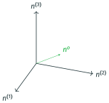
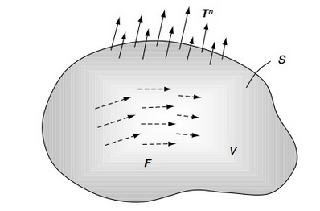
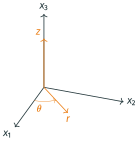
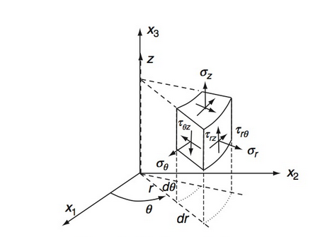
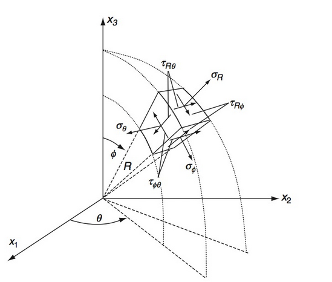

# AE731
## Theory of Elasticity
Dr. Nicholas Smith 
Wichita State University, Department of Aerospace Engineering
September 21, 2021

----
## upcoming schedule

-   Sep 21 - Equilibrium Equations
-   Sep 23 - Material Characterization
-   Sep 24 - Homework 3 Due
-   Sep 28 - Thermoelasticity
-   Sep 30 - Boundary Conditions

----
## outline

<!-- vim-markdown-toc GFM -->

* other stress definitions
* equilibrium equations
* spherical and cylindrical coordinates

<!-- vim-markdown-toc -->

---
# other stress definitions

----
## spherical and deviatoric stress

-   The spherical and deviatoric stress definitions are identical to the analogous strain definitions
-   Spherical stress:

`$$\tilde{\sigma}_{ij} = \frac{1}{3}\sigma_{kk}\delta_{ij}$$`

-   Deviatoric stress:

`$$\hat{\sigma}_{ij} = \sigma_{ij} - \tilde{\sigma}_{ij}$$`

----
## failure theories

-   Many failure theories rely on some form of combined stress
-   One measure is known as the *octahedral stress*
-   We define a special plane whose normal forms the same angle of intersection with the three principal directions
-   This plane is known as the *octahedral plane*

----
## octahedral stress

 <!-- .element width="40%" -->

----
## octahedral stress

-   In the principal direction we know that

`$$\sigma_{ij} = \begin{bmatrix}
	\sigma_1 & 0 & 0\\
	0 & \sigma_2 & 0\\
	0 & 0 & \sigma_3
\end{bmatrix}$$`

-   The normal vector for the octahedral plane in this system is

`$$n^o = \frac{1}{\sqrt{3}}\langle 1, 1, 1 \rangle$$`

----
## octahedral stress

-   And the octahedral normal stress can be found by

`$$\begin{aligned}
	\sigma_{oct} &= t_i n_i \\
	&= \sigma_{ij} n_j n_i \\
	&= \frac{1}{3}\sigma_{kk}
\end{aligned}$$`

----
## octahedral stress

-   We can also find the shear stress in the octahedral plane

`$$\begin{aligned}
	S^2 &= t_i t_i - N^2\\
	&= \sigma_{ij} n_j \sigma_{ik} n_k - N^2\\
	&= \sigma_1^2 n_1^2 + \sigma_2^2 n_2^2 + \sigma_3^2 n_3^2 - N^2\\
\end{aligned}$$`

----
## octahedral stress

-   We can simplify this to

`$$\tau_{oct} = \frac{1}{3}\sqrt{(\sigma_1-\sigma_2)^2+(\sigma_2-\sigma_3)^2+(\sigma_3-\sigma_1)^2}$$`

-   Or in terms of invariants

`$$\tau_{oct} = \frac{1}{3}\sqrt{2I_1^2 - 6I_2}$$`

----
## von mises stress

-   Another common stress is known as the Von Mises stress
-   Von Mises stress is related to the *distortional strain energy*
-   Sometimes the Von Mises stress is referred to as the effective stress

`$$\sigma_e = \sigma_{VM} = \frac{1}{\sqrt{2}}\sqrt{(\sigma_1-\sigma_2)^2+(\sigma_2-\sigma_3)^2+(\sigma_3-\sigma_1)^2}$$`

----
## large deformation

-   The stress tensor we have developed is known as the Cauchy stress tensor
-   The Cauchy stress tensor is expressed in the deformed coordinate system
-   This is appropriate for small deformation problems, where the un-deformed and deformed systems are nearly identical
-   For large deformation problems, we may wish to define stress in terms of the un-deformed coordinate system

----
## large deformation

-   Lagrangian stress is defined as

`$$\sigma_{pi}^L = \frac{\rho^0}{\rho}\sigma_{ji} \frac{\partial x_p^0}{\partial x_j}$$`

----
## large deformations

-   The Cauchy stress tensor is symmetric

`$$\sigma_{ij} = \sigma_{ji}$$`

-   Substitution of this relationship for Lagrangian stress, however, gives

`$$\sigma_{pi}^L \frac{\partial x_j}{x^0_p} = \sigma_{pj}^L \frac{\partial x_i}{\partial x_p^0}$$`

-   Which indicates that `$\sigma_{ij}^L$` is not symmetric

----
## piola kirchoff stress

-   We can force symmetry by changing the definition to

`$$\frac{\partial x_i}{\partial x_j^0}\sigma_{pj}^K = \frac{\rho^0}{\rho}\sigma_{ji} \frac{\partial x_p^0}{\partial x_j}$$`

-   From this we can find the Piola-Kirchoff stress, which is symmetric

`$$\sigma_{pq}^K = \frac{\rho^0}{\rho}\sigma_{ji} \frac{\partial x_p^0}{\partial x_i}\frac{\partial x_q^0}{\partial x_j}$$`

-   This is also known as the *second Piola stress tensor* or the *Kirchoff stress tensor*
-   In this course we focus on small deformations, so we will only use the Cauchy stress tensor

---
# equilibrium equations

----
## static equilibrium

----
## static equilibrium

-   We primarily deal with bodies in static equilibrium
-   This means that all forces and moments must sum to zero
-   For a closed sub-domain of volume *V* and surface area *S* with internal body forces and applied tractions, we find

`$$\iint_S t_i^n dS + \iiint_V F_i dV = 0$$`

----
## static equilibrium

-   Using the Cauchy stress theorem, we can replace the traction vector with the stress tensor

`$$\iint_S \sigma_{ji}n_j dS + \iiint_V F_i dV = 0 $$`

-   We can also apply the divergence theorem to convert the surface integral to a volume integral

`$$\iiint_V(\sigma_{ji,j} + F_i) dV = 0$$`

----
## static equilibrium

-   Since the volume is arbitrary (we could choose any volume and the conditions for equilibrium would still hold), the integrand must vanish

`$$\sigma_{ji,j} + F_i = 0 $$`

----
## equilibrium equations

-   Written in scalar form, the equilibrium equations are

`$$\begin{aligned}
	\frac{\partial \sigma_x}{\partial x} + \frac{\partial \tau_{xy}}{\partial y} + \frac{\partial \tau_{xz}}{\partial z} + F_x &= 0\\
	\frac{\partial \tau_{xy}}{\partial x} + \frac{\partial \sigma_y}{\partial y} + \frac{\partial \tau_{yz}}{\partial z} + F_y &= 0\\
	\frac{\partial \tau_{xz}}{\partial x} + \frac{\partial \tau_{yz}}{\partial y} + \frac{\partial \sigma_z}{\partial z} + F_z &= 0\\
\end{aligned}$$`

----
## angular momentum

-   Similarly, the principle of angular momentum states that the moment forces must all sum to zero as well

`$$\iint_S \epsilon_{ijk}x_jt_k^n dS + \iiint_V \epsilon_{ijk}x_jF_k dV = 0$$`

-   Once again we use Cauchy’s stress theorem

`$$\iint_S \epsilon_{ijk}x_j\sigma_{lk}n_l dS + \iiint_V \epsilon_{ijk}x_jF_k dV = 0$$`

-   And the divergence theorem

`$$\iiint_V [(\epsilon_{ijk}x_j\sigma_{lk})_{,l} + \epsilon_{ijk}x_jF_k ]dV = 0$$`

----
## angular momentum

-   Expanding the derivative using the chain rule gives

`$$\iiint_V [\epsilon_{ijk}x_{j,l}\sigma_{lk} \epsilon_{ijk}x_j\sigma_{lk,l} + \epsilon_{ijk}x_jF_k ]dV = 0$$`

-   Which can be simplified (recall that `$\sigma_{ji,j} + F_i = 0$`)

`$$\begin{aligned}
	\iiint_V [ \epsilon_{ijk}\delta_{jl}\sigma_{lk} + \epsilon_{ijk}x_j\sigma_{lk,l} + \epsilon_{ijk}x_jF_k ] dV &= 0\\
	\iiint_V [ \epsilon_{ijk}\sigma_{jk} - \epsilon_{ijk}x_jF_k + \epsilon_{ijk}x_jF_k ] dV &= 0\\
	\iiint_V \epsilon_{ijk}\sigma_{jk} dV &= 0
\end{aligned}$$`

----
## angular momentum

-   Using the same argument as before (arbitrary volume) the integrand must vanish

`$$\epsilon_{ijk}\sigma_{jk} = 0$$`

-   Since the alternating symbol is antisymmetric in *jk*, `$\sigma_{jk}$` must be symmetric in *jk* for this to vanish

-   And thus we have proved that the stress tensor is symmetric, thus equilibrium and angular momentum equations are satisfied when

`$$\sigma_{ji,j} + F_i = 0$$`

----
## example

-   Under what circumstances is the following stress field in static equilibrium?

-   `$\sigma_{11} = 3x_1 + k_1 x_2^2$`, `$\sigma_{22} = 2x_1 + 4x_2$` `$\sigma_{12} = \sigma_{21} = a+ bx_1 + cx_1^2 + dx_2 + ex_2^2 + f x_1 x_2$`

-   We are only examining the stress field, so we neglect any internal body forces
-   The first equilibrium equation gives

`$$\frac{\partial \sigma_{11}}{\partial x_1} + \frac{\partial \sigma_{12}}{\partial x_2} = 0$$`

`$$3 + d + 2ex_2 + fx_1 = 0$$`

----
## example

-   The second equilibrium equation gives

`$$\frac{\partial \sigma_{12}}{\partial x_1} + \frac{\partial \sigma_{22}}{\partial x_2} = 0$$`

`$$b + 2cx_1 + fx_2 + 4 = 0 $$`

---
# spherical and cylindrical coordinates

----
## cylindrical coordinates

 <!-- .element width="30%" -->

----
## stress in cylindrical coordinates

	
-   We can also define stress in a cylindrical coordinate system

	

----
## stress in cylindrical coordinates

-   The stress tensor in cylindrical coordinates is

`$$\sigma_{ij} = \begin{bmatrix}
	\sigma_r & \tau_{r\theta}& \tau_{rz} \\
	\tau_{r\theta} & \sigma_{\theta} & \tau_{\theta z}\\
	\tau_{rz} & \tau_{\theta z} & \sigma_z
\end{bmatrix}$$`

----
## equilibrium in cylindrical coordinates

-   Using the derivative relationships developed in Chapter 1, we can express the equilibrium equations as

`$$\begin{aligned}
	\frac{\partial \sigma_r}{\partial r} + \frac{1}{r} \frac{\partial \tau_{r \theta}}{\partial \theta} + \frac{\partial \tau_{rz}}{\partial z} + \frac{1}{r}(\sigma_r - \sigma_\theta) + F_r &= 0\\
	\frac{\partial \tau_{r \theta}}{\partial r} + \frac{1}{r} \frac{\partial \sigma_\theta}{\partial \theta} + \frac{\partial \tau_{\theta z}}{\partial z} + \frac{2}{r}\tau_{r\theta} + F_\theta &= 0\\
	\frac{\partial \tau_{r z}}{\partial r} + \frac{1}{r} \frac{\partial \tau_{\theta z}}{\partial \theta} + \frac{\partial \sigma_z}{\partial z} + \frac{1}{r}\tau_{rz} + F_z &= 0
\end{aligned}$$`

----
## spherical coordinates

	
-   We can do the same thing in spherical coordinates

	

----
## spherical coordinates

-   The stress tensor in spherical coordinates is

`$$\sigma_{ij} = \begin{bmatrix}
	\sigma_r & \tau_{r\phi}& \tau_{r\theta} \\
	\tau_{r\phi} & \sigma_{\phi} & \tau_{\phi \theta}\\
	\tau_{r\theta} & \tau_{\phi \theta} & \sigma_\theta
\end{bmatrix}$$`

----
## equilibrium in spherical coordinates

-   Using the derivative relationships developed in Chapter 1, we can express the equilibrium equations as

`$$\begin{aligned}
	\frac{\partial \sigma_r}{\partial r} + \frac{1}{r} \frac{\partial \tau_{r \phi}}{\partial \phi} + \frac{1}{r \sin \phi}\frac{\partial \tau_{r\theta}}{\partial \theta} + \frac{1}{r}(2\sigma_r - \sigma_\phi - \sigma_\theta + \tau_{r\phi}\cot \phi) + F_r &= 0\\
	\frac{\partial \tau_{r \phi}}{\partial r} + \frac{1}{r} \frac{\partial \sigma_\phi}{\partial \phi} + \frac{1}{r \sin \phi}\frac{\partial \tau_{\phi \theta}}{\partial \theta} + \frac{1}{r} [(\sigma_\phi -\sigma_\theta)\cot \phi + 3\tau_{r\phi}] + F_\phi &= 0\\
	\frac{\partial \tau_{r \theta}}{\partial r} + \frac{1}{r} \frac{\partial \tau_{\phi \theta}}{\partial \phi} + \frac{1}{r \sin \phi}\frac{\partial \sigma_\theta}{\partial \theta} + \frac{1}{r}(2 \tau_{\phi \theta}\cot \phi + 3 \tau_{r \theta}) + F_\theta &= 0
\end{aligned}$$`

