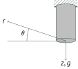
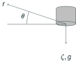
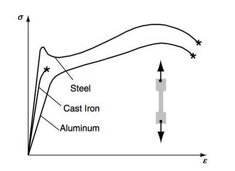
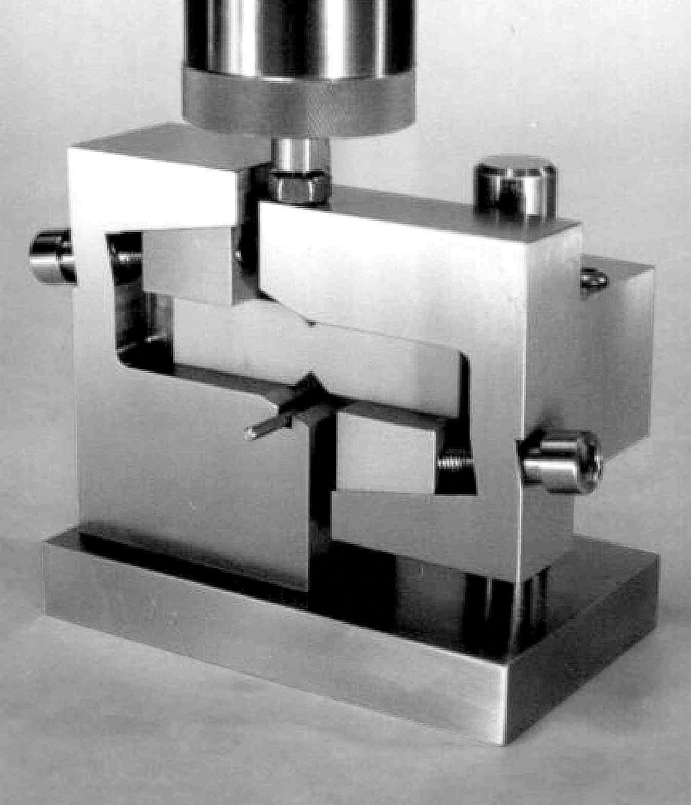
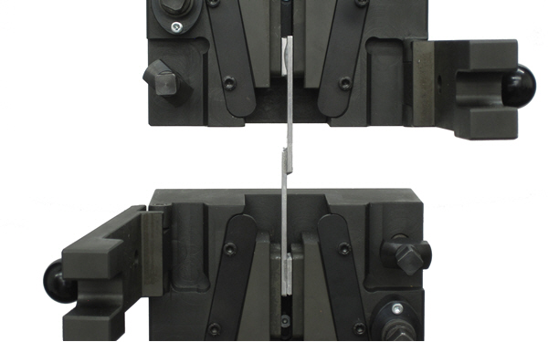
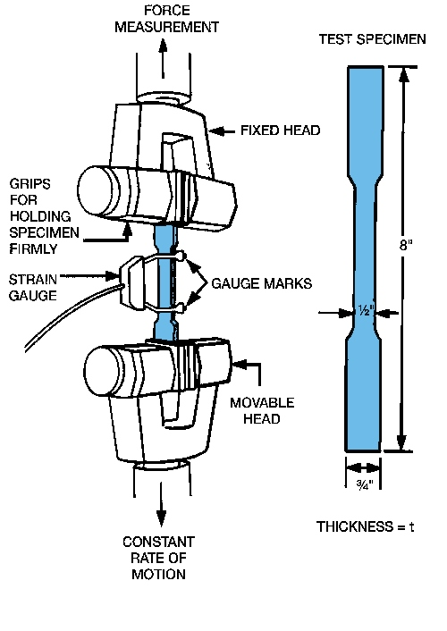
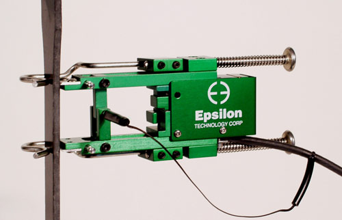
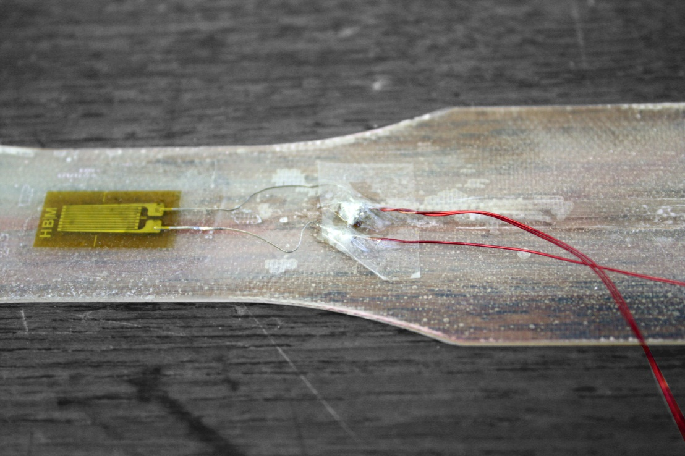
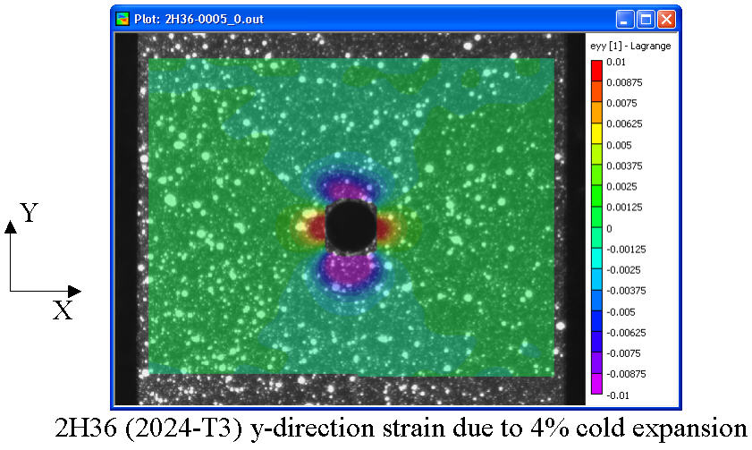

# AE731
## Theory of Elasticity
Dr. Nicholas Smith 
Wichita State University, Department of Aerospace Engineering
October 2, 2019

----
## upcoming schedule

-   Oct 2 - Material Characterization, HW3 Due
-   Oct 7 - Thermoelasticity
-   Oct 9 - Boundary Conditions
-   Oct 14 - Fall Break (no class)

----
## outline

<!-- vim-markdown-toc GFM -->

* review
* material characterization
* hooke’s law
* matrix relationship
* physical meaning

<!-- vim-markdown-toc -->

---
# review

----
## example

	
-   Suppose a hanging cylinder has a density given by *ρ* = *r*2
-   Recall that self-weight is the only force acting on this problem

	

----
## example

-   We know that there is no traction along the outer surfaces, and we can also assume that *σ**ij* = *σ**ij*(*z*), since the only force is acting in the z direction

-   Using Cauchy’s stress theorem we can find

$$\\begin{aligned}
	t\_j &= \\sigma\_{ij} n\_i = 0\\\\
	&= \\langle \\sigma\_{rr}n\_r + \\sigma\_{r\\theta} n\_\\theta + \\sigma\_{rz} n\_z, \\sigma\_{\\theta r}n\_r + \\sigma\_{\\theta \\theta} n\_\\theta + \\sigma\_{\\theta z} n\_z, \\sigma\_{zr}n\_r + \\sigma\_{z\\theta} n\_\\theta + \\sigma\_{zz} n\_z\\rangle \\\\
	&= \\langle \\sigma\_{rr}, \\sigma\_{\\theta r}, \\sigma\_{z r} \\rangle = 0 \\qquad \\text{at } r=a
\\end{aligned}$$

----
## example

-   And on the bottom face
-   *σ**rz* = *σ**θ**z* = *σ**zz* = 0

----
## example

-   To find the stress in the *z* direction, we use the third equilibrium equation

$$\\frac{\\partial \\tau\_{r z}}{\\partial r} + \\frac{1}{r} \\frac{\\partial \\tau\_{\\theta z}}{\\partial \\theta} + \\frac{\\partial \\sigma\_z}{\\partial z} + \\frac{1}{r}\\tau\_{rz} + F\_z = 0$$

-   We can substitute known values to find that

$$\\frac{\\partial \\sigma\_z}{\\partial z} + r^2 g = 0$$

----
## example

	
-   Since we desire to find the stress at any point, we introduce a variable to indicate the coordinate of our free body diagram cut

	

----
## example

-   We integrate over this free body to find

$$\\begin{aligned}
	\\sigma\_z &=  -\\int\_\\zeta^{-L} r^2 g dz\\\\
	&= r^2 g (L-z)
\\end{aligned}$$

-   In this case, the stress is a function of radial distance (just like the body force was)

----
## example

-   We can find the average stress at some location, *z*

$$\\bar{\\sigma}\_z = \\frac{1}{A} \\int \\sigma\_z dA$$

-   In this case this integral becomes

$$\\bar{\\sigma}\_z = \\frac{1}{A} \\int\_0^R \\int\_0^{2\\pi} r^2 g (L-z) r dr d\\theta$$
$$\\bar{\\sigma}\_z = \\frac{1}{\\pi R^2} \\int\_0^R 2 \\pi r^3 g (L-z) dr$$
$$\\begin{aligned}
	\\bar{\\sigma}\_z &= \\frac{2 \\pi }{4 \\pi R^2} R^4 g (L-z)\\\\
	&= \\frac{R^2}{2} g (L-z)
\\end{aligned}$$

---
# material characterization

----
## material characterization

-   We have now formally defined stress and strain tensors, it is desirable to relate these two tensors to one another
-   In this course we make the following assumptions about material behavior:
    -   Small strains
    -   Linear elastic
    -   Rate-independent
    -   Homogeneous

----
## tensile test

----
## shear tests

 <!-- .element width="40%" -->

----
## shear tests

---
# hooke’s law

----
## hooke’s law

-   In its most general form, Hooke’s Law relates the stress and strain tensors by the Cauchy stiffness tensor

_σ_*ij* = *C**ijkl**ϵ**kl*

-   We could, equivalently write this equation in terms of the compliance

_ϵ_*ij* = *S**ijkl**σ**kl*

----
## hooke’s law

-   There are 81 terms in *C**ijkl* (3x3x3x3)
-   Many of these are redundant, so a contracted notation is sometimes convenient.
-   Symmetry of the stress tensor and strain tensors requires symmetries in *C**ijkl*

$$\\begin{aligned}
	\\sigma\_{ij} &= C\_{ijkl}\\epsilon\_{kl}\\\\
	&= \\sigma\_{ji}\\\\
	&= C\_{jikl} \\epsilon\_{kl}\\\\
\\end{aligned}$$

-   *C**ijkl* = *C**jikl*
-   *C**ijkl* = *C**ijlk*

----
## hooke’s law

-   Strain energy concepts further require that *C**ijkl* = *C**klij*
-   This reduces the number of unique, unknown constants to 21
-   In general, if we cannot make any assumptions about material symmetry, there are 21 parameters that we need to find to determine the linear behavior of a material.

---
# matrix relationship

----
## matrix form

-   Due to the symmetry in *σ**ij* and *ϵ**ij*, however, many of these are redundant
-   For this reason (as well as convenience in writing), many will often form a matrix equation, with *σ* and *ϵ* acting as vectors.

----
## matrix form

$$\\begin{Bmatrix}
	\\sigma\_1 \\\\ \\sigma\_2 \\\\ \\sigma\_3 \\\\ \\sigma\_4 \\\\ \\sigma\_5 \\\\ \\sigma\_6
	\\end{Bmatrix} = \\begin{bmatrix}
	C\_{11} & C\_{12} & C\_{13} & C\_{14} & C\_{15} & C\_{16}\\\\
	C\_{21} & C\_{22} & C\_{23} & C\_{24} & C\_{25} & C\_{26}\\\\
	C\_{31} & C\_{32} & C\_{33} & C\_{34} & C\_{35} & C\_{36}\\\\
	C\_{41} & C\_{42} & C\_{43} & C\_{44} & C\_{45} & C\_{46}\\\\
	C\_{51} & C\_{52} & C\_{53} & C\_{54} & C\_{55} & C\_{56}\\\\
	C\_{61} & C\_{62} & C\_{63} & C\_{64} & C\_{65} & C\_{66}\\\\
	\\end{bmatrix} \\begin{Bmatrix}
	\\epsilon\_1 \\\\ \\epsilon\_2 \\\\ \\epsilon\_3 \\\\ 2\\epsilon\_4 \\\\ 2\\epsilon\_5 \\\\ 2\\epsilon\_6
\\end{Bmatrix}$$

-   In this form, the usual tensor transformation equations cannot be used. Also, be careful as *σ*4, *σ*5, and *σ*6 do not always represent the same terms (depends on textbook/community), also sometimes the engineering form of shear (*γ*12 = 2*ϵ*12) is used.

----
## matrix form

-   If we consider the *σ*11 term, we find that

$$\\begin{aligned}
	\\sigma\_{11} &= C\_{11kl} \\epsilon\_{kl}\\\\
	&= C\_{1111} \\epsilon\_{11} + C\_{1112} \\epsilon\_{12} + C\_{1113} \\epsilon\_{13} + \\\\
	&C\_{1121} \\epsilon\_{21} + C\_{1122} \\epsilon\_{22} + C\_{1123} \\epsilon\_{23} + \\\\
	&C\_{1131} \\epsilon\_{31} + C\_{1132} \\epsilon\_{32} + C\_{1133} \\epsilon\_{33} \\\\
\\end{aligned}$$

-   If we simplify this, we find

_σ_11 = *C*1111*ϵ*11 + 2*C*1112*ϵ*12 + 2*C*1113*ϵ*13 + *C*1122*ϵ*22 + 2*C*1123*ϵ*23 + *C*1133*ϵ*33

----
## matrix form

-   In matrix form, we write the normal terms first, and we include the factor of 2 in the strain vector, giving

_σ_1 = *C*11*ϵ*1 + *C*12*ϵ*2 + *C*13*ϵ*3 + *C*14*ϵ*4 + *C*15*ϵ*5 + *C*16*ϵ*6

---
# physical meaning

----
## physical meaning

-   We will discuss symmetries in greater detail in a later lecture
-   An isotropic material reduces the unknown material constants to two

$$\\epsilon\_{ij} = \\frac{1+\\nu}{E}\\sigma\_{ij} - \\frac{\\nu}{E}\\sigma\_{kk} \\delta\_{ij}$$

----
## simple tension

 <!-- .element width="35%" -->

----
## strain measurement

-   How do we measure strain?
    -   grip displacement
    -   extensometers
    -   strain gages
    -   digital image correlation

----
## extensometers

-   Reusable, quick to use, apply, and interpret
-   May slip, only gives one direction, can initiate failure site

----
## strain gages

-   Can be applied in any direction, very accurate
-   Must be perfectly adhered, subject to user-error in attaching, can require complicated electronics to read results

 <!-- .element width="35%" -->

----
## digital image correlation

-   Gives full-field strain tensor
-   Requires expensive equipment, software
-   Cannot compute values near the edges

	

----
## simple tension

-   If we consider a simple tension test, if done correctly the applied stress will be

$$\\sigma\_{ij} = \\begin{bmatrix}
	\\sigma & 0 & 0 \\\\
	0 & 0 & 0\\\\
	0 & 0 & 0
\\end{bmatrix}$$

-   What will the strain be?

----
## simple tension

-   Recall Hooke’s law for isotropic material

$$\\epsilon\_{ij} = \\frac{1+\\nu}{E}\\sigma\_{ij} - \\frac{\\nu}{E}\\sigma\_{kk} \\delta\_{ij}$$
$$\\epsilon\_{ij} = \\begin{bmatrix}
	\\frac{1+\\nu}{E} \\sigma - \\frac{\\nu}{E}\\sigma &0 &0\\\\
	0 & -\\frac{\\nu}{E}\\sigma & 0\\\\
	0 & 0 & -\\frac{\\nu}{E}\\sigma
\\end{bmatrix}$$

$$\\epsilon\_{ij} = \\begin{bmatrix}
	\\frac{1}{E} \\sigma &0 &0\\\\
	0 & -\\frac{\\nu}{E}\\sigma & 0\\\\
	0 & 0 & -\\frac{\\nu}{E}\\sigma
\\end{bmatrix}$$

----
## pure shear

-   In pure shear, the applied stress will be

$$\\sigma\_{ij} = \\begin{bmatrix}
	0 & \\tau & 0 \\\\
	\\tau & 0 & 0\\\\
	0 & 0 & 0
\\end{bmatrix}$$

-   What will the strain be?

----
## pure shear

-   Recall Hooke’s law for isotropic material

$$\\epsilon\_{ij} = \\frac{1+\\nu}{E}\\sigma\_{ij} - \\frac{\\nu}{E}\\sigma\_{kk} \\delta\_{ij}$$
$$\\epsilon\_{ij} = \\begin{bmatrix}
	0 &\\frac{1+\\nu}{E}\\tau &0\\\\
	\\frac{1+\\nu}{E}\\tau & 0 & 0\\\\
	0 & 0 & 0
\\end{bmatrix}$$

----
## hydrostatic pressure

-   In hydrostatic pressure (can be compression or tension), equal normal stress is applied in all three directions

$$\\sigma\_{ij} = \\begin{bmatrix}
	p & 0 & 0 \\\\
	0 & p & 0\\\\
	0 & 0 & p
\\end{bmatrix}$$

-   What will the strain be?

----
## hydrostatic pressure

-   Recall Hooke’s law for isotropic material

$$\\epsilon\_{ij} = \\frac{1+\\nu}{E}\\sigma\_{ij} - \\frac{\\nu}{E}\\sigma\_{kk} \\delta\_{ij}$$
$$\\epsilon\_{ij} = \\begin{bmatrix}
	\\frac{1+\\nu}{E}p - \\frac{3\\nu}{E}p &0 &0\\\\
	0 & \\frac{1+\\nu}{E}p - \\frac{3\\nu}{E}p & 0\\\\
	0 & 0 & \\frac{1+\\nu}{E}p - \\frac{3\\nu}{E}p
\\end{bmatrix}$$

$$\\epsilon\_{ij} = \\begin{bmatrix}
	\\frac{1-2\\nu}{E}p &0 &0\\\\
	0 & \\frac{1-2\\nu}{E}p & 0\\\\
	0 & 0 & \\frac{1-2\\nu}{E}p
\\end{bmatrix}$$

----
## next class

-   Material symmetry (monoclinic, isotropic, orthotropic, transversely isotropic)
-   Poisson’s ratio in anisotropic materials
-   Thermoelastic considerations

