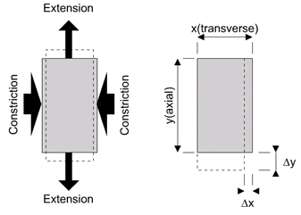

# AE731
## Theory of Elasticity
Dr. Nicholas Smith 
Wichita State University, Department of Aerospace Engineering
October 7, 2019

----
## upcoming schedule

-   Oct 7 - Thermoelasticity
-   Oct 9 - Boundary Conditions
-   Oct 14 - Fall Break (no class)
-   Oct 16 - Boundary Conditions

----
## outline

<!-- vim-markdown-toc GFM -->

* elastic constants
* thermoelasticity
* material symmetries
* poisson’s ratio
* group problems

<!-- vim-markdown-toc -->

---
# elastic constants

----
## isotropic materials

| | *λ*= | *μ* = *G*= | *E*= | *ν*= | *K*= |
|-:|---:|----------:|-------:|-----:|-----:|
|  *λ*, *μ*|                                     |                                  |  $\\frac{\\mu(3\\lambda + 2\\mu)}{\\lambda + \\mu}$|  $\\frac{\\lambda}{2(\\lambda + \\mu)}$|  $\\frac{3\\lambda + 2\\mu}{3}$|
|  *G*, *E*|              $\\frac{G(2G-E)}{E-3G}$|                                  |                                                    |                      $\\frac{E-2G}{2G}$|            $\\frac{GE}{3(3G-E}$|
|  *G*, *ν*|            $\\frac{2G\\nu}{1-2\\nu}$|                                  |                                       2*G*(1 + *G*)|                                        |       $\\frac{2G(1+G)}{3(1-2G}$|
|  *E*, *ν*|  $\\frac{\\nu E}{(1+\\nu)(1-2\\nu)}$|            $\\frac{E}{2(1+\\nu)}$|                                                    |                                        |          $\\frac{E}{3(1-2\\nu}$|
|  *K*, *E*|             $\\frac{3K(3K-E)}{9K-E}$|               $\\frac{3EK}{9K-E}$|                                                    |                      $\\frac{3K-E}{6K}$|                                |
|  *ν*, *K*|             $\\frac{3K\\nu}{1+\\nu}$|  $\\frac{3K(1-2\\nu)}{2(1+\\nu)}$|                                      3*K*(1 − 2*ν*)|                                        |                                |

---
# thermoelasticity

----
## thermal expansion

-   Thermal expansion/contraction is fairly well known
-   Most materials shrink at colder temperatures, but this is not always the case
-   Thermal deformations will alter the strain field
-   We can decompose strain into mechanical and thermal components

_ϵ_*ij* = *ϵ**ij*(*M*) + *ϵ**ij*(*T*)

----
## thermal expansion

-   Thermal strains can be written in terms of a coefficient of thermal expansion tensor

_ϵ_*ij*(*T*) = *α**ij*(*T* − *T*0)

-   For isotropic materials, this relationship is simplified to

_ϵ_*ij*(*T*) = *α*(*T* − *T*0)*δ**ij*

----
## thermal expansion

-   We can combine the previous results with Hooke’s law to find

$$\\epsilon\_{ij} = \\frac{1+\\nu}{E}\\sigma\_{ij} -\\frac{\\nu}{E}\\sigma\_{kk}\\delta\_{ij} + \\alpha (T-T\_0)\\delta\_{ij}$$

-   We can also invert this relationship to find the stress
-   Written in terms of Lamé constants, we find

_σ_*ij* = *λϵ**kk**δ**ij* + 2*μϵ**ij* − (3*λ* + 2*μ*)*α*(*T* − *T*0)*δ**ij*

----
## example

-   A modern-day alchemist is trying to make diamonds from charcoal.
-   He hypothesized that it is easier to build a rigid fixture, and then force the charcoal to expand via thermal expansion, than it is to apply the necessary pressure at room temperature.
-   What temperature is needed to provide a stress of 1 GPa in the charcoal, which has *α* = 5*x*10−6/∘*C*, *E* = 5*GPa*, *ν* = 0.3

----
## example

-   Use stress equation

_σ_*ij* = *λϵ**kk**δ**ij* + 2*μϵ**ij* − (3*λ* + 2*μ*)*α*(*T* − *T*0)*δ**ij*

-   Convert material properties to Lamé constants

---
# material symmetries

----
## monoclinic symmetry

-   *Monoclinic symmetry* means the material is symmetric about one axis
-   This symmetry is common in many types of crystals
-   e.g. the *x**i*′ coordinate system is given by

$$\\begin{aligned}
	\\hat{e}\_1 &= \\langle 1, 0, 0 \\rangle\\\\
	\\hat{e}\_2 &= \\langle 0, 1, 0 \\rangle\\\\
	\\hat{e}\_3 &= \\langle 0, 0, -1 \\rangle\\\\
\\end{aligned}$$

----
## monoclinic symmetry

-   This gives

$$Q\_{ij} = \\begin{bmatrix}
	1 & 0 & 0 \\\\
	0 & 1 & 0 \\\\
	0 & 0 & -1
\\end{bmatrix}$$

----
## monoclinic symmetry

-   The transformed stress is given by

$$\\sigma\_{ij}^\\prime = \\begin{bmatrix}
	\\sigma\_{11} & \\sigma\_{12} & -\\sigma\_{13}\\\\
	\\sigma\_{12} & \\sigma\_{22} & -\\sigma\_{23}\\\\
	-\\sigma\_{13} & -\\sigma\_{23} & \\sigma\_{33}\\\\
\\end{bmatrix}$$

-   Similarly we can transform the strain tensor

$$\\epsilon\_{ij}^\\prime = \\begin{bmatrix}
	\\epsilon\_{11} & \\epsilon\_{12} & -\\epsilon\_{13}\\\\
	\\epsilon\_{12} & \\epsilon\_{22} & -\\epsilon\_{23}\\\\
	-\\epsilon\_{13} & -\\epsilon\_{23} & \\epsilon\_{33}\\\\
\\end{bmatrix}$$

----
## monoclinic symmetry

-   Symmetry requires that *σ**ij* = *σ**ij*′, therefore

$$\\begin{bmatrix}
	C\_{11} & C\_{12} & C\_{13} & C\_{14} & C\_{15} & C\_{16}\\\\
	C\_{21} & C\_{22} & C\_{23} & C\_{24} & C\_{25} & C\_{26}\\\\
	C\_{31} & C\_{32} & C\_{33} & C\_{34} & C\_{35} & C\_{36}\\\\
	C\_{41} & C\_{42} & C\_{43} & C\_{44} & C\_{45} & C\_{46}\\\\
	C\_{51} & C\_{52} & C\_{53} & C\_{54} & C\_{55} & C\_{56}\\\\
	C\_{61} & C\_{62} & C\_{63} & C\_{64} & C\_{65} & C\_{66}\\\\
\\end{bmatrix} = \\begin{bmatrix}
	C\_{11} & C\_{12} & C\_{13} & -C\_{14} & -C\_{15} & C\_{16}\\\\
	C\_{21} & C\_{22} & C\_{23} & -C\_{24} & -C\_{25} & C\_{26}\\\\
	C\_{31} & C\_{32} & C\_{33} & -C\_{34} & -C\_{35} & C\_{36}\\\\
	-C\_{41} & -C\_{42} & -C\_{43} & C\_{44} & C\_{45} & -C\_{46}\\\\
	-C\_{51} & -C\_{52} & -C\_{53} & C\_{54} & C\_{55} & -C\_{56}\\\\
	C\_{61} & C\_{62} & C\_{63} & -C\_{64} & -C\_{65} & C\_{66}\\\\
\\end{bmatrix}$$

----
## monoclinic symmetry

-   The only way for this equation to be satisfied is if

$$C\_{ij} = \\begin{bmatrix}
	C\_{11} & C\_{12} & C\_{13} & 0 & 0 & C\_{16}\\\\
	C\_{21} & C\_{22} & C\_{23} & 0 & 0 & C\_{26}\\\\
	C\_{31} & C\_{32} & C\_{33} & 0 & 0 & C\_{36}\\\\
	0 & 0 & 0 & C\_{44} & C\_{45} & 0\\\\
	0 & 0 & 0 & C\_{54} & C\_{55} & 0\\\\
	C\_{61} & C\_{62} & C\_{63} & 0 & 0 & C\_{66}\\\\
\\end{bmatrix}$$

-   This has only 13 independent terms

----
## orthotropic symmetry

-   *Orthotropic symmetry* is essentially monoclinic symmetry repeated about all three axes
-   Composite materials are often treated as orthotropic, as are many crystals
-   If we use the same method multiple times, we find that

----
## orthotropic symmetry

$$C\_{ij} = \\begin{bmatrix}
	C\_{11} & C\_{12} & C\_{13} & 0 & 0 & 0\\\\
	C\_{21} & C\_{22} & C\_{23} & 0 & 0 & 0\\\\
	C\_{31} & C\_{32} & C\_{33} & 0 & 0 & 0\\\\
	0 & 0 & 0 & C\_{44} & 0 & 0\\\\
	0 & 0 & 0 & 0 & C\_{55} & 0\\\\
	0 & 0 & 0 & 0 & 0 & C\_{66}\\\\
\\end{bmatrix}$$

-   Which has only 9 independent terms

----
## transversely isotropic symmetry

-   *Transverse isotropy* occurs when a material is monoclinic in one axis, and perfectly symmetric (isotropic) in the other plane
-   For example, many micromechanical models of composites look at only one fiber surrounded by matrix
-   In the fiber direction, the material is monoclinic
-   Perpendicular to the fiber, the material is the same in any direction (isotropic)

----
## transverse isotropy

-   To satisfy these conditions, the stiffness must be

$$C\_{ij} = \\begin{bmatrix}
	C\_{11} & C\_{12} & C\_{13} & 0 & 0 & 0\\\\
	C\_{12} & C\_{11} & C\_{13} & 0 & 0 & 0\\\\
	C\_{13} & C\_{13} & C\_{33} & 0 & 0 & 0\\\\
	0 & 0 & 0 & C\_{44} & 0 & 0\\\\
	0 & 0 & 0 & 0 & C\_{44} & 0\\\\
	0 & 0 & 0 & 0 & 0 & \\frac{1}{2}(C\_{11}-C\_{12})
\\end{bmatrix}$$

-   Here there are five independent material constants

----
## isotropic symmetry

-   An *isotropic* material has the same properties in any direction
-   Therefore the stiffness matrix must be unchanged in any rotation

$$C\_{ij} = \\begin{bmatrix}
	C\_{11} & C\_{12} & C\_{12} & 0 & 0 & 0\\\\
	C\_{12} & C\_{11} & C\_{12} & 0 & 0 & 0\\\\
	C\_{12} & C\_{12} & C\_{11} & 0 & 0 & 0\\\\
	0 & 0 & 0 & \\frac{1}{2}(C\_{11}-C\_{12}) & 0 & 0\\\\
	0 & 0 & 0 & 0 & \\frac{1}{2}(C\_{11}-C\_{12}) & 0\\\\
	0 & 0 & 0 & 0 & 0 & \\frac{1}{2}(C\_{11}-C\_{12})
\\end{bmatrix}$$

---
# poisson’s ratio

----
## poisson’s ratio

-   Poisson’s ratio, *ν*, is defined as

$$\\nu = -\\frac{d \\epsilon\_{transverse}}{d \\epsilon\_{axial}}$$

----
## poisson’s ratio

-   For isotropic materials, there is only one Poisson’s ratio in the material
-   For anisotropic materials (transversely isotropic, orthotropic, etc.) there are multiple
-   The subscript notation for Poisson’s ratios is *ν**ij* where extension is applied in direction *i*, with a resulting contraction in direction *j*

----
## poisson’s ratio

-   In an orthotropic material, there are three independent Poisson’s ratios, the others may be obtained from the following relationship

$$\\begin{aligned}
	\\frac{\\nu\_{21}}{E\_2} &= \\frac{\\nu\_{12}}{E\_1}\\\\
	\\frac{\\nu\_{31}}{E\_3} &= \\frac{\\nu\_{13}}{E\_1}\\\\
	\\frac{\\nu\_{32}}{E\_3} &= \\frac{\\nu\_{23}}{E\_2}
\\end{aligned}$$

----
## poisson’s ratio

-   In transversely isotropic materials, there are only two independent Poisson’s ratios
-   If the *x*-direction is monoclinic, then the Poisson’s ratios are

$$\\begin{aligned}
	\\nu\_{12} &= \\nu\_{13}\\\\
	\\nu\_{21} &= \\nu\_{31}\\\\
	\\nu\_{23} &= \\nu\_{32}\\\\
	\\frac{\\nu\_{12}}{E\_1} &= \\frac{\\nu\_{21}}{E\_2}
\\end{aligned}$$

----
## poisson’s ratio

-   Physical considerations
-   You will prove this in the homework, but if we require the moduli to be positive, we find that the Poisson’s ratio must be

$$-1 &lt; \\nu &lt; \\frac{1}{2}$$

---
# group problems

----
## group one

-   Consider some arbitrary, isotropic material under uni-axial tension
-   What occurs when $\\nu = \\frac{1}{2}$?
-   What about when *ν* &lt; 0?

----
## group two

-   Consider a ±45∘ laminate (which has an in-plane poisson’s ratio of 0.8) bonded on top of aluminum (which has an in-plane poisson’s ratio of 0.3)
-   What happens when this is loaded in tension? Why might this create problems in the adhesive joining the two?

----
## group three

-   Use the table provided in these notes (or in the text) to re-write Hooke’s Law in terms of Young’s Modulus, *E* and shear modulus *G*.

