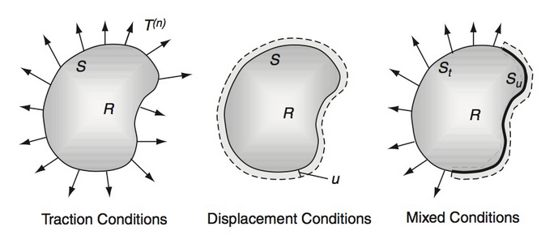
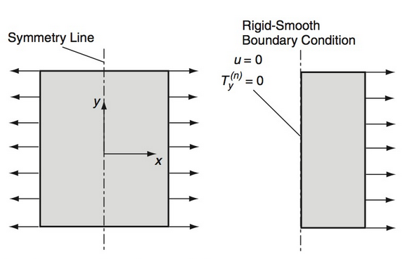
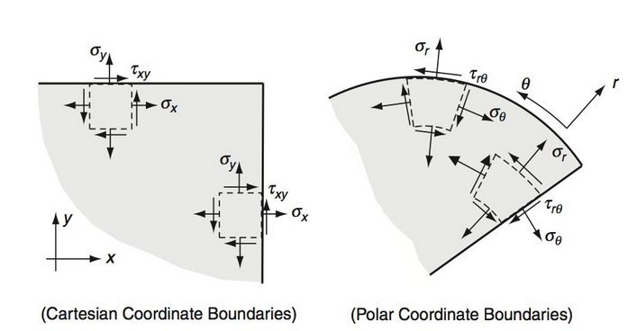
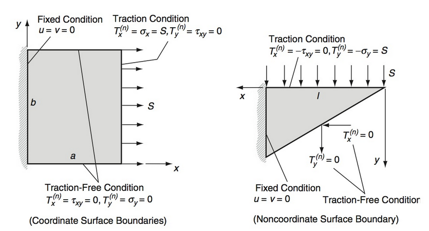
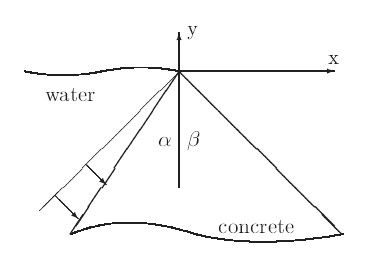

# AE731
## Theory of Elasticity
Dr. Nicholas Smith 
Wichita State University, Department of Aerospace Engineering
October 9, 2019

----
## upcoming schedule

-   Oct 9 - Boundary Conditions, HW4 Due
-   Oct 14 - Fall Break (no class)
-   Oct 16 - Problem Formulation
-   Oct 21 - Solution Strategies

----
## outline

<!-- vim-markdown-toc GFM -->

* field equations
* boundary conditions
* stress formulation

<!-- vim-markdown-toc -->

---
# field equations

----
## field equations

-   Field equations that we have already found
-   Strain-displacement

$$\\epsilon\_{ij} = \\frac{1}{2}(u\_{i,j} + u\_{j,i})$$

-   Equilibrium

$$ \sigma_{ij,j} + F_i = 0 $$

-   Constitutive (Hooke’s Law)

$$\\begin{aligned}
	\\sigma\_{ij} &= \\lambda \\epsilon\_{kk}\\delta\_{ij} + 2\\mu \\epsilon\_{ij}\\\\
	\\epsilon\_{ij} &= \\frac{1+\\nu}{E}\\sigma\_{ij} - \\frac{\\nu}{E}\\sigma\_{kk} \\delta\_{ij}
\\end{aligned}$$

----
## field equations

-   There are 15 unique field equations to solve for the 15 unknowns
-   3 displacements (*u**i*), 6 unique strain tensor terms (*ϵ**ij*), and 6 unique stress tensor terms (*σ**ij*)
-   These equations also depend on a knowledge of the material behavior (*λ*, *μ*) and body forces (usually gravity or zero)

----
## compatibility equations

-   If continuous, single-valued displacements are specified, differentiation will result in well-behaved strain field
-   The inverse relationship, integration of a strain field to find displacement, may not always be true
-   There are cases where we can integrate a strain field to find a set of discontinuous displacements

----
## compatibility equations

-   The compatibility equations enforce continuity of displacements to prevent this from occurring
-   To enforce this condition we consider the strain-displacement relations:

$$\\epsilon\_{ij} = \\frac{1}{2}(u\_{i,j} + u\_{j,i})$$

-   and differentiate with respect to *x**k* and *x**l*

$$\\epsilon\_{ij,kl} = \\frac{1}{2}(u\_{i,jkl} + u\_{j,ikl})$$

-   Or

$$2\epsilon_{ij,kl} = u_{i,jkl} + u_{j,ikl}$$

----
## compatibility equations

-   We can eliminate the displacement terms from the equation by interchanging the indexes to generate new equations

$$\\begin{aligned}
	2\\epsilon\_{ik,jl} &= u\_{i,jkl} + u\_{k,ijl} \\\\
	2\\epsilon\_{jl,ik} &= u\_{j,ikl} + u\_{l,ijk}
\\end{aligned}$$

-   Solving for *u**i*, *jkl* and *u**j*, *ikl*

$$\\begin{aligned}
	u\_{i,jkl} &= 2\\epsilon\_{ik,jl} - u\_{k,ijl} \\\\
	u\_{j,ikl} &= 2\\epsilon\_{jl,ik} - u\_{l,ijk}
\\end{aligned}$$

----
## compatibility equations

-   Substituting these values into the equations gives

$$2\epsilon_{ij,kl} = 2\epsilon_{ik,jl} = u_{k,ijl} + 2 \epsilon_{jl,ik} - u_{l,ijk}$$

-   We now consider one more change of index equation
	
$$2\epsilon_{kl,ij} = u_{k,ijl} + u_{l,ijk}$$

-   and substituting this result gives

$$2\epsilon_{ij,kl} = 2\epsilon_{ik,jl} + 2\epsilon_{jl,ik} - 2\epsilon_{kl,ij}$$

-   Or, simplified

$$\epsilon_{ij,kl} + \epsilon_{kl,ij} - \epsilon_{ik,jl} - \epsilon_{jl,ik} = 0$$

----
## compatibility equations

-   The so-called *Saint-Venant compatibility equations* in full are a system of 81 equations, but only six are useful (although even these six are not entirely linearly independent)
-   These six are found by setting *k* = *l*, or in expanded form

$$\\begin{aligned}
	\\frac{\\partial^2 \\epsilon\_x}{\\partial y^2} + \\frac{\\partial^2 \\epsilon\_y}{\\partial x^2} &= 2\\frac{\\partial^2 \\epsilon\_{xy}}{\\partial x \\partial y}\\\\
	\\frac{\\partial^2 \\epsilon\_y}{\\partial z^2} + \\frac{\\partial^2 \\epsilon\_z}{\\partial y^2} &= 2\\frac{\\partial^2 \\epsilon\_{yz}}{\\partial y \\partial z}\\\\
	\\frac{\\partial^2 \\epsilon\_z}{\\partial x^2} + \\frac{\\partial^2 \\epsilon\_x}{\\partial z^2} &= 2\\frac{\\partial^2 \\epsilon\_{zx}}{\\partial z \\partial x}\\\\
	\\frac{\\partial^2 \\epsilon\_x}{\\partial y \\partial z} &= \\frac{\\partial}{\\partial x} \\left(-\\frac{\\partial \\epsilon\_{yz}}{\\partial x} + \\frac{\\partial \\epsilon\_{zx}}{\\partial y} + \\frac{\\partial \\epsilon\_{xy}}{\\partial z}\\right)\\\\
	\\frac{\\partial^2 \\epsilon\_y}{\\partial z \\partial x} &= \\frac{\\partial}{\\partial y} \\left(-\\frac{\\partial \\epsilon\_{zx}}{\\partial y} + \\frac{\\partial \\epsilon\_{xy}}{\\partial z} + \\frac{\\partial \\epsilon\_{yz}}{\\partial x}\\right)\\\\
	\\frac{\\partial^2 \\epsilon\_z}{\\partial x \\partial y} &= \\frac{\\partial}{\\partial z} \\left(-\\frac{\\partial \\epsilon\_{xy}}{\\partial z} + \\frac{\\partial \\epsilon\_{yz}}{\\partial x} + \\frac{\\partial \\epsilon\_{zx}}{\\partial y}\\right)
\\end{aligned}$$

----
## compatibility equations

-   The compatibility equations are necessary to ensure that the strain field is valid and will produce a continuous displacement field
-   While these equations are important and necessary in solving elasticity problems, they are not sufficient
-   15 equations with 15 “unknowns” but each of these “unknowns” could actually be a function with many more unknowns, we need to develop framework for simplifying the problem into something we can solve

---
# boundary conditions

----
## boundary conditions

-   Boundary conditions commonly specify how a body is supported and/or how it is loaded
-   Mathematically we treat this conditions as *displacements* or *tractions* at boundary points.
-   Symmetry boundary conditions are also common, can reduce computational cost and simplify analytic solutions.

----
## boundary conditions

----
## symmetric boundaries

----
## coordinate systems

----
## boundaries

-   In many systems, the boundaries are parallel to the coordinate system, but this is not always the case

----
## boundaries

-   We often translate traction boundary conditions into stress boundary conditions using Cauchy’s Stress Theorem
-   When the condition is on a face parallel to the coordinate system, this gives a zero-stress condition

*t**j* = *σ**ij**n**i*

-   This results in *σ**xy* = *σ**yy* = 0

-   When the boundary is not parallel to the coordinate system, we do not necessarily have any zero-stress conditions

$$\\begin{aligned}
	t\_x &= \\sigma\_x n\_x + \\tau\_{xy} n\_y = 0 \\\\
	t\_y &= \\tau\_{xy} n\_x + \\sigma\_y n\_y = 0 \\\\
\\end{aligned}$$

----
## interfaces

-   When we deal with multiple materials, we must prescribe conditions at the interface of these materials
-   Some common *interface conditions* are
    -   *Perfectly bonded interface* where displacements and tractions are continuous at the interface
    -   *Slip interface* where only normal displacements and tractions are continuous at the interface, with no tangential traction and potentially discontinuous tangential displacement

---
# stress formulation

----
## stress formulation

-   For traction problems (i.e. traction is defined on all surfaces) it is convenient to re-formulate field equations in terms of stress only
-   Since displacements are eliminated, we will need to use the compatibility equations to ensure a continuous displacement field
-   It is desirable for this formulation to write the compatibility equations in terms of stress

----
## stress formulation

-   We start by using Hooke’s law for each of the strain terms

$$\\epsilon\_{ij} = \\frac{1+\\nu}{E}\\sigma\_{ij} - \\frac{\\nu}{E}\\sigma\_{kk} \\delta\_{ij}$$

-   After some tedious algebra, we find

$$\\sigma\_{ij,kk} + \\sigma\_{kk,ij} - \\sigma\_{ik,jk} - \\sigma\_{jk,ik} = \\frac{\\nu}{1+\\nu} (\\sigma\_{mm,kk}\\delta\_{ij} + \\sigma\_{mm,ij}\\delta\_{kk} - \\sigma\_{mm,jk}\\delta\_{ik} - \\sigma\_{mm,ik}\\delta\_{jk})$$

----
## stress formulation

-   If we also include the equilibrium equations (*σ**ij*, *j* − *F**i*) in the formulation, we find

$$\\sigma\_{ij,kk} + \\frac{1}{1+\\nu}\\sigma\_{kk,ij} = \\frac{\\nu}{1+\\nu}\\sigma\_{mm,kk}\\delta\_{ij} - F\_{i,j} - F\_{j,i}$$

-   We can further simplify the equation by consider the case when *i* = *j* and nothing that

$$\\sigma\_{ii,kk} = -\\frac{1+\\nu}{1-\\nu}F\_{i,i}$$

-   Which we can substitute into the equation to find

$$\\sigma\_{ij,kk} + \\frac{1}{1+\\nu}\\sigma\_{kk,ij} = -\\frac{\\nu}{1+\\nu}\\delta\_{ij}F\_{k,k} - F\_{i,j} - F\_{j,i}$$

----
## beltrami-michell compatibility

-   The compatibility equations in terms of stress are commonly known as the *Beltrami-Michell compatibility equations*
-   When there are no body forces, we can write the six expanded form equations as

$$\\begin{aligned}
	(1+\\nu) \\nabla^2 \\sigma\_x + \\frac{\\partial^2}{\\partial x^2} (\\sigma\_x + \\sigma\_y + \\sigma\_z) &= 0\\\\ (1+\\nu) \\nabla^2 \\sigma\_y + \\frac{\\partial^2}{\\partial y^2} (\\sigma\_x + \\sigma\_y + \\sigma\_z) &= 0\\\\
	(1+\\nu) \\nabla^2 \\sigma\_z + \\frac{\\partial^2}{\\partial z^2} (\\sigma\_x + \\sigma\_y + \\sigma\_z) &= 0\\\\
	(1+\\nu) \\nabla^2 \\tau\_{xy} + \\frac{\\partial^2}{\\partial x \\partial y} (\\sigma\_x + \\sigma\_y + \\sigma\_z) &= 0\\\\
	(1+\\nu) \\nabla^2 \\tau\_{yz} + \\frac{\\partial^2}{\\partial y \\partial z} (\\sigma\_x + \\sigma\_y + \\sigma\_z) &= 0\\\\
	(1+\\nu) \\nabla^2 \\tau\_{zx} + \\frac{\\partial^2}{\\partial z \\partial x} (\\sigma\_x + \\sigma\_y + \\sigma\_z) &= 0\\\\
\\end{aligned}$$

----
## stress formulation

-   When working with traction boundary problems, these compatibility equations, together with the equilibrium equations, are sufficient to solve the problem
-   These partial differential equations are not easy to solve, and analytic problems approached this way are often solved only in 2D
-   Solutions are also commonly based on *stress functions*, which gives a base equation form that automatically satisfies equilibrium

----
## solution methods

-   Direct method
    -   Solved via direction integration
    -   Limited to very simple geometries
-   Inverse method
    -   Choose a basic form for the solution based on our knowledge of the problem
    -   Solve for coefficients
    -   Usually we know the answer before we know the problem, it can be difficult to find useful problems for our solution
-   Semi-inverse method
    -   Only part of the solution is assumed
    -   Use direct integration to find the rest

---
example

----
## Levy’s problem

-   Find the stresses in a semi-infinite wedge due to fluid pressure and its own self-weight

----
## Levy’s problem

-   Since pressure varies linearly with depth, we will assume a linear state of stress

$$\\begin{aligned}
	\\sigma\_{x} &= a\_1 x + b\_1 y + c\_1\\\\
	\\sigma\_{y} &= a\_2 x + b\_2 y + c\_2\\\\
	\\tau\_{xy} &= a\_{12}x + b\_{12} y + c\_{12}\\\\
\\end{aligned}$$

-   This leaves 9 coefficients to be determined

----
## Levy’s problem

-   First let us consider the boundary conditions at the apex of the dam
-   If we let the origin be at the apex of the dam, which must be traction free, we find

*c*1 = *c*2 = *c*12 = 0

----
## Levy’s problem

-   Next let us consider the equilibrium equations

$$\\begin{aligned}
	\\sigma\_{x,x} + \\tau\_{xy,y} + \\rho b\_x &= 0\\\\
	\\tau\_{xy,x} + \\sigma\_{y,y} + \\rho b\_y &= 0
\\end{aligned}$$

-   Which in this case become

$$\\begin{aligned}
	a\_1 + b\_{12} + 0 &= 0\\\\
	a\_{12} + b\_2 - \\rho g &= 0
\\end{aligned}$$

----
## Levy’s problem

-   The stresses can now be written as

$$\\begin{aligned}
	\\sigma\_x &= a\_1 x + b\_1 y\\\\
	\\sigma\_y &= a\_2 x + b\_2 y\\\\
	\\tau\_{xy} &= -b\_2 x + \\rho g x - a\_1 y
\\end{aligned}$$

----
## Levy’s problem

-   The compatibility equations are all satisfied, as these linear functions will all go to zero when taking second derivatives
-   We now consider the boundary conditions along both faces

