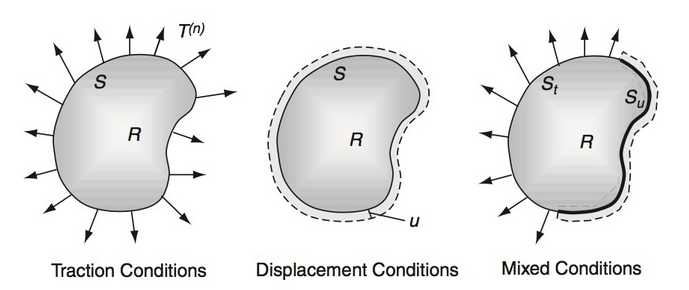

# AE731
## Theory of Elasticity
Dr. Nicholas Smith 
Wichita State University, Department of Aerospace Engineering
October 16, 2019

----
## upcoming schedule

-   Oct 16 - Problem Formulation
-   Oct 21 - Solution Strategies
-   Oct 23 - Exam 2 Review, HW 5 Due
-   Oct 28 - Exam 2 
-   Oct 30 - SPTE, Strain Energy

----
## outline

<!-- vim-markdown-toc GFM -->

* review
* displacement formulation
* principle of superposition
* saint-venant’s principle
* examples

<!-- vim-markdown-toc -->

---
# review

----
## field equations

$$\begin{aligned}
	\epsilon_{ij} &= \frac{1}{2}(u_{i,j} + u_{j,i}) &\text{Strain-Displacement} \\\\
	\sigma_{ij,j} + F_i &= 0 &\text{Equilibrium} \\\\
	\sigma_{ij} &= \lambda \epsilon\_{kk}\\delta\_{ij} + 2\\mu \\epsilon\_{ij} &\text{Constitutive (Hooke's Law)}\\\\
	\epsilon_{ij} &= \frac{1+\nu}{E}\\sigma\_{ij} - \\frac{\\nu}{E}\\sigma\_{kk} \\delta\_{ij} &
\end{aligned}$$

----
## field equations

-   There are 15 unique field equations to solve for the 15 unknowns
-   3 displacements (*u**i*), 6 unique strain tensor terms (*ϵ**ij*), and 6 unique stress tensor terms (*σ**ij*)
-   These equations also depend on a knowledge of the material behavior (*λ*, *μ*) and body forces (usually gravity or zero)

----
## compatibility equations

-   If continuous, single-valued displacements are specified, differentiation will result in well-behaved strain field
-   The inverse relationship, integration of a strain field to find displacement, may not always be true
-   There are cases where we can integrate a strain field to find a set of discontinuous displacements

----
## compatibility equations

$$\\begin{aligned}
	\\frac{\\partial^2 \\epsilon\_x}{\\partial y^2} + \\frac{\\partial^2 \\epsilon\_y}{\\partial x^2} &= 2\\frac{\\partial^2 \\epsilon\_{xy}}{\\partial x \\partial y}\\\\
	\\frac{\\partial^2 \\epsilon\_y}{\\partial z^2} + \\frac{\\partial^2 \\epsilon\_z}{\\partial y^2} &= 2\\frac{\\partial^2 \\epsilon\_{yz}}{\\partial y \\partial z}\\\\
	\\frac{\\partial^2 \\epsilon\_z}{\\partial x^2} + \\frac{\\partial^2 \\epsilon\_x}{\\partial z^2} &= 2\\frac{\\partial^2 \\epsilon\_{zx}}{\\partial z \\partial x}\\\\
	\\frac{\\partial^2 \\epsilon\_x}{\\partial y \\partial z} &= \\frac{\\partial}{\\partial x} \\left(-\\frac{\\partial \\epsilon\_{yz}}{\\partial x} + \\frac{\\partial \\epsilon\_{zx}}{\\partial y} + \\frac{\\partial \\epsilon\_{xy}}{\\partial z}\\right)\\\\
	\\frac{\\partial^2 \\epsilon\_y}{\\partial z \\partial x} &= \\frac{\\partial}{\\partial y} \\left(-\\frac{\\partial \\epsilon\_{zx}}{\\partial y} + \\frac{\\partial \\epsilon\_{xy}}{\\partial z} + \\frac{\\partial \\epsilon\_{yz}}{\\partial x}\\right)\\\\
	\\frac{\\partial^2 \\epsilon\_z}{\\partial x \\partial y} &= \\frac{\\partial}{\\partial z} \\left(-\\frac{\\partial \\epsilon\_{xy}}{\\partial z} + \\frac{\\partial \\epsilon\_{yz}}{\\partial x} + \\frac{\\partial \\epsilon\_{zx}}{\\partial y}\\right)
\\end{aligned}$$

----
## beltrami-michell 

$$\\begin{aligned}
	(1+\\nu) \\nabla^2 \\sigma\_x + \\frac{\\partial^2}{\\partial x^2} (\\sigma\_x + \\sigma\_y + \\sigma\_z) &= 0\\\\
	(1+\\nu) \\nabla^2 \\sigma\_y + \\frac{\\partial^2}{\\partial y^2} (\\sigma\_x + \\sigma\_y + \\sigma\_z) &= 0\\\\
	(1+\\nu) \\nabla^2 \\sigma\_z + \\frac{\\partial^2}{\\partial z^2} (\\sigma\_x + \\sigma\_y + \\sigma\_z) &= 0\\\\
	(1+\\nu) \\nabla^2 \\tau\_{xy} + \\frac{\\partial^2}{\\partial x \\partial y} (\\sigma\_x + \\sigma\_y + \\sigma\_z) &= 0\\\\
	(1+\\nu) \\nabla^2 \\tau\_{yz} + \\frac{\\partial^2}{\\partial y \\partial z} (\\sigma\_x + \\sigma\_y + \\sigma\_z) &= 0\\\\
	(1+\\nu) \\nabla^2 \\tau\_{zx} + \\frac{\\partial^2}{\\partial z \\partial x} (\\sigma\_x + \\sigma\_y + \\sigma\_z) &= 0\\\\
\\end{aligned}$$

----
## stress formulation

-   For traction problems (i.e. traction is defined on all surfaces) it is convenient to re-formulate field equations in terms of stress only
-   Since displacements are eliminated, we will need to use the compatibility equations to ensure a continuous displacement field
-   It is desirable for this formulation to write the compatibility equations in terms of stress

----
## boundary conditions

----
## symmetric boundaries

----
## boundaries

-   In many systems, the boundaries are parallel to the coordinate system, but this is not always the case

 <!-- .element width="50%" -->

----
## solution procedure

-   Solution procedure for stress/traction problems:
	-   Assume stress function
	-   Must be capable of meeting boundary conditions (linear, quadratic, etc.)
	-   Enforce equilibrium
	-   Check compatibility
	-   Enforce boundary conditions

---
# displacement formulation

----
## displacement formulation

-   Just as we posed all field equations in terms of stress for traction problems, it is convenient to pose all the field equations in terms of displacement when dealing with displacement boundary conditions
-   We can use the strain-displacement relations in Hooke’s law to find

_σ_*ij* = *λu**k*, *k**δ**ij* + *μ*(*u**i*, *j* + *u**j*, *i*)

----
## navier’s equations

-   We can substitute this relationship into the equilibrium equations to find

_μu_*i*, *kk* + (*λ* + *μ*)*u**k*, *ki* + *F**i* = 0

-   This is known as *Navier’s* or *Lamé’s equations* and is sometimes written in vector form as

_μ_∇2u + (*λ* + *μ*)∇(∇ ⋅ u)+F = 0

----
## solutions

-   General solutions to Navier’s equations are very difficult to obtain (as with the stress solution)
-   Later in the course, we will learn about *stress functions* and *displacement potential functions*
-   These functions provide a starting point to simplify solving this complicated partial differential equations

----
## example

-   Determine when the following quadratic displacement field will be in equilibrium

$$\\begin{aligned}
	u &= a\_1 x^2 + b\_1 y^2 + c\_1 xy + d\_1 x + e\_1 y + f\_1\\\\
	v &= a\_2 x^2 + b\_2 y^2 + c\_2 xy + d\_2 x + e\_2 y + f\_2\\\\
	w &= a\_3 x^2 + b\_3 y^2 + c\_3 xy + d\_3 x + e\_3 y + f\_3\\\\
\\end{aligned}$$

----
## example

-   We use the equilibrium equations in displacement

_μu_*i*, *kk* + (*λ* + *μ*)*u**k*, *ki* + *F**i* = 0

-   If we consider *u**i*, *kk*, we find

$$\\begin{aligned}
	u\_{1,kk} &= 2a\_1 + 2b\_1\\\\
	u\_{2,kk} &= 2a\_2 + 2b\_2\\\\
	u\_{3,kk} &= 2a\_3 + 2b\_3
\\end{aligned}$$

----
## example

-   The next term is more difficult, so first let us note that *u**k*, *ki* = (*u**k*, *k*),*i*
-   This gives

_u_*k*, *ki* = (2*a*1*x* + *c*1*y* + *d*1 + 2*b*2*y* + *c*2*x* + *e*2 + 0),*i*

-   We can now differentiate this to find

$$\\begin{aligned}
	u\_{k,k1} &= 2a\_1 + c\_2\\\\
	u\_{k,k2} &= c\_1 + 2b\_2\\\\
	u\_{k,k3} &= 0
\\end{aligned}$$

----
## example

-   Finally, we can obtain the equilibrium equations as

$$\\begin{aligned}
	\\mu(2a\_1 + 2b\_1) + (\\lambda+\\mu)(2a\_1 + c\_2) + F\_x &= 0\\\\
	\\mu(2a\_2 + 2b\_2) + (\\lambda+\\mu)(c\_1 + 2b\_2) + F\_y &= 0\\\\
	\\mu(2a\_3 + 2b\_3) + (\\lambda+\\mu)(0) + F\_z &= 0
\\end{aligned}$$

---
# principle of superposition

----
## superposition

-   Any problem governed by linear equations can be superposed
-   By the principle of superposition if

_σ_*ij*(1), *ϵ**ij*(1), *u**i*(1)

are the solution to an elasticity problem with body forces *F**i*(1) and surface tractions *t**i*(1) and

_σ_*ij*(2), *ϵ**ij*(2), *u**i*(2)

are the solution to an elasticity problem with body forces *F**i*(2) and surface tractions *t**i*(2), then

_σ_*ij*(1) + *σ**ij*(2), *ϵ**ij*(1) + *ϵ**ij*(2), *u**i*(1) + *u**i*(2)

are the solution to that problem with body forces *F**i*(1) + *F**i*(2) and surface tractions *t**i*(1) + *t**i*(2)

----
## superposition

-   Superposition is a very useful tool in real elasticity problems
-   A large number of basic elasticity solutions have already been solved, these can be looked up
-   Basic problems often do not have direct real-world applications
-   Many real-world problems can be broken down into the sum of multiple basic problems

----
## principle of superposition

---
# saint-venant’s principle

----
## saint-venant’s principle

	
-   The stress, strain, and displacement fields caused by statically equivalent forces are approximately the same far away from the load points

	

----
## saint-venant’s principle

-   Often the stress/strain field we are concerned with is far away from the load point
-   In this case we can use a statically equivalent load
-   We apply the load in whatever way makes the problem easiest

---
# examples

----
## baseball

-   Consider a baseball with an incombressible rubber core
-   Model the stress field due to some external pressure, *p* given the governing equation is

$$\\frac{\partial}{\partial r} \\left( \\frac{1}{r^2} \\frac{\partial }{\partial r}(r^2 u\_r)\\right) = 0$$

----
## hollow cylinder

-   Consider a long, hollow cylinder with pressure applied on both the inner and outer faces
-   Find the stress field given the governing equation

$$\\frac{\\partial}{\\partial r} \\left( \\frac{1}{r} \\frac{\\partial}{\\partial r} (ru\_r)\\right) = 0$$

