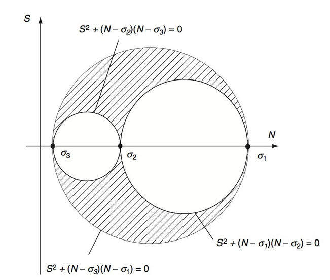

# AE731
## Theory of Elasticity
Dr. Nicholas Smith 
Wichita State University, Department of Aerospace Engineering
October 21, 2019

----
## upcoming schedule

-   Oct 21 - Solution Strategies
-   Oct 23 - Exam 2 Review, HW 5 Due
-   Oct 28 - Exam 2 
-   Oct 30 - SPTE, Strain Energy

----
## outline

<!-- vim-markdown-toc GFM -->

* exam
* group problems
* stress and equilibrium
* material behavior
* problem formulation

<!-- vim-markdown-toc -->

---
# exam

----
## exam format

-   Similar format to last exam
-   Three problems
-   Focus on organizing your work clearly to maximize partial credit

---
# group problems

----
## problem one - thermoelasticity

As a first-order model of the problem of freezing water in a glass bottle, we treat water as a thermoelastic solid and the glass as a fixed boundary.
Find the stress and strain field in the water as a function of the elastic properties ($E,\nu$) and the coefficient of thermal expansion ($\alpha$).

----
## problem two - inverse solution

Consider the stress field

$$ \sigma = \begin{bmatrix} Ay & 0 & 0 \\\\ 0 & 0 & 0 \\\\ 0 & 0 & 0 \end{bmatrix}  $$

Show that this is a valid solution to an elasticity problem.
What problem does it solve?

----
## problem three - semi-inverse

To solve the problem of torsion in prismatic bars we consider the displacement field

$$ u = -\alpha y z, \qquad v = -\alpha x z, \qquad w = w(x,y) $$

Solve this problem using the boundary conditions for a solid square cross-section.

---
# stress and equilibrium

----
## topics

-   Traction
-   Stress transformation
-   Principal stress
-   Equilibrium

----
## derivations

-   Cauchy’s stress theorem
-   Max shear stress for plane stress
-   Mohr’s circle

----
## stress tensor

-   To simplify the notation, we introduce the stress tensor

$$\\sigma\_{ij} = t\_j^{(\\hat{e}\_i)}$$

----
## traction

-   We can find some interesting information about the traction vector by considering an arbitrary tetrahedron with some traction $\\hat{t}^{(n)}$ applied to the surface

----
## traction

-   If we consider the balance of forces in the *x*1-direction

_t_1*dA* − *σ*11*dA*1 − *σ*21*dA*2 − *σ*31*dA*3 + *b*1*ρdV* = 0

-   The area components are:

$$\\begin{aligned}
	dA\_1 &= n\_1 dA\\\\
	dA\_2 &= n\_2 dA\\\\
	dA\_3 &= n\_3 dA\\\\
\\end{aligned}$$

-   And $dV = \\frac{1}{3}h dA$.

----
## traction

$$t\_1 dA - \\sigma\_{11} n\_1 dA - \\sigma\_{21} n\_2 dA - \\sigma\_{31} n\_3 dA + b\_1 \\rho \\frac{1}{3}h dA = 0$$

-   If we let *h* → 0 and divide by *dA*

_t_1 = *σ*11*n*1 + *σ*21*n*2 + *σ*31*n*3

-   We can write this in index notation as

_t_1 = *σ**i*1*n**i*

----
## traction

-   We find, similarly

$$\\begin{aligned}
	t\_2 &= \\sigma\_{i2} n\_i\\\\
	t\_3 &= \\sigma\_{i3} n\_i\\\\
\\end{aligned}$$

----
## traction

-   We can further combine these results in index notation as

_t_*j* = *σ**ij**n**i*

-   This means with knowledge of the nine components of *σ**ij*, we can find the traction vector at any point on any surface

----
## maximum shear stress

-   For plane stress problems, we can also use the stress transformation equations to find the maximum shear stress
-   We desire to maximize this equation:

$$\\tau^\\prime\_{xy} = \\frac{\\sigma\_y - \\sigma\_x}{2}\\sin 2\\theta + \\tau\_{xy} \\cos 2\\theta$$

----
## maximum shear stress

-   Taking the derivative with respect to *θ* gives

$$\\frac{\\partial}{\\partial \\theta} (\\tau^\\prime\_{xy}) = (\\sigma\_y-\\sigma\_x)\\cos 2\\theta - 2\\tau\_{xy} \\sin 2\\theta = 0$$

-   Which we can use to find 2*θ*

$$2\\theta = \\tan ^{-1} \\left(\\frac{(\\sigma\_y-\\sigma\_x)}{2\\tau\_{xy}}\\right)$$

----
## maximum shear stress

-   Substituting back into the original equation gives

$$\\tau^\\prime\_{max} = \\frac{\\sigma\_y - \\sigma\_x}{2}\\sin \\left\[\\tan ^{-1} \\left(\\frac{(\\sigma\_y-\\sigma\_x)}{2\\tau\_{xy}}\\right)\\right\] + \\tau\_{xy} \\cos \\left\[\\tan ^{-1} \\left(\\frac{(\\sigma\_y-\\sigma\_x)}{2\\tau\_{xy}}\\right)\\right\]$$

-   Note that

$$\\begin{aligned}
	\\sin (\\tan ^{-1} (x)) &= \\frac{x}{\\sqrt{1+x^2}}\\\\
	\\cos (\\tan ^{-1} (x)) &= \\frac{1}{\\sqrt{1+x^2}}\\\\
\\end{aligned}$$

----
## maximum shear stress

-   We note that

$$\\sqrt{1+ \\left(\\frac{\\sigma\_y - \\sigma\_x}{2 \\tau\_{xy}}\\right)^2} = \\frac{\\sqrt{(\\sigma\_y-\\sigma\_x)^2+4\\tau\_{xy}^2}}{2\\tau\_{xy}}$$

-   And thus we find

$$\\tau\_{max} = \\frac{(\\sigma\_y-\\sigma\_x)^2}{2 \\sqrt{(\\sigma\_y-\\sigma\_x)^2+4\\tau\_{xy}^2}} + \\frac{4\\tau\_{xy}^2}{2 \\sqrt{(\\sigma\_y-\\sigma\_x)^2+4\\tau\_{xy}^2}}$$

----
## maximum shear stress

-   Adding the terms and simplifying, we find

$$\\tau\_{max} = \\sqrt{\\left(\\frac{\\sigma\_y-\\sigma\_x}{2}\\right)^2+\\tau\_{xy}^2}$$

----
## tractions

 <!-- .element width="65%" -->
	
-   We can use what we know about principal values to find some interesting things about the tractions
-   Consider the traction vector on an arbitrary internal face, and decompose into Normal and Shear components.

 <!-- .element width="35%" -->
	

----
## tractions

-   The normal component can be found using the dot product

$$N = \\hat{T}^n \\cdot \\hat{n}$$

-   The shear component can be found using the Pythagorean theorem

$$S^2 = |\\hat{T}^n|^2 - N^2$$

----
## tractions

-   We now use the stress tensor in the principal direction to simplify the calculations

$$\\begin{aligned}
	N &= \\hat{T}^n \\cdot \\hat{n}\\\\
	&= T^n\_i n\_i \\\\
	&= \\sigma\_{ji} n\_j n\_i\\\\
	&= \\sigma\_1 n\_1^2 + \\sigma\_2 n\_2^2 + \\sigma\_3 n\_3^2
\\end{aligned}$$

----
## tractions

-   We also know that

$$\\begin{aligned}
	|\\hat{T}^n|^2 &= \\hat{T}^n \\cdot \\hat{T}^n\\\\
	&= T\_i^n T\_i^n \\\\
	&= \\sigma\_{ji} n\_j \\sigma\_{ki} n\_k\\\\
	&= \\sigma\_1^2 n\_1^2 + \\sigma\_2^2 n\_2^2 + \\sigma\_3^2 n\_3^2
\\end{aligned}$$

----
## mohr’s circle

-   If we constrain the normal vector to be a unit vector we can formulate the following inequalities

$$\\begin{aligned}
	S^2 + (N-\\sigma\_2)(N-\\sigma\_3) &\\ge 0\\\\
	S^2 + (N-\\sigma\_3)(N-\\sigma\_1) &\\le 0\\\\
	S^2 + (N-\\sigma\_1)(N-\\sigma\_2) &\\ge 0\\\\
\\end{aligned}$$

-   These inequalities form what is known as Mohr’s circle

----
## mohr’s circle

 <!-- .element width="60%" -->

---
# material behavior

----
## topics

-   Hooke’s Law
-   Physical meaning of elastic constants
-   Thermal expansion

----
## hooke’s law

-   Can be written in terms of strain

$$\\epsilon\_{ij} = \\frac{1+\\nu}{E}\\sigma\_{ij} - \\frac{\\nu}{E}\\sigma\_{kk} \\delta\_{ij}$$

-   Or stress

_σ_*ij* = *λϵ**kk**δ**ij* + 2*μϵ**ij*

----
## isotropic materials

| | *λ*= | *μ* = *G*= | *E*= | *ν*= | *K*= |
|-:|---:|----------:|-------:|-----:|-----:|
|  *λ*, *μ*|                                     |                                  |  $\\frac{\\mu(3\\lambda + 2\\mu)}{\\lambda + \\mu}$|  $\\frac{\\lambda}{2(\\lambda + \\mu)}$|  $\\frac{3\\lambda + 2\\mu}{3}$|
|  *G*, *E*|              $\\frac{G(2G-E)}{E-3G}$|                                  |                                                    |                      $\\frac{E-2G}{2G}$|            $\\frac{GE}{3(3G-E}$|
|  *G*, *ν*|            $\\frac{2G\\nu}{1-2\\nu}$|                                  |                                       2*G*(1 + *G*)|                                        |       $\\frac{2G(1+G)}{3(1-2G}$|
|  *E*, *ν*|  $\\frac{\\nu E}{(1+\\nu)(1-2\\nu)}$|            $\\frac{E}{2(1+\\nu)}$|                                                    |                                        |          $\\frac{E}{3(1-2\\nu}$|
|  *K*, *E*|             $\\frac{3K(3K-E)}{9K-E}$|               $\\frac{3EK}{9K-E}$|                                                    |                      $\\frac{3K-E}{6K}$|                                |
|  *ν*, *K*|             $\\frac{3K\\nu}{1+\\nu}$|  $\\frac{3K(1-2\\nu)}{2(1+\\nu)}$|                                      3*K*(1 − 2*ν*)|                                        |                                |

----
## physical meaning

-   Young’s modulus
-   Poisson’s ratio
-   Shear modulus
-   Bulk modulus

----
## thermoelasticity

-   Separate strain into mechanical and thermal components

_ϵ_*ij* = *ϵ**ij*(*M*) + *ϵ**ij*(*T*)

-   For isotropic materials:

_ϵ_*ij*(*T*) = *α*(*T* − *T*0)*δ**ij*

----
## thermoelasticity

-   We can combine this with Hooke’s Law to find

$$\\epsilon\_{ij} = \\frac{1+\\nu}{E}\\sigma\_{ij} -\\frac{\\nu}{E}\\sigma\_{kk}\\delta\_{ij} + \\alpha (T-T\_0)\\delta\_{ij}$$

-   Or formulated in terms of stress (and Lamé constants)

_σ_*ij* = *λϵ**kk**δ**ij* + 2*μϵ**ij* − (3*λ* + 2*μ*)*α*(*T* − *T*0)*δ**ij*

---
# problem formulation

----
## topics

-   Boundary conditions
-   Compatibility
-   Beltrami-Michell
-   Navier’s Equations
-   Superposition

----
## boundary conditions

-   Traction
-   Displacement
-   Mixed

----
## compatibility equations

-   If continuous, single-valued displacements are specified, differentiation will result in well-behaved strain field
-   The inverse relationship, integration of a strain field to find displacement, may not always be true
-   There are cases where we can integrate a strain field to find a set of discontinuous displacements

----
## compatibility equations

-   The compatibility equations enforce continuity of displacements to prevent this from occurring
-   To enforce this condition we consider the strain-displacement relations:

$$\\epsilon\_{ij} = \\frac{1}{2}(u\_{i,j} + u\_{j,i})$$

-   and differentiate with respect to *x**k* and *x**l*

$$\\epsilon\_{ij,kl} = \\frac{1}{2}(u\_{i,jkl} + u\_{j,ikl})$$

-   Or

2*ϵ**ij*, *kl* = *u**i*, *jkl* + *u**j*, *ikl*

----
## compatibility equations

-   We can eliminate the displacement terms from the equation by interchanging the indexes to generate new equations

$$\\begin{aligned}
	2\\epsilon\_{ik,jl} &= u\_{i,jkl} + u\_{k,ijl} \\\\
	2\\epsilon\_{jl,ik} &= u\_{j,ikl} + u\_{l,ijk}
\\end{aligned}$$

-   Solving for *u**i*, *jkl* and *u**j*, *ikl*

$$\\begin{aligned}
	u\_{i,jkl} &= 2\\epsilon\_{ik,jl} - u\_{k,ijl} \\\\
	u\_{j,ikl} &= 2\\epsilon\_{jl,ik} - u\_{l,ijk}
\\end{aligned}$$

----
## compatibility equations

-   Substituting these values into the equations gives

2*ϵ**ij*, *kl* = 2*ϵ**ik*, *jl* − *u**k*, *ijl* + 2*ϵ**jl*, *ik* − *u**l*, *ijk*

-   We now consider one more change of index equation

2*ϵ**kl*, *ij* = *u**k*, *ijl* + *u**l*, *ijk*

-   and substituting this result gives

2*ϵ**ij*, *kl* = 2*ϵ**ik*, *jl* + 2*ϵ**jl*, *ik* − 2*ϵ**kl*, *ij*

-   Or, simplified

_ϵ_*ij*, *kl* + *ϵ**kl*, *ij* − *ϵ**ik*, *jl* − *ϵ**jl*, *ik* = 0

----
## beltrami-michell

-   When working with stress functions, it is convenient to check compatibility of the stress function directly
-   Using Hooke’s Law, we can formulate compatibility in terms of stress
-   These are known as the Beltrami-Michell equations

----
## navier’s equations

-   Similarly, we can write the equilibrium equations in terms of displacement
-   This is convenient when dealing with displacement boundary conditions
-   Known as Navier’s equations

