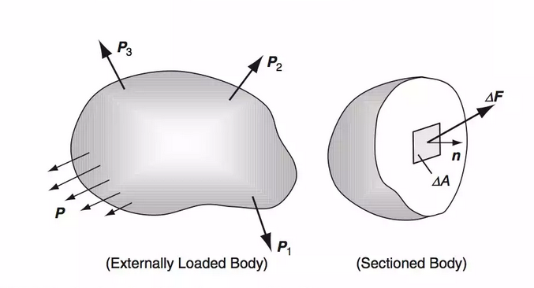
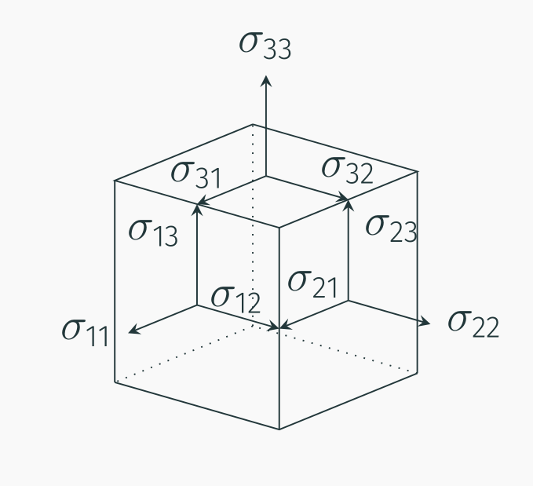

# AE731
## Theory of Elasticity
Dr. Nicholas Smith 
Wichita State University, Department of Aerospace Engineering
September 23, 2019

----
## upcoming schedule

-   Sep 23 - Exam return, Traction vector
-   Sep 25 - Stress Transformation
-   Sep 30 - Equilibrium Equations
-   Oct 2 - Material Characterization, HW3 Due

---
# exam

----
## average

-   Scores were very high on this exam (class average of 88%), so there is no curve
-   Standard deviation of 13.4%

----
## problems

-   Problem 1 had lowest average, followed by Problem 4
-   Problem 4 had the highest average, followed by Problem 3

---
# traction vector and stress tensor

----
## traction

----
## traction

-   The traction vector is defined as

$$\\hat{t}^n(x,\\hat{n}) = \\lim\\limits\_{\\Delta A \\to 0} \\frac{\\Delta \\hat{f}}{\\Delta A}$$

-   By Newton’s third law (action-reaction principle)

$$\\hat{t}^n(x,\\hat{n}) = -\\hat{t}^n(x,-\\hat{n})$$

----
## traction

----
## traction

-   If we consider the special case where the normal vectors, $\\hat{n}$, align with the coordinate system ($\\hat{e}\_1$,$\\hat{e}\_2$,$\\hat{e}\_3$)

-   On the 1-face:

$$\\begin{aligned}
	\\hat{n}&=\\hat{e}\_1: &\\quad \\hat{t}^n = t\_i^{(\\hat{e}\_1)} \\hat{e}\_i = t\_1^{(\\hat{e}\_1)} \\hat{e}\_1 + t\_2^{(\\hat{e}\_1)} \\hat{e}\_2 + t\_3^{(\\hat{e}\_1)} \\hat{e}\_3
\\end{aligned}$$

-   On the 2-face:

$$\\begin{aligned}
	\\hat{n}&=\\hat{e}\_2: &\\quad \\hat{t}^n = t\_i^{(\\hat{e}\_2)} \\hat{e}\_i = t\_1^{(\\hat{e}\_2)} \\hat{e}\_1 + t\_2^{(\\hat{e}\_2)} \\hat{e}\_2 + t\_3^{(\\hat{e}\_2)} \\hat{e}\_3
\\end{aligned}$$

----
## traction

-   And on the 3-face:

$$\\begin{aligned}
	\\hat{n}&=\\hat{e}\_3: &\\quad \\hat{t}^n = t\_i^{(\\hat{e}\_3)} \\hat{e}\_i = t\_1^{(\\hat{e}\_3)} \\hat{e}\_1 + t\_2^{(\\hat{e}\_3)} \\hat{e}\_2 + t\_3^{(\\hat{e}\_3)} \\hat{e}\_3
\\end{aligned}$$

----
## stress tensor

-   To simplify the notation, we introduce the stress tensor

$$\\sigma\_{ij} = t\_j^{(\\hat{e}\_i)}$$

----
## traction

-   We can find some interesting information about the traction vector by considering an arbitrary tetrahedron with some traction $\\hat{t}^{(n)}$ applied to the surface

----
## traction

-   If we consider the balance of forces in the *x*1-direction

_t_1*dA* − *σ*11*dA*1 − *σ*21*dA*2 − *σ*31*dA*3 + *b*1*ρdV* = 0

-   The area components are:

$$\\begin{aligned}
	dA\_1 &= n\_1 dA\\\\
	dA\_2 &= n\_2 dA\\\\
	dA\_3 &= n\_3 dA\\\\
\\end{aligned}$$

-   And $dV = \\frac{1}{3}h dA$.

----
## traction

$$t\_1 dA - \\sigma\_{11} n\_1 dA - \\sigma\_{21} n\_2 dA - \\sigma\_{31} n\_3 dA + b\_1 \\rho \\frac{1}{3}h dA = 0$$

-   If we let *h* → 0 and divide by *dA*

_t_1 = *σ*11*n*1 + *σ*21*n*2 + *σ*31*n*3

-   We can write this in index notation as

_t_1 = *σ**i*1*n**i*

----
## traction

-   We find, similarly

$$\\begin{aligned}
	t\_2 &= \\sigma\_{i2} n\_i\\\\
	t\_3 &= \\sigma\_{i3} n\_i\\\\
\\end{aligned}$$

----
## traction

-   We can further combine these results in index notation as

_t_*j* = *σ**ij**n**i*

-   This means with knowledge of the nine components of *σ**ij*, we can find the traction vector at any point on any surface

----
## example

-   Consider a block of material with a uniformly distributed force acting on the 1-face. Find the tractions on an arbitrary interior plane

----
## example

-   First we consider a vertical cut on the interior 1-face (*n**i* = ⟨1, 0, 0⟩)
-   Next we represent the force *P* as a vector, *p**i* = ⟨*P*, 0, 0⟩
-   Balancing forces yields

_t_*i**A* − *p**i* = 0

-   We find $t\_1 = \\frac{P}{A} = \\sigma\_{11}$, *t*2 = 0 = *σ*12 and *t*3 = 0 = *σ*13

----
## example

-   No force is applied in the other directions, so it is trivial to find the rest of the stress tensor

$$\\sigma\_{ij} = \\begin{bmatrix}
	P/A & 0 & 0\\\\
	0 & 0 & 0\\\\
	0 & 0 & 0
\\end{bmatrix}$$

----
## example

-   We can now consider any arbitrary angle of interior cut.
-   The normal for a cut as shown in the diagram will be *n**i* = ⟨cos*θ*, sin*θ*, 0⟩.
-   We can again use *t**j* = *σ**ij**n**i* to find *t**j* for any angle *θ*.

$$\\begin{aligned}
	t\_1 &= \\frac{P}{A} \\cos \\theta \\\\
	t\_2 &= 0\\\\
	t\_3 &= 0
\\end{aligned}$$

