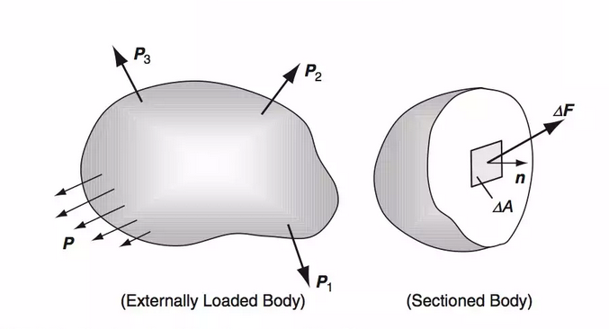
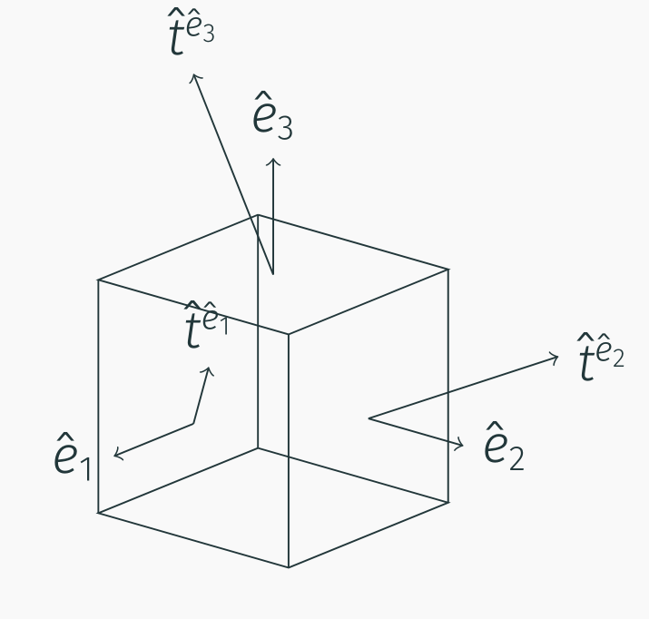
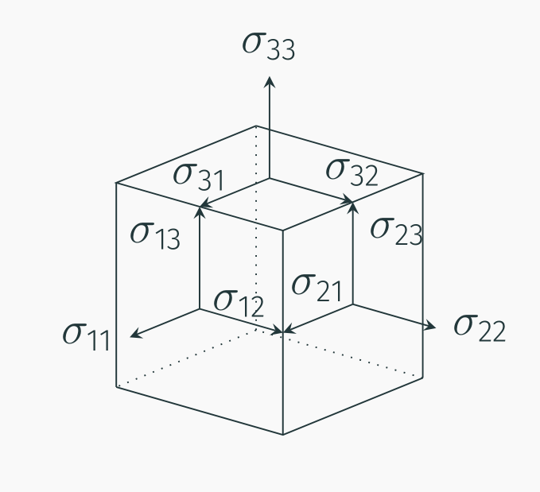
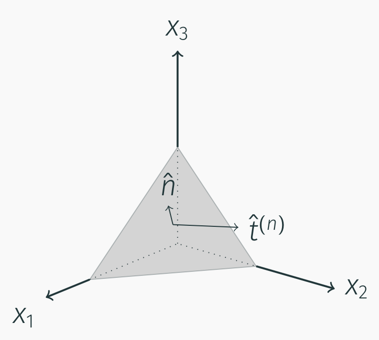
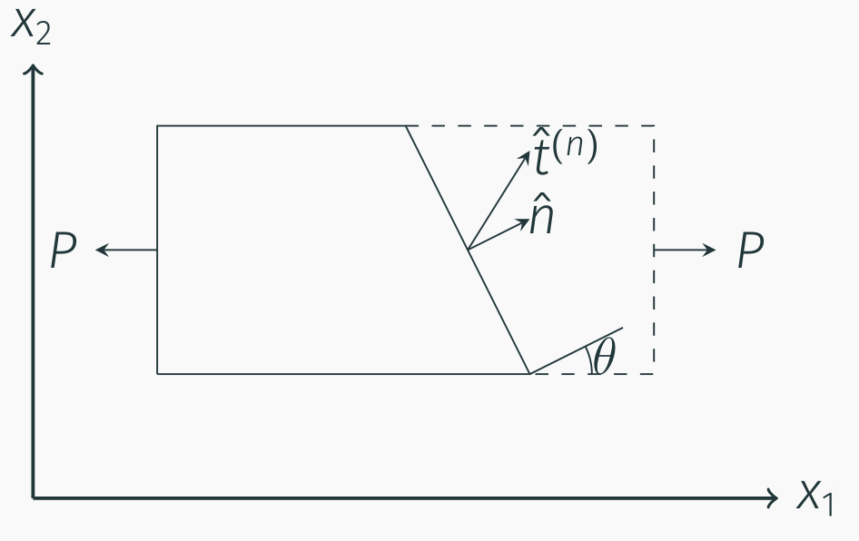
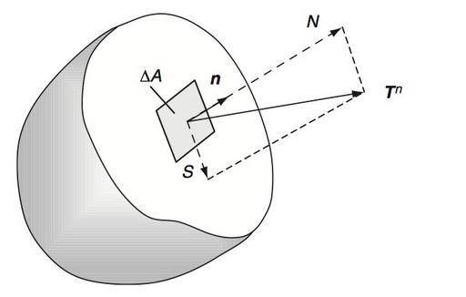
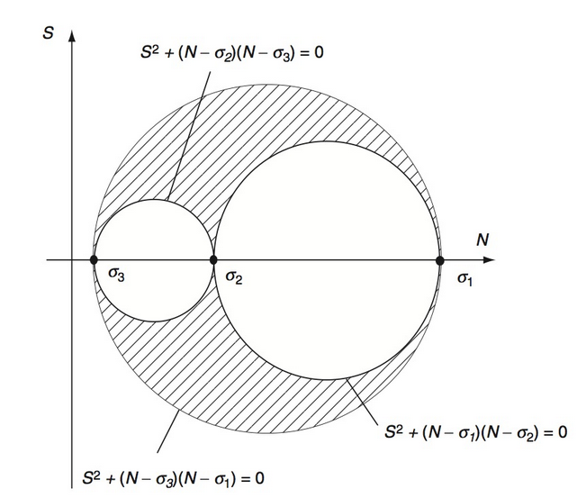
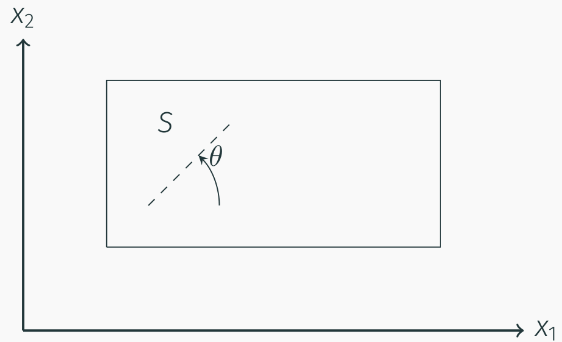
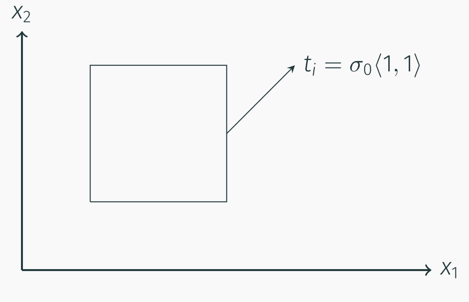
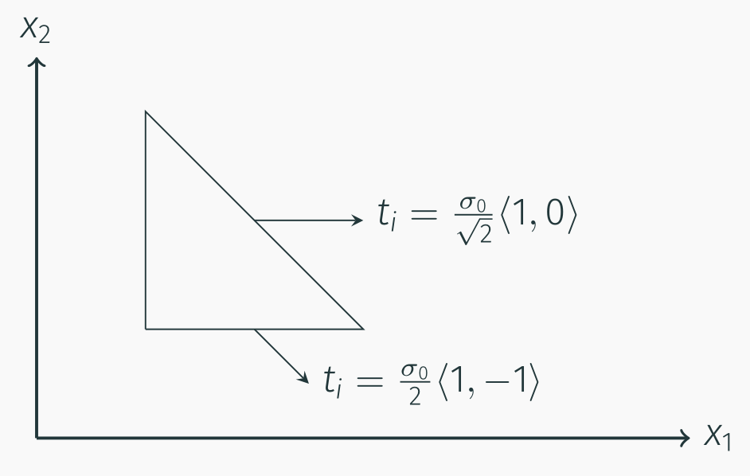

# AE731
## Theory of Elasticity
Dr. Nicholas Smith 
Wichita State University, Department of Aerospace Engineering
September 25, 2019

----
## upcoming schedule

-   Sep 25 - Stress Transformation
-   Sep 30 - Equilibrium Equations
-   Oct 2 - Material Characterization, HW3 Due
-   Oct 7 - Thermoelasticity

----
## outline

<!-- vim-markdown-toc GFM -->

* traction vector and stress tensor
* stress transformation
* principal stresses
* maximum shear stress
* group problems

<!-- vim-markdown-toc -->

---
# traction vector and stress tensor

----
## traction

----
## traction

-   The traction vector is defined as

$$\\hat{t}^n(x,\\hat{n}) = \\lim\\limits\_{\\Delta A \\to 0} \\frac{\\Delta \\hat{f}}{\\Delta A}$$

-   By Newton’s third law (action-reaction principle)

$$\\hat{t}^n(x,\\hat{n}) = -\\hat{t}^n(x,-\\hat{n})$$

----
## traction

 <!-- .element width="40%" -->

----
## traction

-   If we consider the special case where the normal vectors, $\\hat{n}$, align with the coordinate system ($\\hat{e}\_1$,$\\hat{e}\_2$,$\\hat{e}\_3$)

-   On the 1-face:

$$\\begin{aligned}
	\\hat{n}&=\\hat{e}\_1: &\\quad \\hat{t}^n = t\_i^{(\\hat{e}\_1)} \\hat{e}\_i = t\_1^{(\\hat{e}\_1)} \\hat{e}\_1 + t\_2^{(\\hat{e}\_1)} \\hat{e}\_2 + t\_3^{(\\hat{e}\_1)} \\hat{e}\_3
\\end{aligned}$$

-   On the 2-face:

$$\\begin{aligned}
	\\hat{n}&=\\hat{e}\_2: &\\quad \\hat{t}^n = t\_i^{(\\hat{e}\_2)} \\hat{e}\_i = t\_1^{(\\hat{e}\_2)} \\hat{e}\_1 + t\_2^{(\\hat{e}\_2)} \\hat{e}\_2 + t\_3^{(\\hat{e}\_2)} \\hat{e}\_3
\\end{aligned}$$

----
## traction

-   And on the 3-face:

$$\\begin{aligned}
	\\hat{n}&=\\hat{e}\_3: &\\quad \\hat{t}^n = t\_i^{(\\hat{e}\_3)} \\hat{e}\_i = t\_1^{(\\hat{e}\_3)} \\hat{e}\_1 + t\_2^{(\\hat{e}\_3)} \\hat{e}\_2 + t\_3^{(\\hat{e}\_3)} \\hat{e}\_3
\\end{aligned}$$

----
## stress tensor

-   To simplify the notation, we introduce the stress tensor

$$\\sigma\_{ij} = t\_j^{(\\hat{e}\_i)}$$

	

----
## traction

	
-   We can find some interesting information about the traction vector by considering an arbitrary tetrahedron with some traction $\\hat{t}^{(n)}$ applied to the surface

	

----
## traction

-   If we consider the balance of forces in the *x*1-direction

_t_1*dA* − *σ*11*dA*1 − *σ*21*dA*2 − *σ*31*dA*3 + *b*1*ρdV* = 0

-   The area components are:

$$\\begin{aligned}
	dA\_1 &= n\_1 dA\\\\
	dA\_2 &= n\_2 dA\\\\
	dA\_3 &= n\_3 dA\\\\
\\end{aligned}$$

-   And $dV = \\frac{1}{3}h dA$.

----
## traction

$$t\_1 dA - \\sigma\_{11} n\_1 dA - \\sigma\_{21} n\_2 dA - \\sigma\_{31} n\_3 dA + b\_1 \\rho \\frac{1}{3}h dA = 0$$

-   If we let *h* → 0 and divide by *dA*

_t_1 = *σ*11*n*1 + *σ*21*n*2 + *σ*31*n*3

-   We can write this in index notation as

_t_1 = *σ**i*1*n**i*

----
## traction

-   We find, similarly

$$\\begin{aligned}
	t\_2 &= \\sigma\_{i2} n\_i\\\\
	t\_3 &= \\sigma\_{i3} n\_i\\\\
\\end{aligned}$$

----
## traction

-   We can further combine these results in index notation as

_t_*j* = *σ**ij**n**i*

-   This means with knowledge of the nine components of *σ**ij*, we can find the traction vector at any point on any surface

----
## example

-   Consider a block of material with a uniformly distributed force acting on the 1-face. Find the tractions on an arbitrary interior plane

 <!-- .element width="50%" -->

----
## example

-   First we consider a vertical cut on the interior 1-face (*n**i* = ⟨1, 0, 0⟩)
-   Next we represent the force *P* as a vector, *p**i* = ⟨*P*, 0, 0⟩
-   Balancing forces yields

_t_*i**A* − *p**i* = 0

-   We find $t\_1 = \\frac{P}{A} = \\sigma\_{11}$, *t*2 = 0 = *σ*12 and *t*3 = 0 = *σ*13

----
## example

-   No force is applied in the other directions, so it is trivial to find the rest of the stress tensor

$$\\sigma\_{ij} = \\begin{bmatrix}
	P/A & 0 & 0\\\\
	0 & 0 & 0\\\\
	0 & 0 & 0
\\end{bmatrix}$$

----
## example

-   We can now consider any arbitrary angle of interior cut.
-   The normal for a cut as shown in the diagram will be *n**i* = ⟨cos*θ*, sin*θ*, 0⟩.
-   We can again use *t**j* = *σ**ij**n**i* to find *t**j* for any angle *θ*.

$$\\begin{aligned}
	t\_1 &= \\frac{P}{A} \\cos \\theta \\\\
	t\_2 &= 0\\\\
	t\_3 &= 0
\\end{aligned}$$

---
# stress transformation

----
## stress transformation

-   Stress transformation equations are identical to the strain transformation equations
-   Both stress and strain are tensor, and transform in the same fashion
-   Rotation about z-axis gives

$$Q\_{ij} = \\begin{bmatrix}
	\\cos \\theta & \\cos (90-\\theta) & \\cos 90\\\\
	\\cos (90+\\theta) & \\cos \\theta & \\cos 90\\\\
	\\cos 90 & \\cos 90 & \\cos 0\\\\
	\\end{bmatrix} = \\begin{bmatrix}
	\\cos \\theta & \\sin \\theta & 0\\\\
	-\\sin \\theta & \\cos \\theta & 0\\\\
	0 & 0 & 1\\\\
\\end{bmatrix}$$

----
## stress transformation

-   We recall that
_σ_*ij*′ = *Q**im**Q**jn**Q**mn*
-   Which gives

$$\\begin{aligned}
	\\sigma^\\prime\_x &= \\sigma\_x \\cos ^2 \\theta + \\sigma\_y \\sin^2 \\theta + 2 \\tau\_{xy} \\sin \\theta \\cos \\theta \\\\
	\\sigma^\\prime\_y &= \\sigma\_x \\sin ^2 \\theta + \\sigma\_y \\cos^2 \\theta - 2 \\tau\_{xy} \\sin \\theta \\cos \\theta \\\\
	\\tau^\\prime\_{xy} &= -\\sigma\_x \\sin \\theta \\cos \\theta + \\sigma\_y \\sin \\theta \\cos \\theta + \\tau\_{xy} (\\cos^2 \\theta - \\sin^2 \\theta)
\\end{aligned}$$

----
## stress transformation

-   As with the strain transformation equations, these are often re-written using the double-angle formulae.

$$\\begin{aligned}
	\\sigma^\\prime\_x &= \\frac{\\sigma\_x + \\sigma\_y}{2} + \\frac{\\sigma\_x - \\sigma\_y}{2}\\cos 2\\theta + \\tau\_{xy} \\sin 2\\theta \\\\
	\\sigma^\\prime\_y &= \\frac{\\sigma\_x + \\sigma\_y}{2} - \\frac{\\sigma\_x - \\sigma\_y}{2}\\cos 2\\theta - \\tau\_{xy} \\sin 2\\theta \\\\
	\\tau^\\prime\_{xy} &= \\frac{\\sigma\_y - \\sigma\_x}{2}\\sin 2\\theta + \\tau\_{xy} \\cos 2\\theta
\\end{aligned}$$

---
# principal stresses

----
## principal stresses

-   Principal stresses can be found in the same fashion as principal values and principal strains
det\[*σ**ij* − *σδ**ij*\]=0

----
## tractions

 <!-- .element width="55%" -->
	
-   We can use what we know about principal values to find some interesting things about the tractions
-   Consider the traction vector on an arbitrary internal face, and decompose into Normal and Shear components.

	

----
## tractions

-   The normal component can be found using the dot product

$$N = \\hat{T}^n \\cdot \\hat{n}$$

-   The shear component can be found using the Pythagorean theorem

$$S^2 = |\\hat{T}^n|^2 - N^2$$

----
## tractions

-   We now use the stress tensor in the principal direction to simplify the calculations

$$\\begin{aligned}
	N &= \\hat{T}^n \\cdot \\hat{n}\\\\
	&= T^n\_i n\_i \\\\
	&= \\sigma\_{ji} n\_j n\_i\\\\
	&= \\sigma\_1 n\_1^2 + \\sigma\_2 n\_2^2 + \\sigma\_3 n\_3^2
\\end{aligned}$$

----
## tractions

-   We also know that

$$\\begin{aligned}
	|\\hat{T}^n|^2 &= \\hat{T}^n \\cdot \\hat{T}^n\\\\
	&= T\_i^n T\_i^n \\\\
	&= \\sigma\_{ji} n\_j \\sigma\_{ki} n\_k\\\\
	&= \\sigma\_1^2 n\_1^2 + \\sigma\_2^2 n\_2^2 + \\sigma\_3^2 n\_3^2
\\end{aligned}$$

----
## mohr’s circle

-   If we constrain the normal vector to be a unit vector we can formulate the following inequalities

$$\\begin{aligned}
	S^2 + (N-\\sigma\_2)(N-\\sigma\_3) &\\ge 0\\\\
	S^2 + (N-\\sigma\_3)(N-\\sigma\_1) &\\le 0\\\\
	S^2 + (N-\\sigma\_1)(N-\\sigma\_2) &\\ge 0\\\\
\\end{aligned}$$

-   These inequalities form what is known as Mohr’s circle

----
## mohr’s circle

 <!-- .element width="60%" -->

---
# maximum shear stress

----
## maximum shear stress

-   From Mohr’s circle, we can find the maximum shear stress in terms of the principal stresses

_S_*max* = (*σ*1 − *σ*3)/2

----
## maximum shear stress

-   For plane stress problems, we can also use the stress transformation equations to find the maximum shear stress
-   We desire to maximize this equation:

$$\\tau^\\prime\_{xy} = \\frac{\\sigma\_y - \\sigma\_x}{2}\\sin 2\\theta + \\tau\_{xy} \\cos 2\\theta$$

----
## maximum shear stress

-   Taking the derivative with respect to *θ* gives

$$\\frac{\\partial}{\\partial \\theta} (\\tau^\\prime\_{xy}) = (\\sigma\_y-\\sigma\_x)\\cos 2\\theta - 2\\tau\_{xy} \\sin 2\\theta = 0$$

-   Which we can use to find 2*θ*

$$2\\theta = \\tan ^{-1} \\left(\\frac{(\\sigma\_y-\\sigma\_x)}{2\\tau\_{xy}}\\right)$$

----
## maximum shear stress

-   Substituting back into the original equation gives

$$\\tau^\\prime\_{max} = \\frac{\\sigma\_y - \\sigma\_x}{2}\\sin \\left\[\\tan ^{-1} \\left(\\frac{(\\sigma\_y-\\sigma\_x)}{2\\tau\_{xy}}\\right)\\right\] + \\tau\_{xy} \\cos \\left\[\\tan ^{-1} \\left(\\frac{(\\sigma\_y-\\sigma\_x)}{2\\tau\_{xy}}\\right)\\right\]$$

-   Note that

$$\\begin{aligned}
	\\sin (\\tan ^{-1} (x)) &= \\frac{x}{\\sqrt{1+x^2}}\\\\
	\\cos (\\tan ^{-1} (x)) &= \\frac{1}{\\sqrt{1+x^2}}\\\\
\\end{aligned}$$

----
## maximum shear stress

-   We note that

$$\\sqrt{1+ \\left(\\frac{\\sigma\_y - \\sigma\_x}{2 \\tau\_{xy}}\\right)^2} = \\frac{\\sqrt{(\\sigma\_y-\\sigma\_x)^2+4\\tau\_{xy}^2}}{2\\tau\_{xy}}$$

-   And thus we find

$$\\tau\_{max} = \\frac{(\\sigma\_y-\\sigma\_x)^2}{2 \\sqrt{(\\sigma\_y-\\sigma\_x)^2+4\\tau\_{xy}^2}} + \\frac{4\\tau\_{xy}^2}{2 \\sqrt{(\\sigma\_y-\\sigma\_x)^2+4\\tau\_{xy}^2}}$$

----
## maximum shear stress

-   Adding the terms and simplifying, we find

$$\\tau\_{max} = \\sqrt{\\left(\\frac{\\sigma\_y-\\sigma\_x}{2}\\right)^2+\\tau\_{xy}^2}$$

---
# group problems

----
## group one

-   The stress state in a rectangle under biaxial loading is

$$\\sigma\_{ij} = \\begin{bmatrix} X & 0 & 0\\\\
	0 & Y & 0\\\\
0 & 0 & 0\\end{bmatrix}$$

	
-   Find the traction vector, as well as the normal and shearing stresses on some oblique plane, *S*

 <!-- .element width="40%" -->

----
## group two

	
-   For the figure shown, what must the traction be on the other faces for the stress to be uniform and in equilibrium?

	

----
## group three

	
-   For the figure shown, find the (uniform) stress tensor. What must the traction be on the last face?

	

