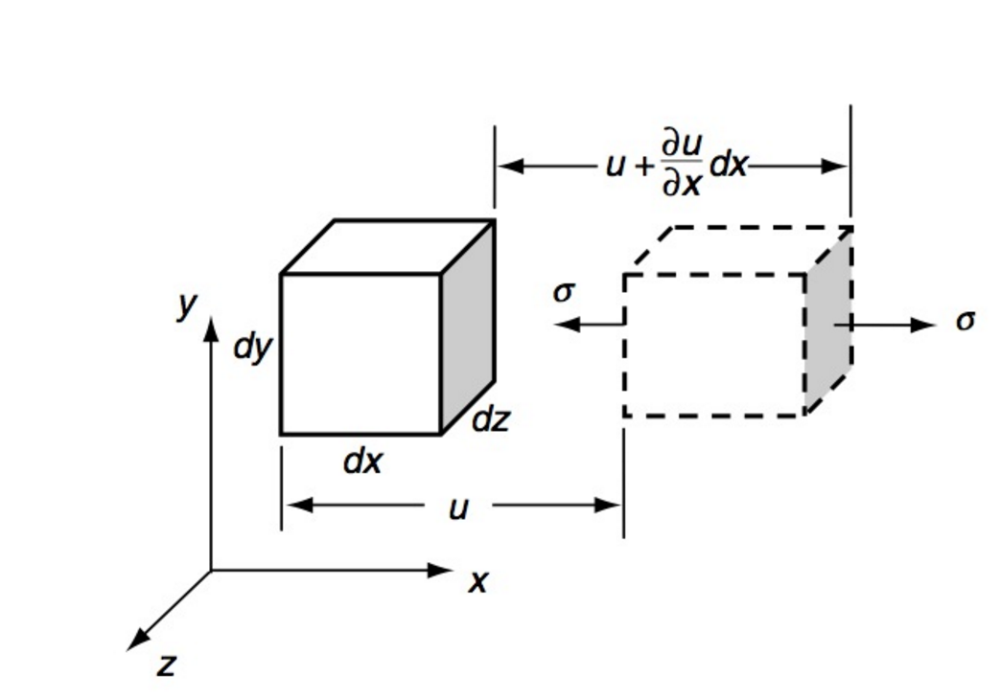
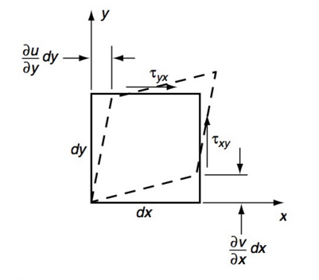

# AE731
## Theory of Elasticity
Dr. Nicholas Smith 
Wichita State University, Department of Aerospace Engineering
October 5, 2021

----
## upcoming schedule

-   Oct 5 - Strain Energy
-   Oct 7 - Exam 2 Review
-   Oct 8 - Homework 4 Self-grade Due, Homework 5 Due
-   (Oct 12) - Fall Break (No Class)
-   Oct 14 - Exam 2 
-   Oct 19 - Strain Energy

----
## outline

<!-- vim-markdown-toc GFM -->

* strain energy
* uniqueness of elasticity problems
* group problems

<!-- vim-markdown-toc -->

---
# strain energy

----
## strain energy

-   Work done by surface and body forces is stored as *strain energy*
-   In an elastic body, this is completely recoverable
-   In one dimension, this is similar to a linear spring

----
## strain energy

-   The strain energy must be equal to the net work done
-   Recall “work” is force times displacement (force in direction of displacement)

----
## strain energy

-   In uniaxial tension, the net work can be expressed as

`$$dU = \int_0^{\sigma_x} \sigma d\left(u + \frac{\partial u}{\partial x}dx\right)dydz - \int_0^{\sigma_x} \sigma du dy dz$$`

-   Or, simplifying

`$$dU = \int_0^{\sigma_x} \sigma d\left(\frac{\partial u}{\partial x}dx\right)dydz$$`

----
## strain energy

-   We can use strain-displacement and Hooke’s Law to say

`$$\frac{\partial u}{\partial x} = \epsilon_x = \frac{\sigma_x}{E}$$`

-   Substituting this gives

`$$dU = \int_0^{\sigma_x} \sigma \frac{d \sigma}{E}dxdydz = \frac{\sigma_x^2}{2E} dx dy dz$$`

----
## strain energy

-   We define the *strain energy density* as

`$$U = \frac{dU}{dx dy dz}$$`

-   In uni-axial tension, this gives

`$$U = \frac{\sigma_x^2}{2E} = \frac{E \epsilon_x^2}{2} = \frac{1}{2}\sigma_x \epsilon_x$$`

----
## strain energy

-   We can also visualize the strain energy graphically as the area under the stress-strain curve

----
## strain energy

-   We can also consider the strain energy due to a uniform shear stress

----
## strain energy

-   Following the same procedure, we find

`$$dU = \frac{1}{2} \tau_{xy} dydz \left(\frac{\partial v}{\partial x} dx\right) + \frac{1}{2} \tau_{xy} dxdz \left(\frac{\partial u}{\partial y} dy\right) = \frac{1}{2} \tau_{xy} \left(\frac{\partial u}{\partial y} + \frac{\partial v}{\partial x} \right) dx dy dz$$`

-   And the strain energy density can be expressed as

`$$U = \frac{1}{2}\tau_{xy}\gamma_{xy} = \frac{\tau_{xy}^2}{2\mu} = \frac{\mu \gamma_{xy}^2}{2}$$`

----
## strain energy

-   Using the conservation of energy, we can add the effects from each of these loadings to find the total strain energy

`$$U = \frac{1}{2} \sigma_{ij} \epsilon_{ij}$$`

-   Note: Although we derived this expression with no body forces, an identical solution is found if they are included

----
## strain energy

-   To find the total strain energy in a body, we integrate the strain energy density over the volume

`$$U_t = \iiint_V U dx dy dz $$`

----
## strain energy

-   As we did before for the uniaxial case, we can write the strain energy density in terms of stress or strain only using Hooke’s Law

`$$\begin{aligned}
	U_\epsilon &= \frac{1}{2} \lambda \epsilon_{jj} \epsilon_{kk} + \mu \epsilon_{ij}\epsilon_{ij}\\
	U_\sigma &= \frac{1+\nu}{2E}\sigma_{ij}\sigma_{ij} - \frac{\nu}{2E} \sigma_{jj}\sigma_{kk}
\end{aligned}$$`

----
## strain energy

-   If we fully expand both versions, we find that each term is squared
-   This means the strain energy must be positive

----
## strain energy

-   Another interesting feature we note is that

`$$\sigma_{ij} = \frac{\partial U_\epsilon}{\partial \epsilon_{ij}}$$`

-   and

`$$\epsilon_{ij} = \frac{\partial U_\sigma}{\partial \sigma_{ij}}$$`

-   These relationships do not depend on stress-strain relations being linear, and are often used to derive stresses and strains in non-linear materials (*hyperelasticity*)

----
## strain energy

-   We can further use this relationship to show that

`$$\begin{aligned}
	\frac{\partial \sigma_{ij}}{\partial \epsilon_{kl}} &= \frac{\partial \sigma_{kl}}{\partial \epsilon_{ij}}\\
	\frac{\partial \epsilon_{ij}}{\partial \sigma_{kl}} &= \frac{\partial \epsilon_{kl}}{\partial \sigma_{ij}}
\end{aligned}$$`

-   Going to back the general form of Hooke’s Law (`$\sigma_{ij} = C_{ijkl}\epsilon_{kl}$`), this gives the symmetry condition

`$$C_{ijkl} = C_{klij}$$`

----
## strain energy

-   We can separate the strain energy into two parts, the portion caused by *volumetric* deformation and the portion caused by *distortional* deformation

`$$U = U_V + U_D$$`

----
## strain energy

-   The volumetric portion can be found using the spherical or hydrostatic components of stress and strain

`$$U_V = \frac{1}{2} \tilde{\sigma_{ij}} \tilde{\epsilon_{ij}} = \frac{1}{6}\sigma_{jj} \epsilon_{kk}$$`

----
## strain energy

-   The distortional portion can be found as

`$$U_D = \frac{1}{12\mu} \left[(\sigma_x - \sigma_y)^2 + (\sigma_y - \sigma_z)^2 + (\sigma_z-\sigma_x)^2 + 6(\tau_{xy}^2 + \tau_{yz}^2 + \tau_{zx}^2)\right]$$`

-   Some failure theories make use of the distortional strain energy

---
# uniqueness of elasticity problems

----
## uniqueness

-   In Chapter 5 we never proved if any solution was unique
-   Let us assume that there exist two solutions to a given boundary value problem
-   The difference of the two solutions is given as

`$$\begin{aligned}
	\sigma_{ij} &= \sigma_{ij}^{(1)} - \sigma_{ij}^{(2)}\\
	\epsilon_{ij} &= \epsilon_{ij}^{(1)} - \epsilon_{ij}^{(2)}\\
	u_i &= u_i^{(1)} - u_i^{(2)}
\end{aligned}$$`

----
## uniqueness

-   Because both solutions will have the same body force, the difference solution must satisfy the equilibrium equation

`$$\sigma_{ij,j} = 0$$`

-   We also know that the difference must give

`$$T_i^n = \sigma_{ij}n_j = 0$$`

On the traction boundary and

`$$u_i = 0$$`

On the displacement boundary

----
## uniqueness

-   Using the definition of strain energy, we can write

`$$\begin{aligned}
	2 \int_V U dV &= \int_V \sigma_{ij} \epsilon_{ij} dV = \int_V \sigma_{ij}(u_{i,j}-\omega_{ij}) dV\\
	&= \int_V \sigma_{ij}u_{i,j} = \int_V (\sigma_{ij}u_i)_{,j} dV - \int_V \sigma_{ij,j}u_i dV\\
	&= \int_S \sigma_{ij}n_j u_i dS - \int_V \sigma_{ij,j}u_i dV
\end{aligned}$$`

----
## uniqueness

-   Note that a symmetric matrix times an antisymmetric matrix =0
-   We know that `$\sigma_{ij}n_j = 0$` on surfaces where tractions are defined and that `$u_i = 0$` on the other surfaces, so the first integral goes to zero
-   We also know by equilibrium that `$\sigma_{ij,j}$`, so the second integral will also be 0

----
## uniqueness

-   If the strain energy of the difference between two solutions is zero, then we know that
	-   The stress field of the difference is zero
	-   The strain field of the difference is zero
	-   The displacement field of the difference is zero

-   Therefore the two solutions are the same solution, and the solution is unique

---
# group problems

----
## uniaxial tension

-   We can establish bounds on physical constants by recalling that the strain energy must always be positive and considering certain states of stress
-   Uniaxial tension gives the stress state

`$$\sigma_{ij} = \begin{bmatrix}
	\sigma & 0 & 0 \\
	0 & 0 & 0\\
	0 & 0 & 0
\end{bmatrix}$$`

-   Find the strain energy and use it to place bounds on the modulus of Elasticity, *E*

----
## simple shear

-   If we consider uniform simple shear

`$$\sigma_{ij} = \begin{bmatrix}
	0 & \tau & 0 \\
	\tau & 0 & 0\\
	0 & 0 & 0
\end{bmatrix}$$`

-   Find the strain energy and use it to place bounds on Poisson’s Ratio

----
## hydrostatic pressure

-   We can also consider hydrostatic pressure

`$$\sigma_{ij} = \begin{bmatrix}
	-p & 0 & 0 \\
	0 & -p & 0\\
	0 & 0 & -p
\end{bmatrix}$$`

-   Find the strain energy and use it to place bounds on the bulk modulus

