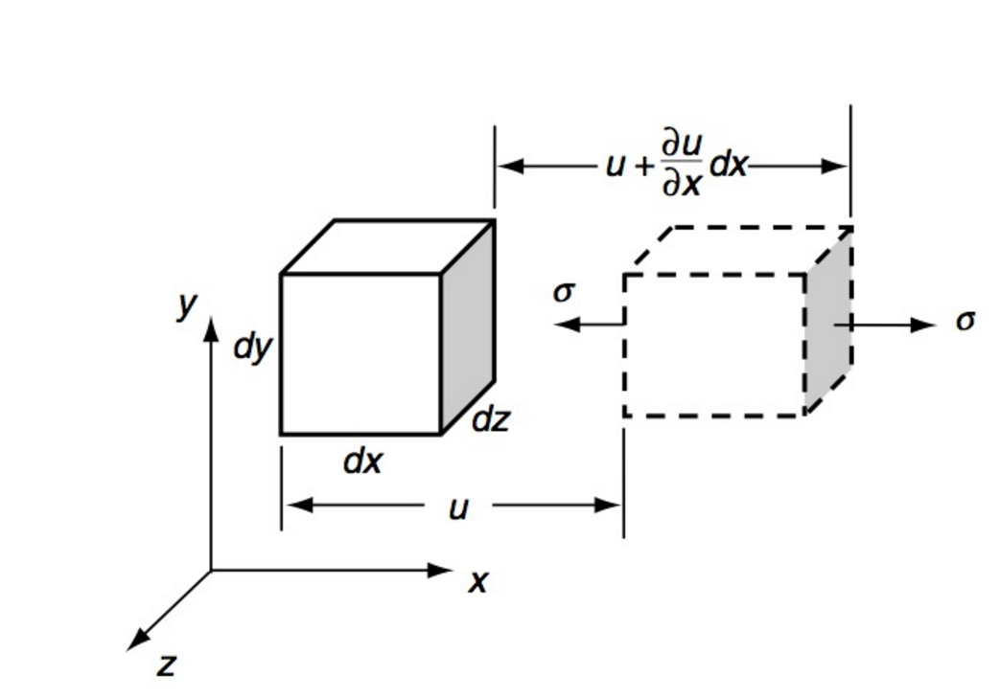
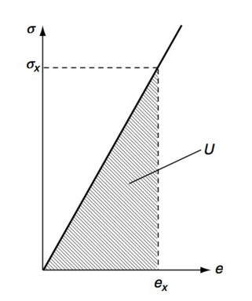
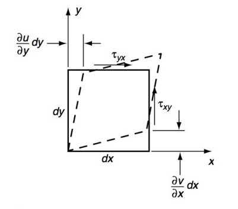

# AE731
## Theory of Elasticity
Dr. Nicholas Smith 
Wichita State University, Department of Aerospace Engineering
November 4, 2019

----
## upcoming schedule

-   Nov 4 - Strain Energy
-   Nov 6 - Strain Energy
-   Nov 11 - 2D Problems
-   Nov 13 - Airy Stress Functions

----
## outline

<!-- vim-markdown-toc GFM -->

* strain energy
* group problems

<!-- vim-markdown-toc -->

---
# strain energy

----
## strain energy

-   Work done by surface and body forces is stored as *strain energy*
-   In an elastic body, this is completely recoverable
-   In one dimension, this is similar to a linear spring

----
## strain energy

-   The strain energy must be equal to the net work done
-   Recall “work” is force times displacement (force in direction of displacement)

----
## strain energy

-   In uniaxial tension, the net work can be expressed as

$$dU = \\int\_0^{\\sigma\_x} \\sigma d\\left(u + \\frac{\\partial u}{\\partial x}dx\\right)dydz - \\int\_0^{\\sigma\_x} \\sigma du dy dz$$

-   Or, simplifying

$$dU = \\int\_0^{\\sigma\_x} d\\left(\\frac{\\partial u}{\\partial x}dx\\right)dydz$$

-   We can use strain-displacement and Hooke’s Law to say

$$\\frac{\\partial u}{\\partial x} = \\epsilon\_x = \\frac{\\sigma\_x}{E}$$

-   Substituting this gives

$$dU = \\int\_0^{\\sigma\_x} \\frac{d \\sigma}{E}dxdydz = \\frac{\\sigma\_x^2}{2E} dx dy dz$$

----
## strain energy

-   We define the *strain energy density* as

$$U = \\frac{dU}{dx dy dz}$$

-   In uni-axial tension, this gives

$$U = \\frac{\\sigma\_x^2}{2E} = \\frac{E \\epsilon\_x^2}{2} = \\frac{1}{2}\\sigma\_x \\epsilon\_x$$

----
## strain energy

-   We can also visualize the strain energy graphically as the area under the stress-strain curve

----
## strain energy

-   We can also consider the strain energy due to a uniform shear stress

----
## strain energy

-   Following the same procedure, we find

$$dU = \\frac{1}{2} \\tau\_{xy} dydz \\left(\\frac{\\partial v}{\\partial x} dx\\right) + \\frac{1}{2} \\tau\_{xy} dxdz \\left(\\frac{\\partial u}{\\partial y} dy\\right) = \\frac{1}{2} \\tau\_{xy} \\left(\\frac{\\partial u}{\\partial y} + \\frac{\\partial v}{\\partial x} \\right) dx dy dz$$

-   And the strain energy density can be expressed as

$$U = \\frac{1}{2}\\tau\_{xy}\\gamma\_{xy} = \\frac{\\tau\_{xy}^2}{2\\mu} = \\frac{\\mu \\gamma\_{xy}^2}{2}$$

----
## strain energy

-   Using the conservation of energy, we can add the effects from each of these loadings to find the total strain energy

$$U = \\frac{1}{2} \\sigma\_{ij} \\epsilon\_{ij}$$

-   Note: Although we derived this expression with no body forces, an identical solution is found if they are included

----
## strain energy

-   To find the total strain energy in a body, we integrate the strain energy density over the volume

_U_*t* = ∭*V**Udxdydz*

-   As we did before for the uniaxial case, we can write the strain energy density in terms of stress or strain only using Hooke’s Law

$$\\begin{aligned}
	U\_\\epsilon &= \\frac{1}{2} \\lambda \\epsilon\_{jj} \\epsilon\_{kk} + \\mu \\epsilon\_{ij}\\epsilon\_{ij}\\\\
	U\_\\sigma &= \\frac{1+\\nu}{2E}\\sigma\_{ij}\\sigma\_{ij} - \\frac{\\nu}{2E} \\sigma\_{jj}\\sigma\_{kk}
\\end{aligned}$$

----
## strain energy

-   If we fully expand both versions, we find that each term is squared
-   This means the strain energy must be positive
-   Another interesting feature we note is that

$$\\sigma\_{ij} = \\frac{\\partial U\_\\epsilon}{\\partial \\epsilon\_{ij}}$$

-   and

$$\\epsilon\_{ij} = \\frac{\\partial U\_\\sigma}{\\partial \\sigma\_{ij}}$$

-   These relationships do not depend on stress-strain relations being linear, and is often used to derive stresses and strains in non-linear materials (*hyperelasticity*)

----
## strain energy

-   We can further use this relationship to show that

$$\\begin{aligned}
	\\frac{\\partial \\sigma\_{ij}}{\\partial \\epsilon\_{kl}} &= \\frac{\\partial \\sigma\_{kl}}{\\partial \\epsilon\_{ij}}\\\\
	\\frac{\\partial \\epsilon\_{ij}}{\\partial \\sigma\_{kl}} &= \\frac{\\partial \\epsilon\_{kl}}{\\partial \\sigma\_{ij}}
\\end{aligned}$$

-   Going to back the general form of Hooke’s Law (*σ**ij* = *C**ijkl**ϵ**kl*), this gives the symmetry condition

_C_*ijkl* = *C**klij*

----
## strain energy

-   We can separate the strain energy into two parts, the portion caused by *volumetric* deformation and the portion caused by *distortional* deformation

_U_ = *U**V* + *U**D*

-   The volumetric portion can be found using the spherical or hydrostatic components of stress and strain

$$U\_V = \\frac{1}{2} \\tilde{\\sigma\_{ij}} \\tilde{\\epsilon\_{ij}} = \\frac{1}{6}\\sigma\_{jj} \\epsilon\_{kk}$$

-   The distortional portion can be found as

$$U\_D = \\frac{1}{12\\mu} \\left\[(\\sigma\_x - \\sigma\_y)^2 + (\\sigma\_y - \\sigma\_z)^2 + (\\sigma\_z-\\sigma\_x)^2 + 6(\\tau\_{xy}^2 + \\tau\_{yz}^2 + \\tau\_{zx}^2)\\right\]$$

-   Some failure theories make use of the distortional strain energy

---
uniqueness of elasticity problems

----
## uniqueness

-   In Chapter 5 we never proved if any solution was unique
-   Let us assume that there exist two solutions to a given boundary value problem
-   The difference of the two solutions is given as

$$\\begin{aligned}
	\\sigma\_{ij} &= \\sigma\_{ij}^{(1)} - \\sigma\_{ij}^{(2)}\\\\
	\\epsilon\_{ij} &= \\epsilon\_{ij}^{(1)} - \\epsilon\_{ij}^{(2)}\\\\
	u\_i &= u\_i^{(1)} - u\_i^{(2)}
\\end{aligned}$$

----
## uniqueness

-   Because both solutions will have the same body force, the difference solution must satisfy the equilibrium equation

_σ_*ij*, *j* = 0

-   We also know that the difference must give

_T_*i**n* = *σ**ij**n**j* = 0

On the traction boundary and

_u_*i* = 0

On the displacement boundary

----
## uniqueness

-   Using the definition of strain energy, we can write

$$\\begin{aligned}
	2 \\int\_V U dV &= \\int\_V \\sigma\_{ij} \\epsilon\_{ij} dV = \\int\_V \\sigma\_{ij}(u\_{i,j}-\\omega\_{ij}) dV\\\\
	&= \\int\_V \\sigma\_{ij}u\_{i,j} = \\int\_V (\\sigma\_{ij}u\_i)\_{,j} dV - \\int\_V \\sigma\_{ij,j}u\_i dV\\\\
	&= \\int\_S \\sigma\_{ij}n\_j u\_i dS - \\int\_V \\sigma\_{ij,j}u\_i dV
\\end{aligned}$$

-   Note that a symmetric matrix times an antisymmetric matrix =0
-   We know that *σ**ij**n**j* = 0 on surfaces where tractions are defined and that *u**i* = 0 on the other surfaces, so the first integral goes to zero
-   We also know by equilibrium that *σ**ij*, *j* = 0, so the second integral will also be 0

----
## uniqueness

-   If the strain energy of the difference between two solutions is zero, then we know that
	-   The stress field of the difference is zero
	-   The strain field of the difference is zero
	-   The displacement field of the difference is zero

-   Therefore the two solutions are the same solution, and the solution is unique

---
# group problems

----
## Group 1 - uniaxial tension

-   We can establish bounds on physical constants by recalling that the strain energy must always be positive and considering certain states of stress

-   Uniaxial tension gives the stress state

$$\\sigma\_{ij} = \\begin{bmatrix}
	\\sigma & 0 & 0 \\\\
	0 & 0 & 0\\\\
	0 & 0 & 0
\\end{bmatrix}$$

-   Find the strain energy and use it to place bounds on the modulus of Elasticity, *E*

----
## Group 2 - simple shear

-   If we consider uniform simple shear

$$\\sigma\_{ij} = \\begin{bmatrix}
	0 & \\tau & 0 \\\\
	\\tau & 0 & 0\\\\
	0 & 0 & 0
\\end{bmatrix}$$

-   Find the strain energy and use it to place bounds on Poisson’s Ratio

----
## Group 3 - hydrostatic pressure

-   We can also consider hydrostatic pressure

$$\\sigma\_{ij} = \\begin{bmatrix}
	-p & 0 & 0 \\\\
	0 & -p & 0\\\\
	0 & 0 & -p
\\end{bmatrix}$$

-   Find the strain energy and use it to place bounds on the hydrostatic pressure

