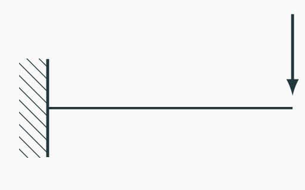
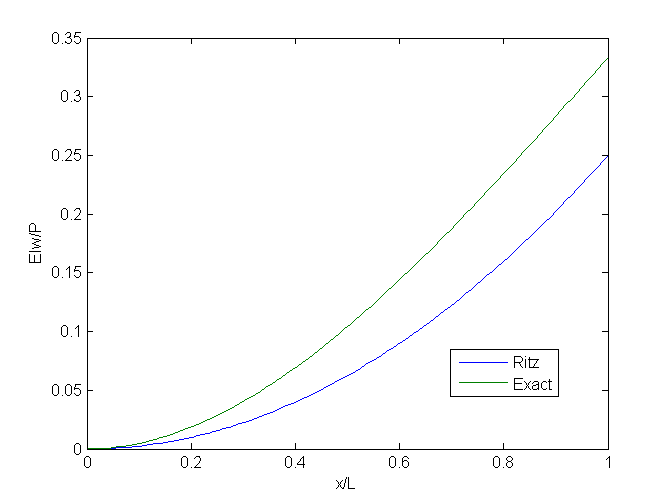

# AE731
## Theory of Elasticity
Dr. Nicholas Smith 
Wichita State University, Department of Aerospace Engineering
November 6, 2019

----
## upcoming schedule

-   Nov 6 - Strain Energy
-   Nov 11 - **Class Canceled**
-   Nov 13 - Airy Stress Functions, HW 6 Due
-   Nov 18 - Airy Stress

----
## outline

<!-- vim-markdown-toc GFM -->

* integral theorems
* virtual work
* ritz method

<!-- vim-markdown-toc -->

---
# integral theorems

----
## clapeyron’s theorem

-   If we return to the uniqueness derivation, the only non-general assumptions were

$$\\begin{aligned}
	\\sigma\_{ij,j} &= 0\\\\
	T\_i^n &= \\sigma\_{ij}n\_j = 0 \\qquad \\text{Along traction boundary}\\\\
	u\_i &= 0 \\qquad \\text{Along displacement boundary} \\\\
\\end{aligned}$$

----
## clapeyron’s theorem

-   This means that for any elastic body we can say

2∫*V**UdV* = ∫*S**σ**ij**n**j**u**i**dS* − ∫*V**σ**ij*, *j**u**i**dV*

----
## clapeyron’s theorem

-   If we consider an elastic body in equilibrium, we can say that

_σ_*ij*, *j* = −*F**i*

-   We also know by Cauchy’s stress theorem that

_T_*i**n* = *σ**ij**n**j*

-   Both of these can be substituted to give

2∫*V**UdV* = ∫*S**T**i**n**u**i**dS* + ∫*V**F**i**u**i**dV*

----
## betti/rayleigh reciprocal theorem

-   We can derive another theorem by returning to

2∫*V**UdV* = ∫*S**σ**ij**n**j**u**i**dS* − ∫*V**σ**ij*, *j**u**i**dV*

-   Consider two different sets of forces and displacements acting on the same body

_T_*i*(1), *F**i*(1), *u**i*(1)and*T**i*(2), *F**i*(2), *u**i*(2)

----
## reciprocal theorem

-   We now consider the work done by the forces in the first system acting through the displacements of the second system

2∫*V**UdV* = ∫*V**σ**ij*(1)*ϵ**ij*(2) = ∫*S**T**i*(1)*u**i*(2)*dS* + ∫*V**F**i*(1)*u**i*(2)*dV*

-   We can similarly write

∫*V**σ**ij*(2)*ϵ**ij*(1) = ∫*S**T**i*(2)*u**i*(1)*dS* + ∫*V**F**i*(2)*u**i*(1)*dV*

----
## reciprocal theorem

-   We can now use Hooke’s Law and symmetry to say that

_σ_*ij*(1)*ϵ**ij*(2) = *C**ijkl**ϵ**kl*(1)*ϵ**ij*(2) = *C**klij**ϵ**kl*(1)*ϵ**ij*(2) = *ϵ**kl*(1)*σ**kl*(2)

-   If *σ**ij*(1)*ϵ**ij*(2) = *σ**ij*(2)*ϵ**ij*(1), then we can also say that the strain energies are equivalent, proving the Betti/Rayleigh Reciprocal Theorem

∫*S**T**i*(1)*u**i*(2)*dS* + ∫*V**F**i*(1)*u**i*(2)*dV* = ∫*S**T**i*(2)*u**i*(1)*dS* + ∫*V**F**i*(2)*u**i*(1)*dV*

----
## integral elasticity

-   The Betti/Rayleigh Reciprocal Theorem is used to derive the Integral Formulation of Elasticity
-   Also known as Somigliana’s Identity
-   Used for Boundary Element Method (BEM) and Boundary Integral Equation methods (BIE), but we will not use it in this class

---
# virtual work

----
## virtual work

-   The solution format we developed in Chapter 5 is known as *Strong Form*, and is not always a convenient solution form
-   We can use energy and work principles to develop additional solution methods
-   *Virtual Displacement* is a fictitious displacement such that the forces acting on the point remain unchanged
-   The work done by these forces is known as *Virtual Work*

----
## virtual work

-   If we consider the elastic boundary-value problem, with tractions applied over the boundary *S**t* and displacements applied over the boundary *S**u*.
-   Virtual displacements denoted by *δu**i* and are arbitrary, but cannot violate the displacement boundary condition, thus *δu**i* = 0 on *S**u*.

----
## virtual work 

-   Virtual work done by surface and body forces can be written as

_δW_ = ∫*S**t**T**i**n**δu**i**dS* + ∫*V**F**i**δu**i**dV*

-   Since the virtual displacement is zero over *S**u*, we can replace *S**t* with *S* in the integral.

_δW_ = ∫*S**T**i**n**δu**i**dS* + ∫*V**F**i**δu**i**dV*

----
## virtual work

$$\\begin{aligned}
	\\delta W &= \\int\_{S} T\_i^n \\delta u\_i dS + \\int\_V F\_i \\delta u\_i dV\\\\
	&= \\int\_{S} \\sigma\_{ij}n\_j \\delta u\_i dS + \\int\_V F\_i \\delta u\_i dV\\\\
	&= \\int\_V (\\sigma\_{ij}\\delta u\_i)\_{,j} dV + \\int\_V F\_i \\delta u\_i dV\\\\
	&= \\int\_V (\\sigma\_{ij,j}\\delta u\_i + \\sigma\_{ij}\\delta u\_{i,j}) dV + \\int\_V F\_i \\delta u\_i dV\\\\
	&= \\int\_V (-F\_i\\delta u\_i + \\sigma\_{ij}(\\delta \\epsilon\_{ij} + \\delta\\omega\_{ij})) dV + \\int\_V F\_i \\delta u\_i dV\\\\
	&= \\int\_V \\sigma\_{ij}\\delta \\epsilon\_{ij} dV
\\end{aligned}$$

----
## virtual work

-   We can follow the procedure from the uniqueness derivation in reverse
-   Notice that this gives the usual strain energy relationship, but without the factor of one-half.
-   This is because stress is constant during virtual displacement

----
## virtual work

-   The virtual strain energy follows the same relationships developed previously, namely

∫*V**δU* = ∫*S**T**i**n**δu**i* + ∫*V**F**i**δu**i**dV*

-   Because the external forces are unchanged during the virtual displacement, the *δ* operator can be placed outside the integrals.
-   We can also move all terms to the same side of the equation to write

_δ_(∫*V**U*−∫*S**T**i**n**u**i*−∫*V**F**i**u**i**dV*) = 0

----
## virtual work

-   Or, written in terms of virtual work

_δ_(*U**T* − *W*)=0

----
## virtual work

-   The total potential energy of an elastic solid is (*U**T* − *W*), and must be zero for a virtual displacement
-   These results are completely general, and apply to both linear and non-linear materials
-   Special theories for rods, beams, plates, and shells use this principle
-   Finite elements is also developed using virtual work
-   We can even use virtual work to re-derive the continuum results we found previously

----
## virtual work

-   If we start with this form

∫*V**σ**ij**δϵ**ij**dV* − ∫*S**T**i**n**δu**i**dS* − ∫*V**F**i**δu**i**dV* = 0

-   We can replace the first term by writing it as

_σ_*ij**δϵ**ij* = *σ**ij**δu**i*, *j* = (*σ**ij**δu**i*),*j* − *σ**ij*, *j**δu**i*

-   Which leads to

∫*V*\[(*σ**ij**δu**i*),*j* − *σ**ij*, *j**δu**i*\]*dV* − ∫*S**T**i**n**δu**i**dS* − ∫*V**F**i**δu**i**dV* = 0

----
## virtual work

-   We can use the divergence theorem to say that

∫*V*(*σ**ij**δu**i*),*j**dV* = ∫*S**σ**ij**n**j**δu**i**dS*

-   This gives

∫*V*\[*σ**ij*, *j* + *F**i*\]*δu**i**dV* + ∫*S*(*T**i**n* − *σ**ij**n**j*)*δu**i**dS* = 0

----
## virtual work

-   This will be satisfied if

_σ_*ij*, *j* + *F**i* = 0  (equilibrium)

-   And either

_δu_*i* = 0  (displacement boundary)

-   Or

_T_*i**n* = *σ**ij**n**j*(traction boundary)

---
# ritz method

----
## ritz method

-   While we have showed previously how virtual work can be used to develop analytic solutions, it is also convenient for approximate solutions
-   The Rayleigh-Ritz Method is an important approximate technique based on this method
-   In this method, trial functions are used as approximate solutions which satisfy the boundary conditions, but not necessarily the differential equations.

----
## ritz method

-   For the elasticity displacement formulation, trial functions take the form

$$\\begin{aligned}
	u &= u\_0 + \\sum\_{j=1}^{N}a\_ju\_j\\\\
	v &= v\_0 + \\sum\_{j=1}^{N}b\_jv\_j\\\\
	w &= w\_0 + \\sum\_{j=1}^{N}c\_jw\_j\\\\
\\end{aligned}$$

----
## ritz method

-   Where the unknown constants are chosen to minimize the total potential energy.

$$\\begin{aligned}
	\\frac{\\partial \\Pi}{\\partial a\_j} &= 0\\\\
	\\frac{\\partial \\Pi}{\\partial b\_j} &= 0\\\\
	\\frac{\\partial \\Pi}{\\partial c\_j} &= 0\\\\
\\end{aligned}$$

----
## example

----
## example

-   We recall that the total potential energy is

_Π_ = *U**T* − *W*

-   In a simple (Euler-Bernoulli) beam, we assume that the stress is a function of the vertical displacement, *w* and the cross-sectional area

-   All stress terms other than *σ*11 are zero

----
## example

-   The strain energy density is

$$U = \\frac{\\sigma\_{11}^2}{2E} = \\frac{M^2 y^2}{2EI^2} = \\frac{E}{2}\\left(\\frac{d^2 w}{dx^2}\\right)^2 y^2$$

-   We integrate over the volume to find the total strain energy in the beam

$$\\begin{aligned}
	U\_T &= \\int\_0^L \\left\[\\iint\_A \\frac{E}{2}\\left(\\frac{d^2 w}{dx^2}\\right)^2 y^2 dA \\right\] dx\\\\
	&= \\int\_0^L \\frac{EI}{2}\\left(\\frac{d^2 w}{dx^2}\\right)^2 dx
\\end{aligned}$$

----
## example

-   The work done by external forces is quite simple in this case

_W_ = *Pw*(*L*)

-   We now consider a trial function for *w*, let us consider a polynomial function

$$w = a\_0 + a\_1 \\left(\\frac{x}{L}\\right) + a\_2 \\left(\\frac{x}{L}\\right)^2$$

----
## example

-   We first ensure the trial solution satisfies the essential boundary conditions

$$\\begin{aligned}
	w(0) &= 0\\\\
	0 &= a\_0 + a\_1 \\left(\\frac{0}{L}\\right) + a\_2 \\left(\\frac{0}{L}\\right)^2
\\end{aligned}$$

----
## example

-   And

$$\\begin{aligned}
	\\frac{d w(0)}{dx} &= 0\\\\
	0 &= a\_1 \\left(\\frac{1}{L}\\right) + 2 a\_2 \\left(\\frac{0}{L}\\right)
\\end{aligned}$$

----
## example

-   This gives *a*0 = *a*1 = 0
-   *a*2 is to be determined
-   The total potential energy is

$$\\Pi = U\_t - W = \\int\_0^L \\frac{EI}{2}\\left(\\frac{d^2 w}{dx^2}\\right)^2 dx - Pw(L)$$

-   After differentiation and substitution, we find

$$\\Pi = \\frac{EI}{2} \\int\_0^L \\left(\\frac{2a\_2}{L^2}\\right)^2 dx - Pa\_2$$

----
## example

-   We minimize the potential energy by letting $\\frac{\\partial \\Pi}{\\partial a\_j} = 0$

$$\\begin{aligned}
	\\Pi &= \\frac{2EI a\_2^2}{L^3} - Pa\_2\\\\
	\\frac{\\partial \\Pi}{\\partial a\_2} &= \\frac{4EIa\_2}{L^3} - P = 0\\\\
	a\_2 &= \\frac{PL^3}{4EI}
\\end{aligned}$$

----
## example

-   Thus our approximate solution is

$$w = \\frac{PL}{4EI}x^2$$

----
## example

-   A simple cantilever beam of this form can be solved for exactly
-   The exact solution is

$$w = \\frac{Px^2}{6EI}(3L-x)$$

----
## example

----
## example

-   If we considered one more term in our trial, we would have recovered the exact solution
-   In this case, more terms would be redundant
-   We could have also considered a trigonometric function
-   A worked example with more terms considered is [here](https://hub.gke.mybinder.org/user/ndaman-elasticity-o5knvww2/notebooks/example/ritz.ipynb)
