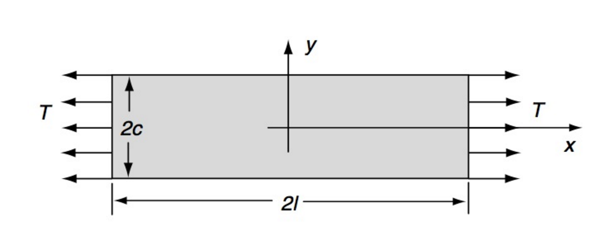
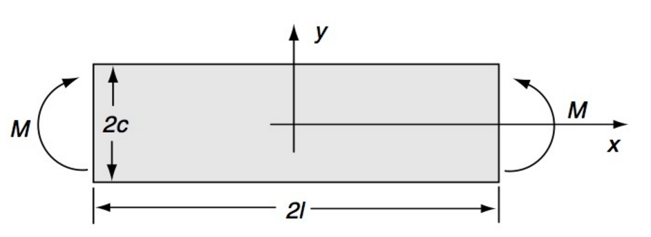
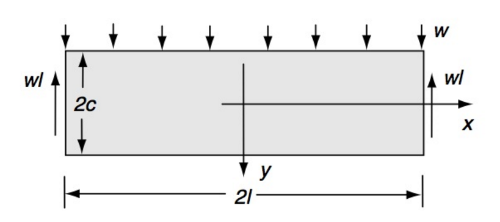

# AE731
## Theory of Elasticity
Dr. Nicholas Smith 
Wichita State University, Department of Aerospace Engineering
November 18, 2019

----
## upcoming schedule

-   Nov 18 - Airy Stress
-   Nov 20 - Airy Stress, Homework 7 Due
-   Nov 25 - Airy Stress
-   Nov 27 - No Class (Thanksgiving Break)

----
## outline

<!-- vim-markdown-toc GFM -->

* airy stress functions
* polar coordinates
* polynomial solutions

<!-- vim-markdown-toc -->

---
# airy stress functions

----
## airy stress function

-   A stress function technique that can be used to solve many planar problems is known as the *Airy stress function*
-   This method reduces the governing equations for a planar problem to a single unknown function
-   We assume first that body forces are derivable from a *potential function*, *V*

$$\\begin{aligned}
	F\_x &= -\\frac{\\partial V}{\\partial x}\\\\
	F\_y &= -\\frac{\\partial V}{\\partial y}
\\end{aligned}$$

-   How restrictive is this assumption?
-   Most body forces are linear (gravity) and can easily be represented this way

----
## airy stress function

-   Consider the following

$$\\begin{aligned}
	\\sigma\_{xx} &= \\frac{\\partial^2 \\phi}{\\partial y^2} + V\\\\
	\\sigma\_{yy} &= \\frac{\\partial^2 \\phi}{\\partial x^2} + V\\\\
	\\tau\_{xy} &= -\\frac{\\partial^2 \\phi}{\\partial x \\partial y}
\\end{aligned}$$

-   The function *ϕ* = *ϕ*(*x*, *y*) is known as the Airy stress function
-   When constructed in this way, equilibrium is automatically satisfied

----
## compatibility

-   Substituting the Airy Stress function and potential function into the relationships, we find

$$\\begin{aligned}
	\\frac{\\partial^4 \\phi}{\\partial x^4} + 2\\frac{\\partial^4 \\phi}{\\partial x^2 \\partial y^2} + \\frac{\\partial^4 \\phi}{\\partial y^4} &= - \\frac{1-2\\nu}{1-\\nu}\\left(\\frac{\\partial^2 V}{\\partial x^2} + \\frac{\\partial^2 V}{\\partial y^2}\\right) &\\text{plane strain}\\\\
	\\frac{\\partial^4 \\phi}{\\partial x^4} + 2\\frac{\\partial^4 \\phi}{\\partial x^2 \\partial y^2} + \\frac{\\partial^4 \\phi}{\\partial y^4} &= - (1-\\nu)\\left(\\frac{\\partial^2 V}{\\partial x^2} + \\frac{\\partial^2 V}{\\partial y^2}\\right) &\\text{plane stress}
\\end{aligned}$$

-   If there are no body forces, or the potential function satisfies Laplace’s Equation

∇2*V* = 0

Then both plane stress and plane strain reduce to

$$\\frac{\\partial^4 \\phi}{\\partial x^4} + 2\\frac{\\partial^4 \\phi}{\\partial x^2 \\partial y^2} + \\frac{\\partial^4 \\phi}{\\partial y^4} = 0$$

---
# polar coordinates

----
## strain-displacement

-   For planar problems we can reduce the strain-displacement relationships we learned previously

$$\\begin{aligned}
	\\epsilon\_r &= \\frac{\\partial u\_r}{\\partial r}, \\epsilon\_\\theta = \\frac{1}{r}\\left(u\_r + \\frac{\\partial u\_\\theta}{\\partial \\theta}\\right), \\epsilon\_z = \\frac{\\partial u\_z}{\\partial z}\\\\
	\\epsilon\_{r \\theta} &= \\frac{1}{2} \\left(\\frac{1}{r} \\frac{\\partial u\_r}{\\partial \\theta} + \\frac{\\partial u\_\\theta}{\\partial r} - \\frac{u\_\\theta}{r}\\right) \\\\
	\\epsilon\_{\\theta z} &= \\frac{1}{2} \\left(\\frac{\\partial u\_\\theta}{\\partial z} + \\frac{1}{r}\\frac{\\partial u\_z}{\\partial \\theta}\\right)\\\\
	\\epsilon\_{zr} &= \\frac{1}{2}\\left(\\frac{\\partial u\_r}{\\partial z} + \\frac{\\partial u\_z}{\\partial r}\\right)
\\end{aligned}$$

----
## strain-displacement

-   Which becomes

$$\\begin{aligned}
	\\epsilon\_r &= \\frac{\\partial u\_r}{\\partial r}\\\\
	\\epsilon\_\\theta &= \\frac{1}{r}\\left(u\_r + \\frac{\\partial u\_\\theta}{\\partial \\theta}\\right)\\\\
	\\epsilon\_{r \\theta} &= \\frac{1}{2} \\left(\\frac{1}{r} \\frac{\\partial u\_r}{\\partial \\theta} + \\frac{\\partial u\_\\theta}{\\partial r} - \\frac{u\_\\theta}{r}\\right) \\\\
\\end{aligned}$$

----
## integration

-   When we change variables in integration, we also need to account for the proper change in dV
-   *dV* = *dxdydz* ≠ *drdθdz*
-   We can find the correct *dV* by calculating the Jacobian

$$dV = dx dy dz = |\\frac{\\partial(x,y,z)}{\\partial(r,\\theta,z)}| dr d\\theta dz$$

$$dV = \\begin{vmatrix}
	\\frac{\\partial x}{\\partial r} & \\frac{\\partial x}{\\partial \\theta} & \\frac{\\partial x}{\\partial z}\\\\
	\\frac{\\partial y}{\\partial r} & \\frac{\\partial y}{\\partial \\theta} & \\frac{\\partial y}{\\partial z}\\\\
	\\frac{\\partial z}{\\partial r} & \\frac{\\partial z}{\\partial \\theta} & \\frac{\\partial z}{\\partial z}
\\end{vmatrix} dr d\\theta dz = r dr d\\theta dz$$

----
## hooke’s law

-   The tensor equation for Hooke’s Law is valid in polar/cylindrical/spherical coordinates too
-   We only need special equations when differentiating or integrating

$$\\begin{aligned}
	\\sigma\_{ij} &= \\lambda \\epsilon\_{kk}\\delta\_{ij} + 2\\mu \\epsilon\_{ij} - (3\\lambda + 2\\mu)\\alpha\\Delta T \\delta\_{ij}\\\\
	\\epsilon\_{ij} &= \\frac{1+\\nu}{E}\\sigma\_{ij} - \\frac{\\nu}{E}\\sigma\_{kk} \\delta\_{ij} + \\alpha\\Delta T \\delta\_{ij}
\\end{aligned}$$

----
## equilibrium

-   We have already found the equilibrium equations in polar coordinates, they are

$$\\begin{aligned}
	\\frac{\\partial \\sigma\_r}{\\partial r} + \\frac{1}{r} \\frac{\\partial \\tau\_{r \\theta}}{\\partial \\theta} + \\frac{1}{r}(\\sigma\_r - \\sigma\_\\theta) + F\_r &= 0 \\\\
	\\frac{\\partial \\tau\_{r \\theta}}{\\partial r} + \\frac{1}{r} \\frac{\\partial \\sigma\_\\theta}{\\partial \\theta} + \\frac{2}{r}\\tau\_{r\\theta} + F\_\\theta &= 0
\\end{aligned}$$

----
## equilibrium

-   The equilibrium equations can be written in terms of displacement (Navier equations)
-   These are only useful when using a displacement formulation, but we are using stress functions
-   Instead we need the Beltrami-Mitchell compatibility equations

----
## compatibility

-   Substituting stress-strain relations into the compatibility equations gives

$$\\begin{aligned}
	\\nabla^2 (\\sigma\_r + \\sigma\_\\theta) &= -\\frac{1}{1-\\nu}\\left(\\frac{\\partial F\_r}{\\partial r} + \\frac{F\_r}{r} + \\frac{1}{r}\\frac{\\partial F\_\\theta}{\\partial \\theta}\\right) & \\text{(Plane Strain)}\\\\
	\\nabla^2 (\\sigma\_r + \\sigma\_\\theta) &= -(1+\\nu)\\left(\\frac{\\partial F\_r}{\\partial r} + \\frac{F\_r}{r} + \\frac{1}{r}\\frac{\\partial F\_\\theta}{\\partial \\theta}\\right) & \\text{(Plane Stress)}
\\end{aligned}$$

----
## airy stress functions

-   When the body forces are zero, we find

$$\\begin{aligned}
	\\sigma\_r &= \\frac{1}{r}\\frac{\\partial \\phi}{\\partial r} + \\frac{1}{r^2}\\frac{\\partial^2 \\phi}{\\partial \\theta^2}\\\\
	\\sigma\_\\theta &= \\frac{\\partial^2 \\phi}{\\partial r^2}\\\\
	\\tau\_{r\\theta} &= -\\frac{\\partial}{\\partial r} \\left( \\frac{1}{r} \\frac{\\partial \\phi}{\\partial \\theta} \\right)
\\end{aligned}$$

----
## airy stress functions

-   When body forces are zero, we find the following biharmonic equation for the Beltrami-Mitchell equations

∇4*ϕ* = 0

-   Where the Laplacian is

$$\\nabla^2 = \\frac{\\partial^2}{\\partial r^2} + \\frac{1}{r}\\frac{\\partial}{\\partial r} + \\frac{1}{r^2} \\frac{\\partial^2}{\\partial \\theta^2}$$

----
## polar coordinates

-   Recall that an Airy Stress function must satisfy the Beltrami-Mitchell compatibility equations

$$\\nabla^4 \\phi = \\left(\\frac{\\partial ^2}{\\partial r^2} + \\frac{1}{r} \\frac{\\partial}{\\partial r} + \\frac{1}{r^2}\\frac{\\partial ^2}{\\partial \\theta^2}\\right)^2\\phi = 0$$

-   One method which gives several useful solutions assumes that the Airy Stress function has the form *ϕ*(*r*, *θ*)=*f*(*r*)*e**bθ*

-   Substituting this into the compatibility equations (and canceling the common *e**bθ*) term gives

$$f^{\\prime \\prime \\prime \\prime} + \\frac{2}{r} f^{\\prime \\prime \\prime} - \\frac{1-2b^2}{r^2}f^{\\prime \\prime} + \\frac{1-2b^2}{r^3}f^{\\prime} + \\frac{b^2(4+b^2)}{r^4}f = 0$$

----
## polar coordinates

-   To solve this, we perform a change of variables, letting *r* = *e**ξ*, which gives

_f_′′′′ − 4*f*′′′ + (4 + 2*b*2)*f*′′ − 4*b*2*f*′ + *b*2(4 + *b*2)*f* = 0

-   We now consider *f* to have the form *f* = *e**aξ* which generates the characteristic equation

(*a*2 + *b*2)(*a*2 − 4*a* + 4 + *b*2)=0

-   And has solutions

$$\\begin{aligned}
	a &= \\pm ib, \\pm 2ib\\\\
	\\text{OR}\\\\
	b &= \\pm ia, \\pm i(a-2)
\\end{aligned}$$

----
## polar coordinates

-   If we consider only solutions which are periodic in *θ*, we find

$$\\begin{aligned}
	\\phi &= a\_0 + a\_1 \\log r + a\_2 r^2 + a\_3 r^2 \\log r \\\\
	&+ (a\_4 + a\_5 \\log r + a\_6 r^2 + a\_7 r^2 \\log r)\\theta \\\\
	&+ \\left(a\_{11}r + a\_{12}r\\log r + \\frac{a\_{13}}{r} + a\_{14}r^3 + a\_{15}r\\theta + a\_{16} r\\theta \\log r\\right) \\cos \\theta\\\\
	&+  \\left(b\_{11}r + b\_{12}r\\log r + \\frac{b\_{13}}{r} + b\_{14}r^3 + b\_{15}r\\theta + b\_{16} r\\theta \\log r\\right) \\sin \\theta\\\\
	&+ \\sum\_{n=2}^{\\infty} (a\_{n1}r^n + a\_{n2}r^{2+n}+a\_{n3}r^{-n}+a\_{n4}r^{2-n})\\cos n\\theta\\\\
	&+ \\sum\_{n=2}^{\\infty} (b\_{n1}r^n + b\_{n2}r^{2+n}+a\_{n3}r^{-n}+b\_{n4}r^{2-n})\\sin n\\theta\\\\
\\end{aligned}$$

----
## polar coordinates

-   For axisymmetric problems, all field quantities are independent of *θ*
-   This reduces the general solution to

_ϕ_ = *a*0 + *a*1log*r* + *a*2*r*2 + *a*3*r*2log*r*

----
## polar coordinates

----
## polar coordinates

---
# polynomial solutions

----
## airy stress function solutions

-   To solve a problem using Airy stress functions, we need to solve this biharmonic equation

$$\\frac{\\partial^4 \\phi}{\\partial x^4} + 2\\frac{\\partial^4 \\phi}{\\partial x^2 \\partial y^2} + \\frac{\\partial^4 \\phi}{\\partial y^4} = 0$$

-   One solution to this is the power series

$$\\phi(x,y) = \\sum\_{m=0}^{\\infty} \\sum\_{n=0}^{\\infty} A\_{mn} x^m y^n$$

----
## power series solution

-   Note that terms for *m* + *n* ≤ 1 do not contribute to the stress, and can be neglected
-   Also note that for *m* + *n* ≤ 3 compatibility is automatically satisfied
-   For *m* + *n* ≥ 4 the coefficients must be related for compatibility to be satisfied

----
## example

----
## example

-   What are the boundary conditions in terms of the stress tensor?

$$\\begin{aligned}
	\\sigma\_x (\\pm l,y) &= T\\\\
	\\sigma\_y (x, \\pm c) &= 0\\\\
	\\tau\_{xy} (\\pm l, y) &= \\tau\_{xy} (x, \\pm c) = 0
\\end{aligned}$$

-   What is the simplest form of polynomial stress function that would satisfy these boundary conditions?

$$\\begin{aligned}
	\\sigma\_{xx} &= \\frac{\\partial^2 \\phi}{\\partial y^2} + V\\\\
	\\sigma\_{yy} &= \\frac{\\partial^2 \\phi}{\\partial x^2} + V\\\\
	\\tau\_{xy} &= -\\frac{\\partial^2 \\phi}{\\partial x \\partial y}
\\end{aligned}$$

----
## saint venant’s principle

-   Some boundary conditions are cumbersome to model exactly
-   In this case we can use Saint Venant’s principle to express a statically equivalent version of the boundary conditions

----
## example

----
## example

-   Locally along the ends, there will be some tractions in order to apply the bending moment
-   These tractions will cancel out, however, so we can use Saint Venant’s principle to avoid modeling them explicitly

$$\\begin{aligned}
	\\sigma\_y (x, \\pm c) &= 0\\\\
	\\tau\_{xy} (x, \\pm c) &= \\tau\_{xy} (\\pm L, y) = 0\\\\
	\\int\_{-c}^{c}\\sigma\_x (\\pm l,y)dy &= 0\\\\
	\\int\_{-c}^{c}\\sigma\_x (\\pm l,y)ydy &= -M
\\end{aligned}$$

----
## example

-   What is the simplest form of polynomial stress function that would satisfy these boundary conditions?

$$\\begin{aligned}
	\\sigma\_{xx} &= \\frac{\\partial^2 \\phi}{\\partial y^2} + V\\\\
	\\sigma\_{yy} &= \\frac{\\partial^2 \\phi}{\\partial x^2} + V\\\\
	\\tau\_{xy} &= -\\frac{\\partial^2 \\phi}{\\partial x \\partial y}
\\end{aligned}$$

----
## example

----
## example

-   In this case we can write the boundary conditions as

$$\\begin{aligned}
	\\tau\_{xy}(x, \\pm c) &= 0\\\\
	\\sigma\_y (x,c) &= 0\\\\
	\\sigma\_y (x,-c) &= -w\\\\
	\\int\_{-c}^{c} \\sigma\_x (\\pm l, y) dy &= 0\\\\
	\\int\_{-c}^{c} \\sigma\_x (\\pm l, y) ydy &= 0\\\\
	\\int\_{-c}^{c} \\tau\_{xy} (\\pm l, y) dy &= \\mp wl\\\\
\\end{aligned}$$

----
## example

-   And find that the stress function

$$\\phi = Ax^2 + Bx^2 y + Cx^2 y^3 + Dy^3 - \\frac{1}{5}C y^5$$

-   Can satisfy the boundary conditions as well as compatibility

