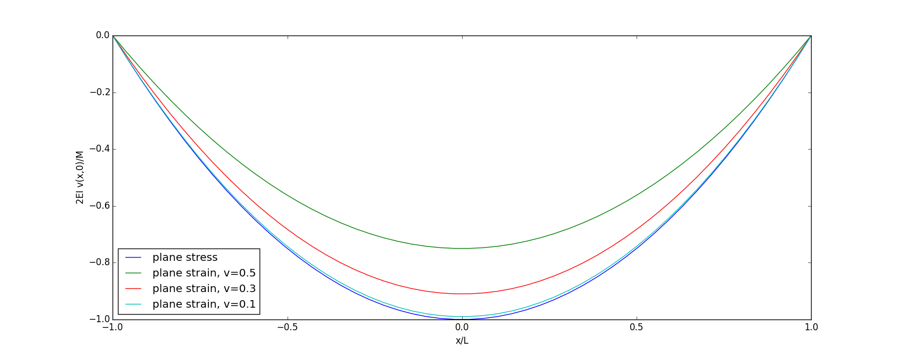

# AE731
## Theory of Elasticity
Dr. Nicholas Smith 
Wichita State University, Department of Aerospace Engineering
November 13, 2019

----
## upcoming schedule

-   Nov 13 - 2D Problem Formulation, HW 6 Due
-   Nov 18 - Airy Stress
-   Nov 20 - Airy Stress
-   Nov 25 - Airy Stress
-   Nov 27 - No Class (Thanksgiving Break)

----
## outline

<!-- vim-markdown-toc GFM -->

* two-dimensional problems
* plane strain
* plane stress
* generalized plane stress

<!-- vim-markdown-toc -->

---
# two-dimensional problems

----
## 2d problems

-   As we learned in Chapter 5, it is often very difficult to solve full problems in 3D
-   Some problems contain symmetry, or particular geometries which allow certain simplifications to be made
-   In this chapter we will consider the following 2D formulations
    -   Plane strain
    -   Plane stress
    -   Generalized plane stress
    -   Antiplane strain

----
## 2d problems

-   Airy stress functions provide a systematic method for solving 2D problems
-   We will also develop Airy stress function solution methods in polar (cylindrical or spherical) coordinates

---
# plane strain

----
## plane strain

-   Plane strain is a state we consider for very long bodies
-   If the body is sufficiently long, then the deformation field can be considered to be a function of *x* and *y* only

$$\\begin{aligned}
	u &= u(x,y)\\\\
	v &= v(x,y)\\\\
	w &= 0
\\end{aligned}$$

-   Results will be the same at every cross-section, so we may consider only a 2D cross-section

----
## plane strain

-   We can use the strain-displacement relations to find the corresponding strains from our assumptions on the displacement

$$\\begin{aligned}
	\\epsilon\_{xx} &= \\frac{\\partial u}{\\partial x}\\\\
	\\epsilon\_{yy} &= \\frac{\\partial v}{\\partial y}\\\\
	\\epsilon\_{xy} &= \\frac{1}{2}\\left(\\frac{\\partial u}{\\partial y} + \\frac{\\partial v}{\\partial x}\\right)\\\\
	\\epsilon\_{zz} &= \\epsilon\_{xz} = \\epsilon\_{yz} = 0
\\end{aligned}$$

----
## plane strain

-   We can use Hooke’s law to find the stresses

$$\\begin{aligned}
	\\sigma\_{xx} &= \\lambda(\\epsilon\_{xx} + \\epsilon\_{yy}) + 2\\mu \\epsilon\_{xx}\\\\
	\\sigma\_{yy} &= \\lambda(\\epsilon\_{xx} + \\epsilon\_{yy}) + 2\\mu \\epsilon\_{yy}\\\\
	\\sigma\_{zz} &= \\lambda(\\epsilon\_{xx} + \\epsilon\_{yy})\\\\
	\\tau\_{xy} &= 2\\mu \\epsilon\_{xy} \\\\
	\\tau\_{xz} &= \\tau\_{yz} = 0
\\end{aligned}$$

----
## plane strain

-   We can use these relationships to reduce the equilibrium equations.
-   Recall that for equilibrium we have

_σ_*ij*, *j* + *F**i* = 0
_τ_*xz* = *τ**yz* = 0, so those terms will vanish

-   Although *σ**zz* ≠ 0, it only appears with a derivative of *z*, and it is a function of *x* and *y* only, so *σ**zz* will not appear in any non-trivial equilibrium equation

$$\\begin{aligned}
	\\frac{\\partial \\sigma\_{xx}}{\\partial x} + \\frac{\\partial \\tau\_{xy}}{\\partial y} + F\_x &= 0\\\\
	\\frac{\\partial \\tau\_{xy}}{\\partial x} +\\frac{\\partial \\sigma\_{yy}}{\\partial y} +  F\_y &= 0
\\end{aligned}$$

----
## plane strain

-   We can use the strain-displacement equations and Hooke’s Law to write Navier’s equations for plane strain

$$\\begin{aligned}
	\\mu \\nabla^2 u + (\\lambda + \\mu) \\frac{\\partial}{\\partial x} \\left(\\frac{\\partial u}{\\partial x} + \\frac{\\partial v}{\\partial y}\\right) + F\_x &= 0\\\\
	\\mu \\nabla^2 v + (\\lambda + \\mu) \\frac{\\partial}{\\partial y} \\left(\\frac{\\partial u}{\\partial x} + \\frac{\\partial v}{\\partial y}\\right) + F\_x &= 0
\\end{aligned}$$

----
## plane strain

-   We can also reduce the compatibility equations

$$\\begin{aligned}
	\\frac{\\partial^2 \\epsilon\_x}{\\partial y^2} + \\frac{\\partial^2 \\epsilon\_y}{\\partial x^2} &= 2\\frac{\\partial^2 \\epsilon\_{xy}}{\\partial x \\partial y}\\\\
	\\frac{\\partial^2 \\epsilon\_y}{\\partial z^2} + \\frac{\\partial^2 \\epsilon\_z}{\\partial y^2} &= 2\\frac{\\partial^2 \\epsilon\_{yz}}{\\partial y \\partial z}\\\\
	\\frac{\\partial^2 \\epsilon\_z}{\\partial x^2} + \\frac{\\partial^2 \\epsilon\_x}{\\partial z^2} &= 2\\frac{\\partial^2 \\epsilon\_{zx}}{\\partial z \\partial x}\\\\
	\\frac{\\partial^2 \\epsilon\_x}{\\partial y \\partial z} &= \\frac{\\partial}{\\partial x} \\left(-\\frac{\\partial \\epsilon\_{yz}}{\\partial x} + \\frac{\\partial \\epsilon\_{zx}}{\\partial y} + \\frac{\\partial \\epsilon\_{xy}}{\\partial z}\\right)\\\\
	\\frac{\\partial^2 \\epsilon\_y}{\\partial z \\partial x} &= \\frac{\\partial}{\\partial y} \\left(-\\frac{\\partial \\epsilon\_{zx}}{\\partial y} + \\frac{\\partial \\epsilon\_{xy}}{\\partial z} + \\frac{\\partial \\epsilon\_{yz}}{\\partial x}\\right)\\\\
	\\frac{\\partial^2 \\epsilon\_z}{\\partial x \\partial y} &= \\frac{\\partial}{\\partial z} \\left(-\\frac{\\partial \\epsilon\_{xy}}{\\partial z} + \\frac{\\partial \\epsilon\_{yz}}{\\partial x} + \\frac{\\partial \\epsilon\_{zx}}{\\partial y}\\right)
\\end{aligned}$$

----
## plane strain

-   The only non-trivial term from the compatibility equations is

$$\\frac{\\partial^2 \\epsilon\_x}{\\partial y^2} + \\frac{\\partial^2 \\epsilon\_y}{\\partial x^2} = 2\\frac{\\partial^2 \\epsilon\_{xy}}{\\partial x \\partial y}$$

-   This can also be written in terms of stress (Beltrami-Mitchell)

$$\\nabla^2(\\sigma\_x + \\sigma\_y) = -\\frac{1}{1-\\nu}\\left(\\frac{\\partial F\_x}{\\partial x} + \\frac{\\partial F\_y}{\\partial y}\\right)$$

----
## plane strain

-   Plane strain is exact for a body of infinite length, but can also be useful for real shapes of finite length
-   Consider a long body with fixed and frictionless ends.
-   The boundary conditions for this case are

$$\\begin{aligned}
	w(x,y,\\pm L) &= 0\\\\
	\\tau\_{xz}(x,y,\\pm L) &= 0\\\\
	\\tau\_{yz}(x,y,\\pm L) &= 0
\\end{aligned}$$

-   Which give the same results as the infinite body plane strain assumptions
-   When the ends are not “fixed and frictionless” we can use Saint-Venants principle to apply plane strain in an approximate sense

---
# plane stress

----
## plane stress

-   If the thickness of a body is small compared to the other dimensions, we assume that there can not be much variation in any of the stress components in that direction
-   The assumptions for plane stress can be summarized as

$$\\begin{aligned}
	\\sigma\_x &= \\sigma\_x(x,y)\\\\
	\\sigma\_y &= \\sigma\_y(x,y)\\\\
	\\tau\_{xy} &= \\tau\_{xy}(x,y)\\\\
	\\sigma\_z &= \\tau\_{xz} = \\tau\_{yz} = 0
\\end{aligned}$$

-   To maintain these assumptions, there can be no body forces in the *z*-direction and no applied tractions in the *z*-direction.
-   Other body forces must be independent of *z*, or distributed symmetrically such that the average may be used.

----
## plane stress

-   We can use Hooke’s law to find the corresponding values of strain

$$\\begin{aligned}
	\\epsilon\_x &= \\frac{1}{E}(\\sigma\_x - \\nu \\sigma\_y)\\\\
	\\epsilon\_y &= \\frac{1}{E}(\\sigma\_y - \\nu \\sigma\_x)\\\\
	\\epsilon\_z &= -\\frac{\\nu}{E}(\\sigma\_x + \\sigma\_y)\\\\
	\\epsilon\_{xy} &= \\frac{1+\\nu}{E}\\tau\_{xy}\\\\
	\\epsilon\_{xz} &= \\epsilon\_{yz} = 0
\\end{aligned}$$

----
## plane stress

-   We can now find the displacements using the strain-displacement relationships

$$\\begin{aligned}
	\\epsilon\_{x} &= \\frac{\\partial u}{\\partial x}\\\\
	\\epsilon\_{y} &= \\frac{\\partial v}{\\partial y}\\\\
	\\epsilon\_{z} &= \\frac{\\partial w}{\\partial z}\\\\
	\\epsilon\_{xy} &= \\frac{1}{2}\\left(\\frac{\\partial u}{\\partial y} + \\frac{\\partial v}{\\partial x}\\right)\\\\
	\\epsilon\_{yz} &= \\frac{1}{2}\\left(\\frac{\\partial v}{\\partial z} + \\frac{\\partial w}{\\partial y}\\right) = 0\\\\
	\\epsilon\_{xz} &= \\frac{1}{2}\\left(\\frac{\\partial u}{\\partial z} + \\frac{\\partial w}{\\partial x}\\right) = 0\\\\
\\end{aligned}$$

----
## plane stress

-   Since strain in the *z*-direction is not zero, *w* becomes a linear function of *z*
-   We also find that *u* and *v* will also be functions of *z*
-   These effects are normally neglected, leading to an approximation in the formulation
-   This is why we cannot use the full 3D compatibility equations to assess compatibility of a body with an assumed state of plane stress

----
## plane stress

-   The equilibrium equations reduce the same form in plane stress as they did for plane strain

$$\\begin{aligned}
	\\frac{\\partial \\sigma\_{xx}}{\\partial x} + \\frac{\\partial \\tau\_{xy}}{\\partial y} + F\_x &= 0\\\\
	\\frac{\\partial \\tau\_{xy}}{\\partial x} +\\frac{\\partial \\sigma\_{yy}}{\\partial y} +  F\_y &= 0
\\end{aligned}$$

-   But the Navier equations in terms of displacement do not reduce to exactly the same form

$$\\begin{aligned}
	\\mu \\nabla^2 u + \\frac{E}{2(1-\\nu)} \\frac{\\partial}{\\partial x} \\left(\\frac{\\partial u}{\\partial x} + \\frac{\\partial v}{\\partial y}\\right) + F\_x &= 0\\\\
	\\mu \\nabla^2 v + \\frac{E}{2(1-\\nu)} \\frac{\\partial}{\\partial y} \\left(\\frac{\\partial u}{\\partial x} + \\frac{\\partial v}{\\partial y}\\right) + F\_y &= 0
\\end{aligned}$$

----
## navier equations

-   The factor in the plane strain Navier equations is

(*λ* + *μ*)

-   We can convert this to *E*, *ν* to better compare with the plane stress equation

$$\\begin{aligned}
	\\lambda + \\mu &= \\frac{\\nu E}{(1+\\nu)(1-2\\nu)} + \\frac{E}{2(1+\\nu)}\\\\
	&= \\frac{2\\nu E}{2(1+\\nu)(1-2\\nu)} + \\frac{E(1-2\\nu)}{2(1+\\nu)(1-2\\nu)}\\\\
	&= \\frac{2\\nu E + E - 2\\nu E}{2(1+\\nu)(1-2\\nu)}\\\\
	&= \\frac{E}{2(1+\\nu)(1-2\\nu)}
\\end{aligned}$$

----
## compatibility

-   Due to the approximations we made earlier, we neglect all compatibility equations with *ϵ**z*, even though these may not be zero

$$\\frac{\\partial^2 \\epsilon\_x}{\\partial y^2} + \\frac{\\partial^2 \\epsilon\_y}{\\partial x^2} = 2 \\frac{\\partial^2 \\epsilon\_{xy}}{\\partial x \\partial y}$$

-   or in terms of stress

$$\\nabla^2 (\\sigma\_{xx} + \\sigma\_{yy}) = -(1+\\nu)\\left(\\frac{\\partial F\_x}{\\partial x} + \\frac{\\partial F\_y}{\\partial y}\\right)$$

----
## conversion

-   While plane strain and plane stress give similar results, they are not identical
-   We can convert between plane strain and plane stress by replacing *E* and *ν*

|                              |               *E*              |         *ν*         |
|:----------------------------:|:------------------------------:|:-------------------:|
| Plane stress to plane strain |      $\\frac{E}{1-\\nu^2}$     | $\\frac{v}{1-\\nu}$ |
| Plane strain to plane stress | $\\frac{E(1+2\\nu)}{1+\\nu^2}$ | $\\frac{v}{1+\\nu}$ |

-   When *ν* = 0, plane strain and plane stress give identical results

---
# generalized plane stress

----
## generalized plane stress

-   Some approximations introduced inconsistencies in the plane stress formulation
-   We can formulate plane stress problems in an alternate fashion to avoid these inconsistencies
-   Generalized plane stress is based on averaging the field quantities through the thickness

$$\\bar{\\psi} = \\frac{1}{2h} \\int\_{-h}^{h}\\psi (x,y,z) dz$$

----
## generalized plane stress

-   We again assume that the thickness, 2*h*, is much smaller than the other dimensions
-   We also assume that tractions on the surfaces *z* = ±*h* are zero
-   Edge loadings must have no *z* component and are independent of *z*
-   Body forces also cannot have a *z* component and must be independent of *z* or symmetrically distributed through the thickness
-   As in plane stress, this will give *w* as a linear function of *z* which means

_w_(*x*, *y*, *z*)= − *w*(*x*, *y*, −*z*)

----
## generalized plane stress

-   If we take the average value of all field variables we find

$$\\begin{aligned}
	\\bar{u} &= \\bar{u}(x,y)\\\\
	\\bar{v} &= \\bar{v}(x,y)\\\\
	\\bar{w} &= \\bar{w}(x,y)\\\\
	\\bar{\\sigma\_z} &= \\bar{\\tau\_{xz}} = \\bar{\\tau\_{yz}} = 0\\\\
	\\bar{\\sigma\_x} &= \\lambda^\*(\\bar{\\epsilon\_x}+\\bar{\\epsilon\_y}) + 2\\mu \\bar{\\epsilon\_x}\\\\
	\\bar{\\sigma\_y} &= \\lambda^\*(\\bar{\\epsilon\_x}+\\bar{\\epsilon\_y}) + 2\\mu \\bar{\\epsilon\_y}\\\\
	\\bar{\\tau\_{xy}} &= 2\\mu \\bar{\\epsilon\_{xy}}\\\\
	\\bar{\\epsilon\_z} &= - \\frac{\\lambda}{\\lambda + 2\\mu} (\\bar{\\epsilon\_x}+ \\bar{\\epsilon\_y})
\\end{aligned}$$

-   Where $\\lambda^\* = \\frac{2\\lambda \\mu}{\\lambda + 2\\mu}$

----
## generalized plane stress

-   We can also write the equilibrium equations in terms of the averaged values

$$\\begin{aligned}
	\\frac{\\partial \\bar{\\sigma\_x}}{\\partial x} + \\frac{\\partial \\bar{\\tau\_{xy}}}{\\partial x} + \\bar{F}\_x &= 0\\\\
	\\frac{\\partial \\bar{\\tau\_{xy}}}{\\partial x} + \\frac{\\partial \\bar{\\sigma\_{y}}}{\\partial y} + \\bar{F}\_y &= 0
\\end{aligned}$$

-   Or in terms of displacements

$$\\begin{aligned}
	\\mu \\nabla^2 \\bar{u} + (\\lambda^\* + \\mu) \\frac{\\partial}{\\partial x} \\left(\\frac{\\partial \\bar{u}}{\\partial x} + \\frac{\\partial \\bar{v}}{\\partial y}\\right) + \\bar{F}\_x &= 0\\\\
	\\mu \\nabla^2 \\bar{u} + (\\lambda^\* + \\mu) \\frac{\\partial}{\\partial y} \\left(\\frac{\\partial \\bar{u}}{\\partial x} + \\frac{\\partial \\bar{v}}{\\partial y}\\right) + \\bar{F}\_y &= 0
\\end{aligned}$$

----
## compatibility

-   The compatibility relations reduce to

$$\\nabla^2 (\\bar{\\sigma\_x} + \\bar{\\sigma\_y}) = - \\frac{2(\\lambda^\* + \\mu)}{\\lambda^\* + 2\\mu} \\left(\\frac{\\partial \\bar{F}\_x}{\\partial x} + \\frac{\\partial \\bar{F}\_y}{\\partial y}\\right)$$

-   When we write the coefficient $\\frac{2(\\lambda^\* + \\mu)}{\\lambda^\* + 2\\mu}$ in terms of *E* and *ν*, we find

$$\\frac{2(\\lambda^\* + \\mu)}{\\lambda^\* + 2\\mu} = 1 + \\nu$$

-   Which means this is an identical result to the simple plane stress derivation
-   Thus the generalized plane stress method is not particularly useful

----
## beam example

