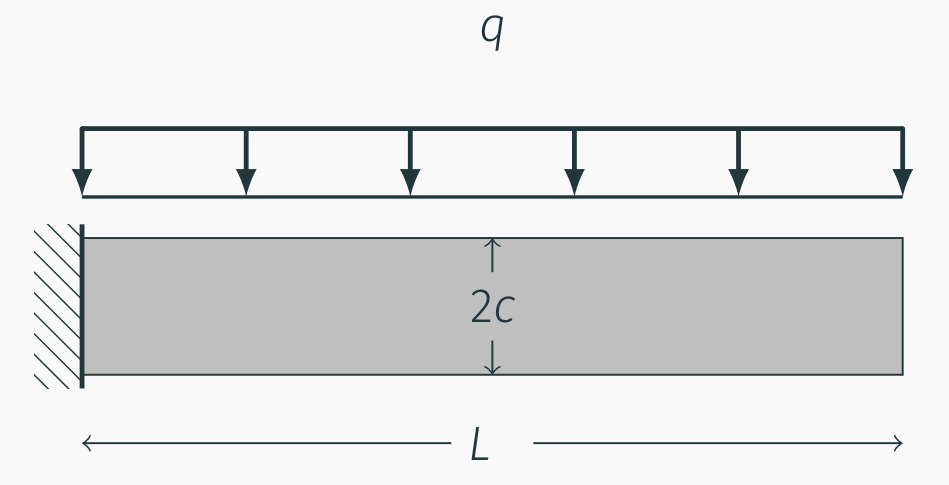
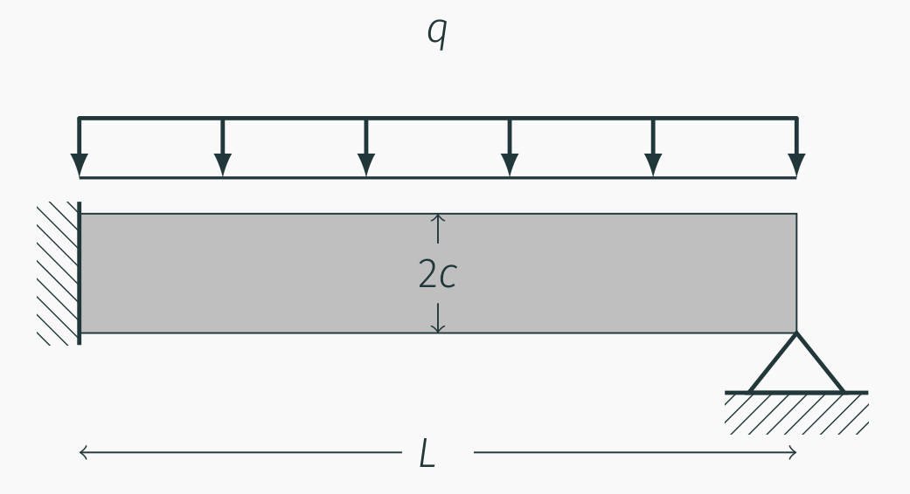
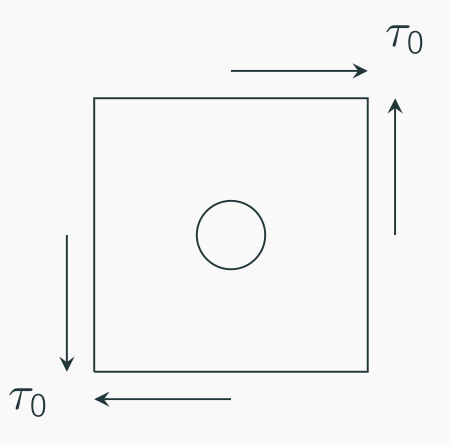
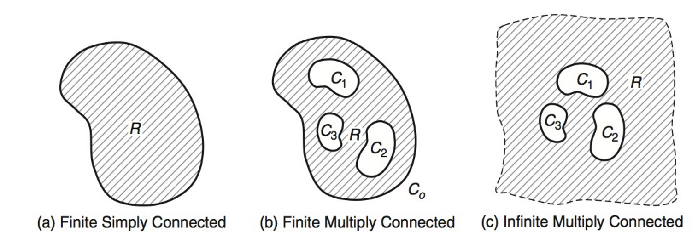
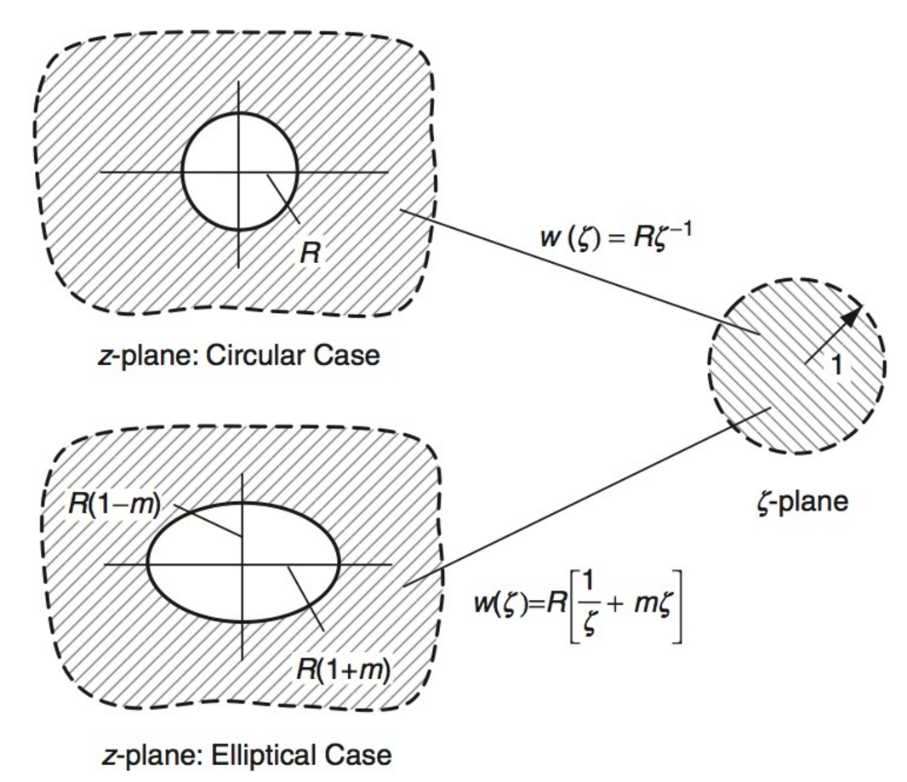
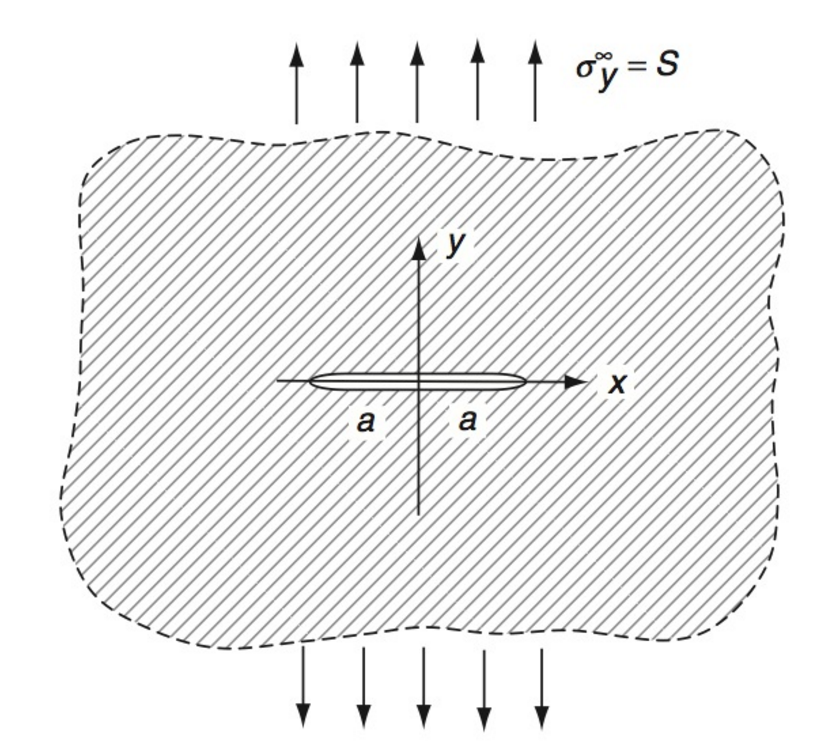

# AE731
## Theory of Elasticity
Dr. Nicholas Smith 
Wichita State University, Department of Aerospace Engineering 
23 November, 2021

----
## upcoming schedule

-   23 Nov - Complex Methods
-   25 Nov - Thanksgiving (No Class)
-   30 Nov - Complex Methods
-   2 Dec - Final Exam Review
-   3 Dec - HW 8 Due, HW 7 Self-Grade Due
-   7 Dec - 5:40 - 7:30 Final Exam

----
## outline

<!-- vim-markdown-toc GFM -->

* group problems, review
* complex variable methods
* research and courses

<!-- vim-markdown-toc -->

---
# group problems

----
## group 1

----
## group 2

----
## group 3

---
# complex variable methods

----
## complex variables

-   Complex variables are made up of a real portion and imaginary portion

`$$z = x + iy$$`

-   Polar form is written as

`$$ z = r(\cos \theta + i \sin \theta) = r e^{i\theta}$$`

-   We also define the complex conjugate, `$\bar{z}$`

`$$\bar{z} = x - iy = re^{-i\theta}$$`

----
## complex variables

-   A function of complex variables will also be made up of a real and imaginary portion

`$$ f(z) = f(x + iy) = u(x, y) + iv(x, y)$$`

-   We also define the complex conjugate of the complex function

`$$\bar{f(z)} = u(x,y) - i v(x,y)$$`

----
## derivatives

- We can use complex conjugates to define derivatives of complex functions

`$$ \frac{\partial}{\partial x} = \frac{\partial}{\partial z} + \frac{\partial}{\partial \bar{z}} $$`
`$$ \frac{\partial}{\partial y} = i\left(\frac{\partial}{\partial z} - \frac{\partial}{\partial \bar{z}} \right)$$`

----
## complex plane strain

`$$ \begin{aligned}
  \sigma_x &= \lambda \left( \frac{\partial u}{\partial x} + \frac{\partial v}{\partial y} \right) + 2\mu \frac{\partial u}{\partial x} \\
  \sigma_x &= \lambda \left( \frac{\partial u}{\partial x} + \frac{\partial v}{\partial y} \right) + 2\mu \frac{\partial v}{\partial y} \\
  \tau_{xy} &= \mu \left( \frac{\partial u}{\partial y} + \frac{\partial v}{\partial x} \right) 
\end{aligned}$$`

----
## Airy stress compatibility

`$$ \frac{\partial ^4 \phi}{\partial z^2 \partial \bar{z}^2} = 0 $$`

----
## complex Airy stress

`$$ \phi (z, \bar{z}) = \frac{1}{2} ( z \bar{\gamma(z)} + \bar{z} \gamma{z} + \xi(z) + \bar{\xi(z)})$$`

`$$ \phi (z, \bar{z}) = \Re( \bar{z} \gamma(z) + \xi(z)) $$`

----
## complex potentials

- It is more convenient to write stresses directly in terms of complex potentials
- These are derived by combining complex Airy stress functions with Navier's equations
`$$ \begin{aligned} 
  \sigma_x + \sigma_y &= 2(\gamma^\prime(z) + \bar{\gamma^\prime(z)})\\
  \sigma_y - \sigma_x + 2 i \tau_{xy} &= 2(\bar{z}\gamma^{\prime \prime}(z) + \psi^\prime(z))
\end{aligned}$$`

----
## uses for complex variables

-   In Elasticity, complex variables are advantageous in many situations
-   Conformal mappings - allows a solution for a simple shape to be mapped onto a more complicated shape
-   With complex methods we can handle singularities, and quantify the order of a singularity

----
## uses for complex variables

-   Multivalued displacements (dislocations)
-   Fracture mechanics
-   Westergaard functions (crack analysis)

----
## multiply connected domains

----
## mapping

 <!-- .element width="50%" -->

----
## westergaard stress function

-   The Westergaard stress function is convenient for many planar crack problems

`$$\begin{aligned}
	\sigma_x &= Re[Z(z)] - y Im[Z^\prime(z)] - A\\
	\sigma_y &= Re[Z(z)] + y Im[Z^\prime(z)] + A\\
	\tau_{xy} &= -y Re[Z^\prime(z)]
\end{aligned}$$`

----
## crack example

 <!-- .element width="50%" -->

----
## crack example

-   Consider the Westergaard stress function

`$$Z(z) = \frac{Sz}{\sqrt{z^2 - a^2}} - \frac{S}{2}$$`

---
# research and courses

----
## continuum mechanics

-   AE 831, even years Fall
-   A “bigger picture” version of 731
-   Develop framework for large deformation
-   Solids, fluids, and viscoelastic solids

----
## continuum mechanics - research

-   When carbon fiber composites are manufactured, there is always a time where both liquids and solids are present
-   If the system is under any motion, the fluid influences the fibers and the fibers influence the fluid
-   We can use continuum mechanics to model both together and predict where the fibers will be

----
## micromechanics and multi-scale modeling

-   AE 760AA, even years Spring
-   Analytic and computational methods for multi-scale modeling
-   Particularly applicable to various forms of composites (3D printed, molded composites, etc.)

----
## fracture mechanics

-   AE 737 (very applied class, AE 731 not pre-req), AE 837 (theoretical and numberical fracture mechanics methods, AE 731 is a pre-req)
-   Research applications: characterize interlaminar fracture toughness, fatigue of aerospace structures, etc.

