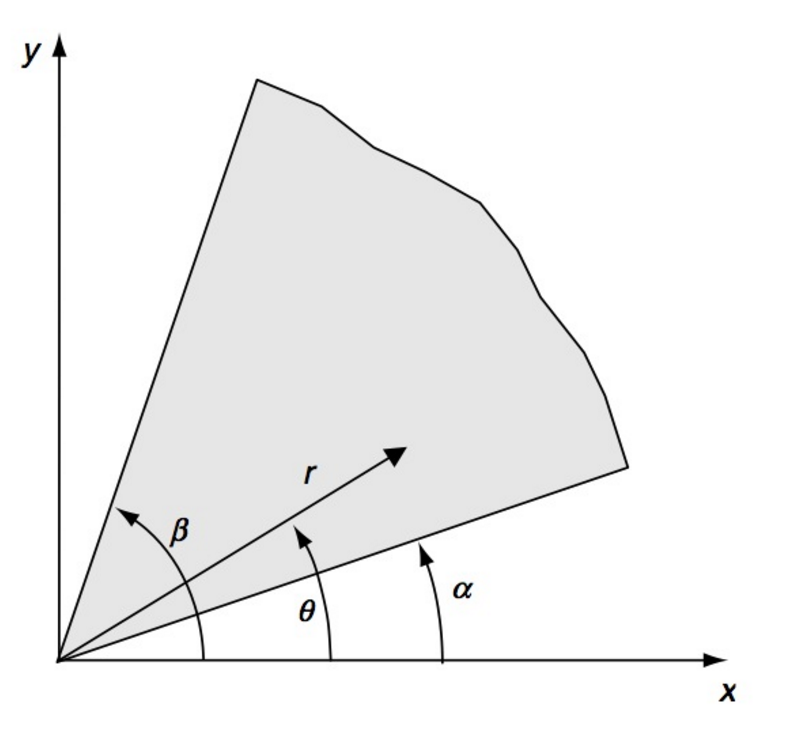
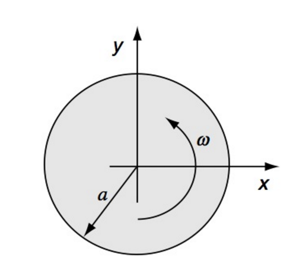

# AE731
## Theory of Elasticity
Dr. Nicholas Smith 
Wichita State University, Department of Aerospace Engineering
November 20, 2019

----
## upcoming schedule

-   Nov 20 - Polar Coordinates in Airy Stress, Homework 7 Due
-   Nov 25 - Polar Coordinates in Airy Stress
-   Nov 27 - No Class (Thanksgiving Break)
-   Dec 2 - Complex Methods
-   Dec 4 - Final Review, Homework 8 Due
-   Dec 11 - 3:00 - 4:50 Final Exam

----
## outline

<!-- vim-markdown-toc GFM -->

* polar coordinate solutions
* examples

<!-- vim-markdown-toc -->

---
# polar coordinate solutions

----
## polar coordinates

-   Recall that an Airy Stress function must satisfy the Beltrami-Mitchell compatibility equations

$$\\nabla^4 \\phi = \\left(\\frac{\\partial ^2}{\\partial r^2} + \\frac{1}{r} \\frac{\\partial}{\\partial r} + \\frac{1}{r^2}\\frac{\\partial ^2}{\\partial \\theta^2}\\right)^2\\phi = 0$$

-   One method which gives several useful solutions assumes that the Airy Stress function has the form *ϕ*(*r*, *θ*)=*f*(*r*)*e**bθ*
-   Substituting this into the compatibility equations (and canceling the common *e**bθ*) term gives

$$f^{\\prime \\prime \\prime \\prime} + \\frac{2}{r} f^{\\prime \\prime \\prime} - \\frac{1-2b^2}{r^2}f^{\\prime \\prime} + \\frac{1-2b^2}{r^3}f^{\\prime} + \\frac{b^2(4+b^2)}{r^4}f = 0$$

----
## polar coordinates

-   To solve this, we perform a change of variables, letting *r* = *e**ξ*, which gives

_f_′′′′ − 4*f*′′′ + (4 + 2*b*2)*f*′′ − 4*b*2*f*′ + *b*2(4 + *b*2)*f* = 0

-   We know consider *f* to have the form *f* = *e**aξ* which generates the characteristic equation

(*a*2 + *b*2)(*a*2 − 4*a* + 4 + *b*2)=0

-   And has solutions

$$\\begin{aligned}
	a &= \\pm ib, \\pm 2ib\\\\
	\\text{OR}\\\\
	b &= \\pm ia, \\pm i(a-2)
\\end{aligned}$$

----
## polar coordinates

-   If we consider only solutions which are periodic in *θ*, we find

$$\\begin{aligned}
	\\phi &= a\_0 + a\_1 \\log r + a\_2 r^2 + a\_3 r^2 \\log r \\\\
	&+ (a\_4 + a\_5 \\log r + a\_6 r^2 + a\_7 r^2 \\log r)\\theta \\\\
	&+ \\left(a\_{11}r + a\_{12}r\\log r + \\frac{a\_{13}}{r} + a\_{14}r^3 + a\_{15}r\\theta + a\_{16} r\\theta \\log r\\right) \\cos \\theta\\\\
	&+  \\left(b\_{11}r + b\_{12}r\\log r + \\frac{b\_{13}}{r} + b\_{14}r^3 + b\_{15}r\\theta + b\_{16} r\\theta \\log r\\right) \\sin \\theta\\\\
	&+ \\sum\_{n=2}^{\\infty} (a\_{n1}r^n + a\_{n2}r^{2+n}+a\_{n3}r^{-n}+a\_{n4}r^{2-n})\\cos n\\theta\\\\
	&+ \\sum\_{n=2}^{\\infty} (b\_{n1}r^n + b\_{n2}r^{2+n}+a\_{n3}r^{-n}+b\_{n4}r^{2-n})\\sin n\\theta\\\\
\\end{aligned}$$

----
## polar coordinates

-   For axisymmetric problems, all field quantities are independent of *θ*

-   This reduces the general solution to

_ϕ_ = *a*0 + *a*1log*r* + *a*2*r*2 + *a*3*r*2log*r*

----
## polar coordinates

----
## polar coordinate

---
# examples

----
## tube under uniform pressure

----
## pressurized hole

----
## stress-free hole in tension

----
## stress-free hole in tension

----
## concentrated force

----
## concentrated force

----
## concentrated force

----
## wedge

----
## notch/crack

----
## curved beam

----
## rotating disk

